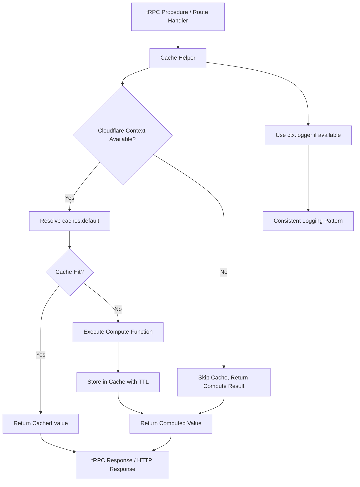
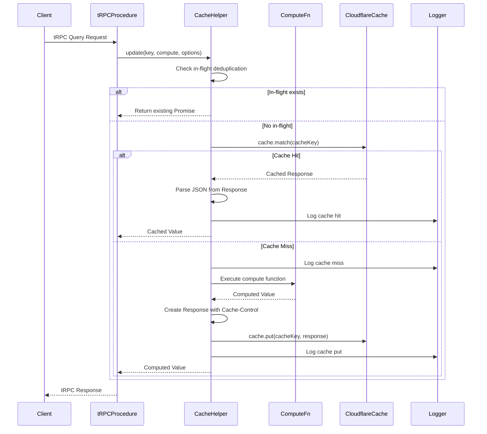
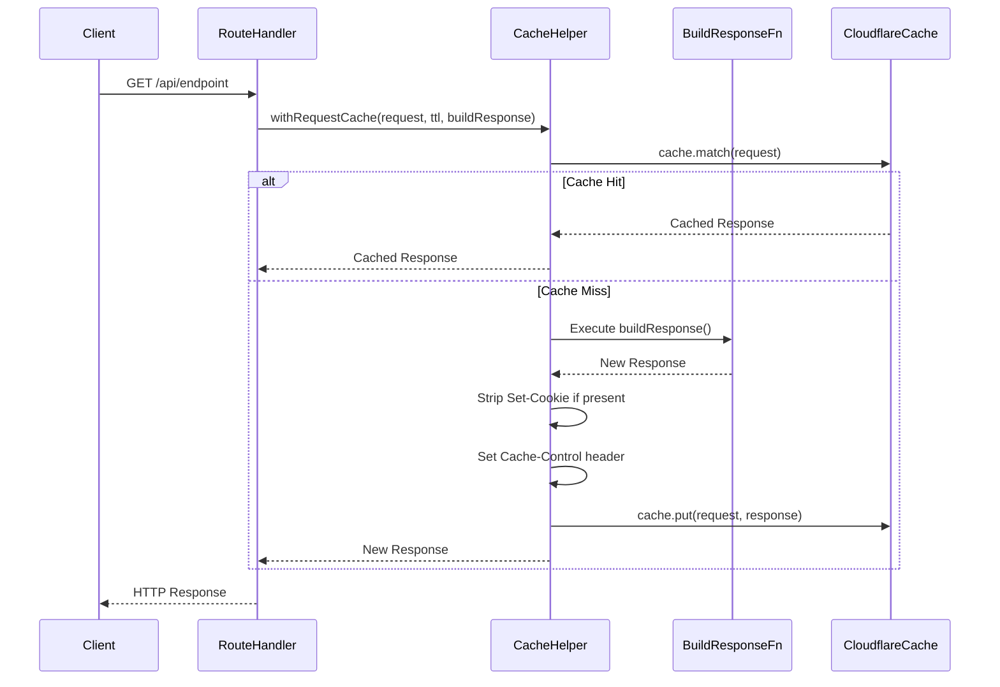
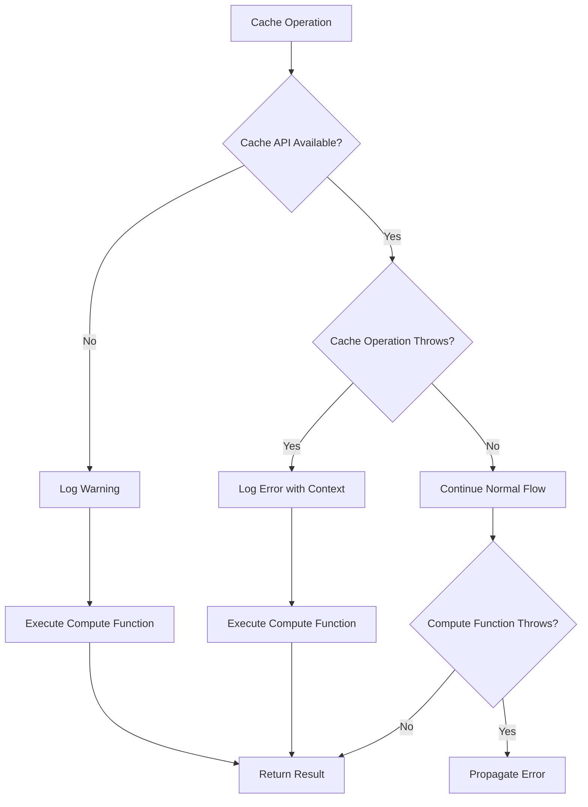

# Technical Design: Cloudflare Cache Helper

## Overview

この機能は、Cloudflare Workers の Cache API を活用した型安全なキャッシュヘルパーライブラリを提供する。**主に Cloudflare Workers にデプロイされているサーバー側**で使用され、`getCloudflareContext()` を用いて環境を解決し、任意のキーと型付けされた値を TTL 付きでキャッシュできるユーティリティを実装する。これにより、外部 API（Dex Screener 等）へのアクセス削減、レイテンシ低減、スループット向上、コスト最適化、および UX 向上を実現する。

**Purpose**: Cloudflare Workers 環境で実行されるサーバー開発者が、Cloudflare Edge 上で型安全なキー値キャッシュと HTTP レスポンスキャッシュを簡単に利用できるようにし、外部 API 呼び出しや重い計算結果を効率的にキャッシュできるようにする。

**Users**: Cloudflare Workers にデプロイされたサーバー側コード（tRPC ルーター、Next.js Route Handlers、Server Components）を開発するサーバー開発者、API 開発者、プラットフォームエンジニアがこの機能を利用する。

**Impact**: 現在のシステムでは外部 API へのアクセスが毎回発生しているが、この機能により同一 TTL 内のリクエストはキャッシュから返されるようになり、レイテンシが大幅に削減される。特に `trpc.mc.getMarketCaps`、`trpc.mc.getRoundedMcMap`、`trpc.token.getState`、`trpc.r2.getJson` などの高トラフィック tRPC プロシージャでの効果が期待される。tRPC の型安全性を維持しながら、Edge Cache の恩恵を受けられる。

### Goals

- Cloudflare Workers Cache API を活用した型安全なキャッシュヘルパーの提供
- キー値キャッシュと HTTP レスポンスキャッシュの両方をサポート
- Cloudflare 環境外でのグレースフルなフォールバック
- 同時リクエストの重複実行を防ぐデデュプリケーション機能
- 可観測性とエラーハンドリングの実装

### Non-Goals

- クライアント側（ブラウザ）での使用（Cloudflare Workers の Cache API はサーバー側でのみ利用可能）
- Cache API の完全なラッパー実装（基本的な get/put 操作に焦点）
- 分散キャッシュの実装（Cloudflare の Edge Cache に依存）
- キャッシュの手動無効化機能（TTL ベースの自動期限切れに依存）
- メトリクス収集機能の実装（設計上拡張可能だが、初期実装では含めない）

## Architecture

### Existing Architecture Analysis

現在のコードベースでは以下のパターンが確立されている：

- **環境解決パターン**: `getCloudflareContext()` を `@opennextjs/cloudflare` からインポートし、`resolveR2Bucket()` などで使用している（`src/lib/r2.ts` を参照）
- **エラーハンドリング**: `neverthrow` の `Result<T, E>` 型を使用した関数型エラーハンドリング
- **ロギング**: `src/utils/logger.ts` の統一ロガーを使用
- **型定義**: `src/types/app-error.ts` でアプリケーションエラー型を定義
- **tRPC ルーター**: `src/server/trpc/routers/` にルーターが配置され、`createContext()` で Cloudflare 環境を解決している。tRPC Context には `ctx.logger` が含まれており、統一されたロギングパターンが確立されている
- **tRPC プロシージャ**: `publicProcedure.query()` 内でサービス層を呼び出し、結果を返すパターンが確立されている（`mcRouter`、`tokenRouter`、`r2Router` を参照）

**統合アプローチ**: 既存の `resolveR2Bucket()` パターンと同様に、`resolveCache()` 関数を提供し、`getCloudflareContext()` から `caches.default` を安全に取得する。このヘルパーは **Cloudflare Workers 環境で実行されるサーバー側コード専用**であり、tRPC プロシージャ、Next.js Route Handlers、Server Components などで使用される。エラーハンドリングは `Result` 型ではなく、グレースフルなフォールバック（キャッシュ不可の場合は計算結果をそのまま返す）を採用する。tRPC プロシージャ内での使用時は、`ctx.logger` をオプショナルパラメータとして受け取り、既存のロギングパターンと整合させる。

### High-Level Architecture



**Architecture Integration**:

- **実行環境**: Cloudflare Workers にデプロイされたサーバー側コードでのみ実行される。Edge Runtime で動作し、Cloudflare のグローバルネットワーク上でキャッシュが共有される
- **既存パターンの維持**: `getCloudflareContext()` を使用した環境解決パターンを踏襲
- **新規コンポーネントの理由**: `src/lib/cache.ts` にキャッシュヘルパーを集約し、サーバー側コードから再利用可能なユーティリティとして提供
- **技術スタックの整合性**: TypeScript、neverthrow パターン、既存のロガーとエラー型を活用
- **ステアリング準拠**: 関数型アプローチ、型安全性、グレースフルなフォールバックを維持

### Technology Stack and Design Decisions

**Technology Alignment**:

この機能は既存の技術スタックに完全に統合される：

- **TypeScript**: 型安全な API を提供するため、既存の TypeScript コードベースと整合
- **@opennextjs/cloudflare**: 既に `getCloudflareContext()` を使用しており、追加の依存関係は不要
- **Web Platform APIs**: Cache API は Cloudflare Workers ランタイムで標準提供されるため、追加ライブラリ不要
- **neverthrow**: エラーハンドリングには使用しない（グレースフルフォールバックのため）が、既存コードパターンと整合

**新規依存関係**: なし。既存の `@opennextjs/cloudflare` と Web Platform APIs のみを使用。

**Key Design Decisions**:

1. **Decision**: グレースフルフォールバック戦略（キャッシュ不可時もエラーを投げずに計算結果を返す）
   - **Context**: Cloudflare 環境外（ローカル開発、テスト環境）でも動作する必要がある
   - **Alternatives**:
     - エラーを投げる（環境依存が強くなる）
     - KV ストレージにフォールバック（複雑性が増す）
   - **Selected Approach**: キャッシュが利用できない場合は計算関数を実行して結果を返す。ログで警告を出力するが、エラーは発生させない
   - **Rationale**: 開発体験を損なわず、本番環境でのみキャッシュの恩恵を受けられる。既存の `resolveR2Bucket()` パターンとは異なるが、キャッシュはオプショナルな最適化であるため、このアプローチが適切
   - **Trade-offs**: キャッシュ失敗を検知しにくいが、システムの可用性は維持される

2. **Decision**: リクエストレベルのデデュプリケーション（同一キーへの同時リクエストを1つの計算に統合）
   - **Context**: 高トラフィック時に同一キーへの同時リクエストが発生し、無駄な計算が発生する
   - **Alternatives**:
     - デデュプリケーションなし（シンプルだが非効率）
     - 外部キューシステム（過剰な複雑性）
   - **Selected Approach**: `Map<string, Promise<T>>` を使用したインメモリデデュプリケーション。計算開始時に Promise を Map に保存し、完了時に削除する
   - **Rationale**: シンプルで効果的。Cloudflare Workers はステートレスだが、単一リクエスト処理中はメモリが保持されるため、このアプローチが機能する
   - **Trade-offs**: メモリ使用量がわずかに増えるが、計算コストの削減効果が大きい

3. **Decision**: キー値キャッシュと HTTP レスポンスキャッシュの両方を提供
   - **Context**: tRPC ルーターでは JSON データをキャッシュし、Route Handlers では HTTP レスポンス全体をキャッシュしたい
   - **Alternatives**:
     - HTTP レスポンスキャッシュのみ（柔軟性が低い）
     - キー値キャッシュのみ（Route Handlers での利用が複雑になる）
   - **Selected Approach**: `getOrSet<T>()` でキー値キャッシュ、`withRequestCache()` で HTTP レスポンスキャッシュを提供
   - **Rationale**: 異なるユースケースに対応し、使いやすい API を提供できる
   - **Trade-offs**: API サーフェスが大きくなるが、それぞれのユースケースに最適化されたインターフェースを提供できる

## System Flows

### Key-Value Cache Flow (tRPC Procedure)



### Request-Level Cache Flow



### Error Handling Flow



## Requirements Traceability

| Requirement | Requirement Summary                          | Components  | Interfaces                                                                   | Flows                                          |
| ----------- | -------------------------------------------- | ----------- | ---------------------------------------------------------------------------- | ---------------------------------------------- |
| 1.1         | update returns cached or computed value      | CacheHelper | update<T>()                                                                  | Key-Value Cache Flow                           |
| 1.2         | Graceful fallback when Cache API unavailable | CacheHelper | resolveCache()                                                               | Error Handling Flow                            |
| 1.3         | Cache hit skips compute function             | CacheHelper | update<T>()                                                                  | Key-Value Cache Flow                           |
| 1.4         | Independent cache entries per key            | CacheHelper | get<T>(), set<T>(), update<T>()                                              | Key-Value Cache Flow                           |
| 1.5         | Deduplication for concurrent requests        | CacheHelper | update<T>()                                                                  | Key-Value Cache Flow                           |
| 2.1         | withRequestCache caches HTTP responses       | CacheHelper | withRequestCache()                                                           | Request-Level Cache Flow                       |
| 2.2         | Set-Cookie header handling                   | CacheHelper | withRequestCache()                                                           | Request-Level Cache Flow                       |
| 2.3         | Cached response served within TTL            | CacheHelper | withRequestCache()                                                           | Request-Level Cache Flow                       |
| 2.4         | Cache-Tag support for future purge           | CacheHelper | withRequestCache()                                                           | Request-Level Cache Flow                       |
| 3.1         | Safe environment resolution                  | CacheHelper | resolveCache()                                                               | Error Handling Flow                            |
| 3.2         | Graceful degradation outside Cloudflare      | CacheHelper | resolveCache()                                                               | Error Handling Flow                            |
| 3.3         | Next.js Route Handler support                | CacheHelper | withRequestCache()                                                           | Request-Level Cache Flow                       |
| 3.4         | Cache-Control header setting                 | CacheHelper | set<T>(), update<T>(), withRequestCache()                                    | Key-Value Cache Flow, Request-Level Cache Flow |
| 4.1         | Error logging and fallback                   | CacheHelper | get<T>(), set<T>(), update<T>(), withRequestCache()                          | Error Handling Flow                            |
| 4.2         | Compute error propagation                    | CacheHelper | update<T>(), withRequestCache()                                              | Error Handling Flow                            |
| 4.3         | Debug logging for cache operations           | CacheHelper | get<T>(), set<T>(), update<T>(), remove(), withRequestCache()                | Key-Value Cache Flow, Request-Level Cache Flow |
| 4.4         | Extensible design for metrics                | CacheHelper | Interface design                                                             | N/A                                            |
| 5.1         | Application to trpc.mc.getMarketCaps         | Integration | mcRouter.getMarketCaps                                                       | Key-Value Cache Flow                           |
| 5.2         | Application to trpc.mc.getRoundedMcMap       | Integration | mcRouter.getRoundedMcMap                                                     | Key-Value Cache Flow                           |
| 5.3         | Application to trpc.token.getState           | Integration | tokenRouter.getState                                                         | Key-Value Cache Flow                           |
| 5.4         | Application to trpc.r2.getJson               | Integration | r2Router.getJson                                                             | Key-Value Cache Flow                           |
| 5.5         | Internal service memoization                 | Integration | Service layer usage                                                          | Key-Value Cache Flow                           |
| 5.6         | Latency improvement                          | CacheHelper | All interfaces                                                               | All flows                                      |
| 5.7         | tRPC Context logger integration              | CacheHelper | update<T>() with logger param                                                | Key-Value Cache Flow                           |
| 2.5         | tRPC HTTP adapter caching                    | CacheHelper | Procedure-level caching                                                      | Key-Value Cache Flow                           |
| 3.3         | tRPC procedure execution                     | CacheHelper | resolveCache()                                                               | Error Handling Flow                            |
| 3.6         | tRPC context creation failure                | CacheHelper | resolveCache()                                                               | Error Handling Flow                            |
| 7.4         | tRPC return type preservation                | CacheHelper | get<T>(), set<T>(), update<T>()                                              | Key-Value Cache Flow                           |
| 7.5         | tRPC Context logger parameter                | CacheHelper | get<T>(), set<T>(), update<T>(), remove() with logger                        | Key-Value Cache Flow                           |
| 6.1         | Set-Cookie header compliance                 | CacheHelper | withRequestCache()                                                           | Request-Level Cache Flow                       |
| 6.2         | Cache-Control header setting                 | CacheHelper | set<T>(), update<T>(), withRequestCache()                                    | Key-Value Cache Flow, Request-Level Cache Flow |
| 6.3         | ETag/Last-Modified compatibility             | CacheHelper | withRequestCache()                                                           | Request-Level Cache Flow                       |
| 7.1         | Type-safe API in src/lib/cache.ts            | CacheHelper | All interfaces                                                               | All flows                                      |
| 7.2         | Text and binary variants                     | CacheHelper | getText(), setText(), updateText(), getBinary(), setBinary(), updateBinary() | Key-Value Cache Flow                           |
| 7.3         | Minimal dependencies                         | CacheHelper | Implementation                                                               | N/A                                            |

## Components and Interfaces

### Library / Cache Helper

#### CacheHelper

**Responsibility & Boundaries**

- **Primary Responsibility**: Cloudflare Workers Cache API を活用した型安全なキャッシュ操作を提供する
- **Domain Boundary**: インフラストラクチャ層のユーティリティライブラリ
- **Data Ownership**: キャッシュキーと値の一時的な管理（Cloudflare Edge Cache に実際に保存される）
- **Transaction Boundary**: 各キャッシュ操作は独立したトランザクション（一貫性保証は Cloudflare Cache API に依存）

**Dependencies**

- **Inbound**: Cloudflare Workers 環境で実行されるサーバー側コードから呼び出される：
  - tRPC ルーター（`src/server/trpc/routers/mc.ts`, `src/server/trpc/routers/token.ts`, `src/server/trpc/routers/r2.ts`）
  - Next.js Route Handlers（`src/app/api/r2/[...key]/route.ts`）
  - Server Components（Next.js のサーバー側コンポーネント）
- **Outbound**: `@opennextjs/cloudflare` の `getCloudflareContext()`、`src/utils/logger.ts` のロガー、tRPC Context の `ctx.logger`（オプショナル）
- **External**: Cloudflare Workers Cache API（`caches.default`）、Web Platform APIs（`Request`, `Response`）
- **実行環境**: Cloudflare Workers Edge Runtime（サーバー側でのみ実行可能）

**Contract Definition**

**Service Interface**:

```typescript
/**
 * Cache options for cache operations
 */
type CacheOptions = {
  ttlSeconds: number;
  namespace?: string;
  logger?: typeof logger;
};

/**
 * Get a cached value by key
 *
 * @template T - The type of value to retrieve (preserves tRPC procedure return types)
 * @param key - Cache key (will be prefixed with namespace if provided)
 * @param options - Optional cache options
 * @returns Promise resolving to the cached value or null if not found/expired
 *
 * Preconditions:
 * - key must be a non-empty string
 *
 * Postconditions:
 * - Returns cached value of type T if found and valid, otherwise null
 * - Never throws (returns null on cache miss or error)
 *
 * Invariants:
 * - Returns null if cache is unavailable
 * - Type safety is preserved for tRPC procedure return types
 */
function get<T>(key: string, options?: Omit<CacheOptions, "ttlSeconds">): Promise<T | null>;

/**
 * Set a value in cache with TTL
 *
 * @template T - The type of value to cache
 * @param key - Cache key (will be prefixed with namespace if provided)
 * @param value - Value to cache (must be JSON-serializable for generic version)
 * @param options - Cache options including TTL
 * @returns Promise resolving to void
 *
 * Preconditions:
 * - key must be a non-empty string
 * - ttlSeconds must be a positive number
 * - value must be JSON-serializable (for generic version)
 *
 * Postconditions:
 * - Value is stored in cache with specified TTL if cache is available
 * - If cache is unavailable, operation is silently skipped (no error thrown)
 *
 * Invariants:
 * - Never throws (gracefully degrades if cache unavailable)
 */
function set<T>(key: string, value: T, options: CacheOptions): Promise<void>;

/**
 * Update a cached value, computing it if not present
 *
 * This is the recommended method for caching expensive operations (external API calls,
 * heavy computations, paid data reads). It combines get + set with deduplication.
 *
 * @template T - The type of value to cache (preserves tRPC procedure return types)
 * @param key - Cache key (will be prefixed with namespace if provided)
 * @param compute - Function that computes the value if not cached or expired
 * @param options - Cache options including TTL
 * @returns Promise resolving to the cached or computed value
 *
 * Preconditions:
 * - key must be a non-empty string
 * - ttlSeconds must be a positive number
 * - compute function should handle errors internally or propagate them appropriately
 *
 * Postconditions:
 * - Returns a value of type T (either from cache or computed)
 * - If cache is available, value is stored with specified TTL
 * - If cache is unavailable, computed value is returned without caching
 * - Type safety is preserved for tRPC procedure return types
 *
 * Invariants:
 * - Same key with same options always returns same cache entry
 * - Concurrent requests for same key are deduplicated (single computation per key)
 * - Logger is used if provided, otherwise falls back to default logger
 */
function update<T>(key: string, compute: () => Promise<T>, options: CacheOptions): Promise<T>;

/**
 * Remove a cached value by key
 *
 * @param key - Cache key to remove (will be prefixed with namespace if provided)
 * @param options - Optional cache options
 * @returns Promise resolving to boolean (true if removed, false if not found)
 *
 * Preconditions:
 * - key must be a non-empty string
 *
 * Postconditions:
 * - Returns true if value was removed, false if not found or cache unavailable
 * - Never throws (gracefully degrades if cache unavailable)
 *
 * Invariants:
 * - Returns false if cache is unavailable
 */
function remove(key: string, options?: Omit<CacheOptions, "ttlSeconds">): Promise<boolean>;

/**
 * Text-based cache helpers (for string values)
 * Useful for caching text responses, HTML, or stringified JSON
 */
function getText(key: string, options?: Omit<CacheOptions, "ttlSeconds">): Promise<string | null>;
function setText(key: string, value: string, options: CacheOptions): Promise<void>;
function updateText(key: string, compute: () => Promise<string>, options: CacheOptions): Promise<string>;

/**
 * Binary cache helpers (for ArrayBuffer values)
 * Useful for caching images, binary files, or other binary data
 */
function getBinary(key: string, options?: Omit<CacheOptions, "ttlSeconds">): Promise<ArrayBuffer | null>;
function setBinary(key: string, value: ArrayBuffer, options: CacheOptions): Promise<void>;
function updateBinary(key: string, compute: () => Promise<ArrayBuffer>, options: CacheOptions): Promise<ArrayBuffer>;

/**
 * Request-level cache wrapper for HTTP responses
 *
 * @param request - The incoming Request object
 * @param ttlSeconds - Time-to-live in seconds
 * @param buildResponse - Function that builds the Response if not cached
 * @returns Promise resolving to cached or newly built Response
 *
 * Preconditions:
 * - request must be a valid Request object
 * - ttlSeconds must be a positive number
 * - buildResponse must return a Response object
 *
 * Postconditions:
 * - Returns a Response (either from cache or newly built)
 * - If cache is available, Response is stored with specified TTL
 * - Set-Cookie headers are stripped before caching
 * - Cache-Control header is set appropriately
 *
 * Invariants:
 * - Same request URL returns same cached Response within TTL
 * - Response headers are properly sanitized before caching
 */
function withRequestCache(
  request: Request,
  ttlSeconds: number,
  buildResponse: () => Promise<Response>,
): Promise<Response>;

/**
 * Resolve Cloudflare Cache API instance
 *
 * @returns Cache instance or null if unavailable
 *
 * Preconditions:
 * - Must be called in context where getCloudflareContext() is available
 *
 * Postconditions:
 * - Returns Cache instance if Cloudflare context is available
 * - Returns null if context is unavailable (graceful degradation)
 *
 * Invariants:
 * - Never throws (always returns Cache or null)
 */
function resolveCache(): Cache | null;
```

**Implementation Notes**:

- **環境解決**: `getCloudflareContext()` を使用して `caches.default` にアクセス。失敗時は `null` を返す。tRPC Context が利用可能な場合でも、内部的に `getCloudflareContext()` を使用する（tRPC Context には Cache API が直接含まれていないため）
- **デデュプリケーション**: `Map<string, Promise<T>>` を使用して、同一キーへの同時リクエストを1つの計算に統合
- **キー生成**: `namespace` が指定されている場合は `namespace:key` 形式でキーを生成。tRPC プロシージャでの使用時は、プロシージャパスを含めることでキー衝突を防ぐ（例: `mc:getMarketCaps`）
- **TTL 設定**: `Cache-Control: public, max-age={ttlSeconds}` ヘッダーを設定して Cloudflare Edge Cache の TTL を制御
- **エラーハンドリング**: キャッシュ操作が失敗しても計算関数を実行して結果を返す。エラーはログに記録。`get()` と `remove()` はエラーを投げず、`null` または `false` を返す
- **ロギング統合**: `logger` パラメータが提供された場合（tRPC Context の `ctx.logger` など）、それを使用する。提供されない場合はデフォルトの `logger` を使用。これにより、tRPC プロシージャ内でのロギングパターンと整合性が保たれる
- **型安全性**: TypeScript の型推論により、tRPC プロシージャの戻り値型がそのままキャッシュヘルパーで使用できる。`get<T>()`、`set<T>()`、`update<T>()` の型パラメータ `T` は、tRPC プロシージャの戻り値型から自動的に推論される
- **使用パターン**:
  - **重いファイルのレスポンス向上**: `updateBinary()` を使用して画像などのバイナリデータをキャッシュ
  - **有料データ読み取りの最適化**: `update<T>()` を使用して、データ読み取りに料金がかかるサービスへのアクセスをキャッシュ
  - **外部APIレスポンスのキャッシュ**: `update<T>()` を使用して頻繁にアクセスが発生する外部APIのレスポンスをキャッシュ

**Integration Strategy**:

- **Modification Approach**: 新規ファイル `src/lib/cache.ts` を作成し、Cloudflare Workers 環境で実行されるサーバー側コードからインポートして使用
- **Backward Compatibility**: 既存のコードには影響しない（新規追加のみ）
- **Migration Path**: 段階的に適用可能。まず `mcRouter.getMarketCaps` と `mcRouter.getRoundedMcMap` に `update<T>()` を適用し、その後 `tokenRouter.getState`、`r2Router.getJson` に拡張。各プロシージャ内で `ctx.logger` を渡すことで、統一されたロギングパターンを維持
- **実行環境の制約**: このヘルパーは Cloudflare Workers Edge Runtime でのみ動作する。クライアント側（ブラウザ）では使用できない（Cloudflare Cache API がサーバー側でのみ利用可能なため）
- **使用例**:

  ```typescript
  // 外部APIレスポンスのキャッシュ（頻繁なアクセス）
  const result = await update(
    "mc:getMarketCaps",
    async () => {
      const service = createMarketCapService({ log: ctx.logger });
      return await service.getMcMap();
    },
    { ttlSeconds: 60, logger: ctx.logger },
  );

  // 画像などの重いファイルのキャッシュ
  const imageData = await updateBinary(
    `image:${imageId}`,
    async () => {
      const response = await fetch(imageUrl);
      return await response.arrayBuffer();
    },
    { ttlSeconds: 3600, logger: ctx.logger },
  );

  // 有料データ読み取りの最適化
  const paidData = await update(
    `paid:${dataId}`,
    async () => {
      // 有料APIへのアクセス
      return await fetchPaidData(dataId);
    },
    { ttlSeconds: 300, logger: ctx.logger },
  );
  ```

## Data Models

### Logical Data Model

**Cache Key Structure**:

- **Format**: `{namespace}:{key}` (namespace が指定されている場合) または `{key}` (namespace 未指定)
- **Constraints**: キーは文字列で、空文字列は許可されない
- **Namespace Usage**: アプリケーション間やバージョン間のキー衝突を防ぐため

**Cache Value Structure**:

- **JSON Values**: `getOrSet<T>()` でキャッシュされる値は JSON シリアライズ可能な型
- **Text Values**: `getOrSetText()` でキャッシュされる値は文字列
- **Binary Values**: `getOrSetBinary()` でキャッシュされる値は `ArrayBuffer`

**HTTP Response Cache Structure**:

- **Request Key**: `Request` オブジェクト自体がキャッシュキーとして使用される（URL、メソッド、ヘッダーが考慮される）
- **Response Storage**: `Response` オブジェクトがそのままキャッシュされる
- **Header Sanitization**: `Set-Cookie` ヘッダーはキャッシュ前に削除される

### Physical Data Model

**Cloudflare Cache Storage**:

- **Storage Type**: Cloudflare Edge Cache（分散キャッシュ）
- **Key Format**: HTTP Request オブジェクト（URL ベース）
- **Value Format**: HTTP Response オブジェクト
- **TTL Control**: `Cache-Control: max-age={seconds}` ヘッダーで制御
- **Expiration**: TTL 経過後に自動的に期限切れとなる

**In-Memory Deduplication Storage**:

- **Storage Type**: `Map<string, Promise<T>>`
- **Key Format**: キャッシュキー文字列
- **Value Format**: 進行中の計算の Promise
- **Lifetime**: リクエスト処理中のみ（リクエスト完了時に自動的にクリアされる）

## Error Handling

### Error Strategy

キャッシュ操作は最適化であり、失敗してもアプリケーションの機能に影響を与えないようにする。すべてのキャッシュ操作エラーはログに記録し、計算関数を実行して結果を返す。

### Error Categories and Responses

**Cache Unavailable Errors** (環境エラー):

- **原因**: Cloudflare 環境外での実行、`getCloudflareContext()` の失敗
- **処理**: 警告ログを出力し、キャッシュをスキップして計算関数を実行
- **影響**: パフォーマンスは低下するが、機能は正常に動作

**Cache Operation Errors** (操作エラー):

- **原因**: `cache.match()` や `cache.put()` の失敗、ネットワークエラー
- **処理**: エラーログを出力（キー、TTL、エラー詳細を含む）し、計算関数を実行
- **影響**: キャッシュが効かないが、計算結果は正常に返される

**Compute Function Errors** (ビジネスロジックエラー):

- **原因**: 計算関数内でのエラー（外部 API エラー、バリデーションエラーなど）
- **処理**: エラーをそのまま伝播し、キャッシュには保存しない
- **影響**: アプリケーションのエラーハンドリングに従って処理される

**Header Sanitization Errors** (整合性エラー):

- **原因**: `Set-Cookie` ヘッダーの削除失敗、不正な `Cache-Control` ヘッダー
- **処理**: 警告ログを出力し、可能な限りヘッダーを修正してからキャッシュ
- **影響**: キャッシュが拒否される可能性があるが、レスポンスは正常に返される

### Monitoring

**Logging Strategy**:

- **Debug Level**: キャッシュヒット、ミス、put 操作の詳細をログ出力
- **Info Level**: キャッシュ統計（ヒット率など）を将来的に出力可能な設計
- **Warn Level**: キャッシュが利用できない場合の警告
- **Error Level**: キャッシュ操作の失敗（キー、TTL、エラー詳細を含む）

**Log Format**:

```typescript
// Cache hit (uses ctx.logger if provided)
logger.debug("cache.hit", { key, ttlSeconds });

// Cache miss (uses ctx.logger if provided)
logger.debug("cache.miss", { key, ttlSeconds });

// Cache put (uses ctx.logger if provided)
logger.debug("cache.put", { key, ttlSeconds });

// Cache unavailable (uses ctx.logger if provided)
logger.warn("cache.unavailable", { reason: "Cloudflare context not available" });

// Cache operation error (uses ctx.logger if provided)
logger.error("cache.operation.error", { key, ttlSeconds, error });
```

**tRPC Integration Examples**:

```typescript
// Example 1: 外部APIレスポンスのキャッシュ（頻繁なアクセス）
export const mcRouter = router({
  getMarketCaps: publicProcedure.query(async ({ ctx }) => {
    return await update(
      "mc:getMarketCaps",
      async () => {
        const service = createMarketCapService({ log: ctx.logger });
        const result = await service.getMcMap();
        if (result.isErr()) {
          return zeroMap;
        }
        return roundMc(result.value);
      },
      { ttlSeconds: 60, logger: ctx.logger },
    );
  }),
});

// Example 2: 画像などの重いファイルのキャッシュ
export async function getCachedImage(imageId: string, logger?: typeof logger): Promise<ArrayBuffer | null> {
  return await updateBinary(
    `image:${imageId}`,
    async () => {
      const response = await fetch(`https://example.com/images/${imageId}`);
      if (!response.ok) {
        throw new Error(`Failed to fetch image: ${response.status}`);
      }
      return await response.arrayBuffer();
    },
    { ttlSeconds: 3600, logger },
  );
}

// Example 3: 有料データ読み取りの最適化
export async function getCachedPaidData(dataId: string, logger?: typeof logger): Promise<PaidData | null> {
  return await update(
    `paid:${dataId}`,
    async () => {
      // 有料APIへのアクセス（料金がかかる）
      return await fetchPaidData(dataId);
    },
    { ttlSeconds: 300, logger },
  );
}

// Example 4: get/set パターン（より細かい制御が必要な場合）
export async function getOrComputeData(key: string, logger?: typeof logger): Promise<Data | null> {
  // まずキャッシュから取得を試みる
  const cached = await get<Data>(key, { logger });
  if (cached !== null) {
    return cached;
  }

  // キャッシュにない場合は計算
  const computed = await computeData();

  // キャッシュに保存
  await set(key, computed, { ttlSeconds: 60, logger });

  return computed;
}
```

**Future Extensibility**:

- メトリクス収集のためのコールバック関数をオプションで受け取れる設計
- キャッシュ統計（ヒット率、ミス率、平均 TTL など）を返す関数を将来的に追加可能

## Testing Strategy

### Unit Tests

- **resolveCache()**: Cloudflare 環境あり/なしでの動作確認、エラー時の null 返却確認
- **get<T>()**: キャッシュヒット時の動作、キャッシュミス時の null 返却、エラー時の null 返却確認
- **set<T>()**: 値の保存、TTL の設定確認、namespace の動作確認、エラー時のグレースフルデグラデーション
- **update<T>()**: キャッシュヒット時の動作、キャッシュミス時の計算実行と保存、TTL の設定確認、namespace の動作確認
- **remove()**: キャッシュ削除の動作確認、存在しないキーの削除時の false 返却、エラー時の false 返却
- **getText() / setText() / updateText()**: 文字列値のキャッシュと取得の動作確認
- **getBinary() / setBinary() / updateBinary()**: ArrayBuffer 値のキャッシュと取得の動作確認
- **withRequestCache()**: HTTP レスポンスのキャッシュ、Set-Cookie ヘッダーの削除、Cache-Control ヘッダーの設定確認
- **Deduplication**: `update<T>()` での同時リクエストのデデュプリケーション動作確認
- **Error Handling**: キャッシュ操作失敗時のフォールバック動作、計算関数エラーの伝播確認

### Integration Tests

- **tRPC Router Integration**:
  - `mcRouter.getMarketCaps` に `update<T>()` を適用し、キャッシュヒット時の動作確認、`ctx.logger` の使用確認
  - `mcRouter.getRoundedMcMap` に `update<T>()` を適用し、計算結果のキャッシュ動作確認
  - `tokenRouter.getState` に `update<T>()` を適用し、入力パラメータ（ticker）を含むキー生成の動作確認
  - `r2Router.getJson` に `update<T>()` を適用し、R2 オブジェクトのキャッシュ動作確認
- **get/set パターンのテスト**: `get()` と `set()` を組み合わせた使用パターンの動作確認
- **remove 操作のテスト**: キャッシュ削除後の `get()` が null を返すことを確認
- **Route Handler Integration**: `/api/r2/[...key]` に `withRequestCache` を適用し、HTTP レスポンスキャッシュの動作確認
- **tRPC Context Integration**: tRPC Context が利用できない環境でのグレースフルデグラデーション確認
- **Concurrent Requests**: 同一キーへの同時リクエストでデデュプリケーションが機能することを確認
- **TTL Expiration**: TTL 経過後のキャッシュミス動作確認
- **Type Safety**: tRPC プロシージャの戻り値型がキャッシュヘルパーで正しく推論されることを確認

### Performance Tests

- **Cache Hit Latency**: キャッシュヒット時のレイテンシ測定（目標: 10ms 以下）
- **Cache Miss Latency**: キャッシュミス時のオーバーヘッド測定（目標: 5ms 以下）
- **Deduplication Effectiveness**: 同時リクエスト時の計算実行回数確認（1回のみ実行されることを確認）

## Security Considerations

### Cache Key Security

- **Key Injection Prevention**: ユーザー入力から直接キーを生成しない。キーはアプリケーション内で制御された値のみを使用
- **Namespace Isolation**: 異なるアプリケーションやバージョン間でキーが衝突しないよう、namespace を使用

### HTTP Header Security

- **Set-Cookie Stripping**: 認証情報を含む `Set-Cookie` ヘッダーはキャッシュ前に必ず削除
- **Cache-Control Settings**: `public` ディレクティブを使用するが、機密情報を含むレスポンスには適用しない

### Data Privacy

- **Sensitive Data**: 個人情報や機密情報を含むデータはキャッシュしない（TTL 0 またはキャッシュをスキップ）
- **Cache Visibility**: Cloudflare Edge Cache は複数のユーザー間で共有される可能性があるため、ユーザー固有のデータはキャッシュしない

## Performance & Scalability

### Target Metrics

- **Cache Hit Latency**: 10ms 以下（Cloudflare Edge Cache からの取得）
- **Cache Miss Overhead**: 5ms 以下（キャッシュ操作のオーバーヘッド）
- **Cache Hit Rate**: 高トラフィックエンドポイントで 70% 以上を目標

### Scaling Approaches

- **Horizontal Scaling**: Cloudflare Edge Cache は自動的に分散されるため、追加の設定は不要
- **Cache Capacity**: Cloudflare の制限に依存（通常は十分な容量が提供される）

### Caching Strategies

- **TTL Selection**:
  - 外部 API レスポンス: 60秒（`trpc.mc.getMarketCaps`、`trpc.mc.getRoundedMcMap`）
  - トークン情報: 30-120秒（`trpc.token.getState`）
  - R2 オブジェクト: データの揮発性に応じて 60-300秒（`trpc.r2.getJson`）
  - 計算結果: 60秒（市場価値集計など）
- **Cache Warming**: 初期実装では含めないが、将来的に Scheduled Events で実装可能

### Optimization Techniques

- **Deduplication**: 同時リクエストの重複実行を防ぐことで、外部 API への負荷を削減
- **Key Design**: 短く意味のあるキーを使用し、キャッシュ効率を向上
- **Namespace Usage**: アプリケーション間のキー衝突を防ぎ、キャッシュの有効性を維持
