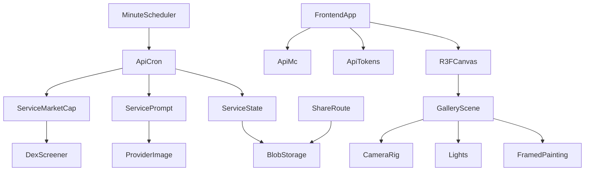
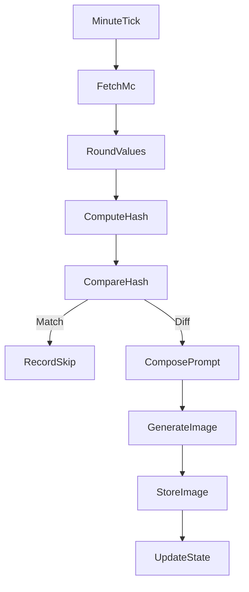
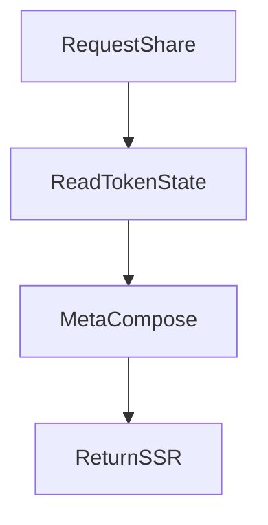
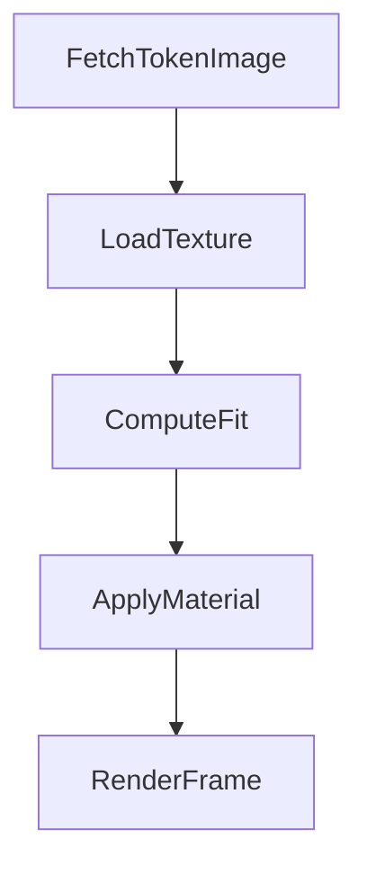
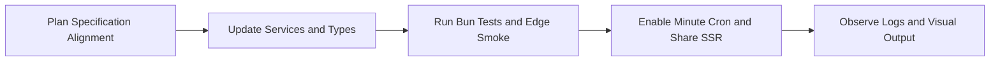

# Technical Design — doom-index

## Overview

DOOM INDEX は、Solana 上の 8 種類の指標トークン（`$CO2 / $ICE / $FOREST / $NUKE / $MACHINE / $PANDEMIC / $FEAR / $HOPE`）の Market Cap を 1 分単位で取得し、その瞬間の世界像を 1 枚の生成絵画として提示するエッジネイティブなアート体験である。本設計書は、要件で定義された差分検出・単一画像生成・収益推計を満たすための技術的アーキテクチャ、コンポーネント設計、データモデル、試験方針を詳細化する。
主対象ユーザーは、美術館的演出を体験するビューワーと、取引誘発による手数料収益を観測したい運営である。Edge Runtime による高速応答と Vercel Blob の軽量ストレージを活用し、1 分あたり 1 枚のみ生成する前提でコスト最小化と再現性を両立させる。

### Goals

- 8 トークンの市場データを minute 粒度で正規化しつつハッシュ化し、変化時のみ生成する
- 生成画像とトークン state を原子的に更新し、全トークンが同一 URL を参照する体験を保証する
- React Three Fiber による暗闇の館内表現、カメラ移動、スポットライトで中央額縁を強調する
- OGP 共有ページが常に最新の生成画像 URL を返すよう SSR で更新する

### Non-Goals

- トークン別の個別画像生成や複数キャンバス表示
- データベース導入、長期履歴参照、複雑なバッチ処理
- Edge 以外のランタイムを常用する Provider SDK の採用

## Architecture

### Existing Architecture Analysis

- Next.js App Router + Vercel Edge を前提とし、API 層は I/O と Result → HTTP の写像に限定する既存方針を踏襲する。
- `lib/` は Dexscreener や Blob に対する薄い防腐層および純関数群を保持し、`services/` に業務ロジックを集中させる構造を維持する。
- 既存コードベースでは `neverthrow.Result` とカスタム logger を使用するため、同じエラー戦略・ロガー API を採用する。
- `.kiro/steering` 下に明示的な steering ドキュメントは現時点で確認できないため、要件および開発要件定義書に基づき、既存構造の原則（Edge、Result、Vercel Blob、シンプル UI）に準拠する。

### High-Level Architecture



**Architecture Integration**

- 既存パターン維持: App Router, Edge Runtime, services 層の Result 戻り、Blob ストレージを継続利用する。
- 新規コンポーネント導入: フロントエンドに `GalleryScene`, `CameraRig`, `Lights`, `FramedPainting` を追加し、React Three Fiber による 3D 体験を構築する。
- 技術整合性: すべての外部コールを `fetch` ベースに揃え、Edge 制約を満たす Provider 限定で運用する。

### Technology Alignment

- Runtime: Next.js App Router（Edge Runtime 固定）
- Scheduling: Vercel Scheduled Function（1 分周期）
- Fetch Layer: `fetch`（Dexscreener / Provider API）＋ `neverthrow` による Result 化
- Storage: Vercel Blob（画像・グローバル state・トークン state・収益スナップショット）
- Client State: React Query（MC の 10 秒リフレッシュ、画像 URL の即時反映）
- Logging: `utils/logger`（info/ debug/ warn/ error）＋ JSON ライクな payload
- Testing: `bun test` / `bun:test` と Bun 組み込みモック

### Key Design Decisions

- **Decision: 丸め済みハッシュによる単一画像生成制御**
  - Context: 無駄な生成を避けつつ、同一入力に対して同一画像を得る必要がある。
  - Alternatives: 変化閾値判定、統計的平滑化、取引イベントトリガー。
  - Selected Approach: 8 トークンの market cap を小数第 4 位で丸めて JSON → SHA256 → `nowHash` とし、`prevHash` と比較して生成/スキップを分岐する。
  - Rationale: 実装が単純で Edge 上でも低コスト、完全決定的な結果を保証できる。
  - Trade-offs: 非常に小さな変化は切り捨てられるが、コストモデル優先のため許容する。

- **Decision: R3F CameraRig による 800ms 補間移動**
  - Context: 中央額縁とダッシュボード間を 800ms 以内で移動し、酔いを避けつつ焦点を誘導したい。
  - Alternatives: instant jump、CSS ベース UI 切替、外部アニメーションライブラリ。
  - Selected Approach: Three.js の `Vector3.lerp` と easeInOutCubic を用いた明示的補間を `useFrame` で実装する。
  - Rationale: 依存を増やさず R3F のフレームループ内で滑らかな遷移を実現できる。
  - Trade-offs: 自前実装のため微細なチューニングが必要だが、制御性が高い。

- **Decision: GLB 額縁 ImageAnchor へ Plane テクスチャ挿入**
  - Context: 生成画像を額縁中央に歪みなくはめ込み、フラットで光学的に自然な表示を行いたい。
  - Alternatives: GLB マテリアル差し替え、`<Html>` 埋め込み、Sprite 表示。
  - Selected Approach: GLB 内 `ImageAnchor` ノードのローカル座標に `PlaneGeometry` を生成し、`useTexture` の sRGB + anisotropy を設定して contain フィットでスケールする。
  - Rationale: 3D 空間内で反射・陰影を保ちつつ差し替えを最小限の負荷で実現できる。
  - Trade-offs: GLB にアンカー命名規約が必要（モデリング段階で取り決め）。

- **Decision: PromptService を 8 指標の影響軸に最適化**
  - Context: トークン種類と対応パラメータが再設計され、旧来の 15 指標モチーフは無効になった。
  - Alternatives: 旧モチーフを残す、Provider 側に委譲する、動的モジュレーションを導入する。
  - Selected Approach: `fogDensity` など新しい生成要素へマッピングし、`buildPrompt` 内で固定テンプレートに埋め込む。
  - Rationale: 仕様通りのビジュアル影響軸を明示し、再現性の高い生成プロンプトを実現する。
  - Trade-offs: トークン追加時は PromptService の再調整が必須。

## System Flows

### Minute Generation Flow



### OGP Share SSR Flow



### GLB Texture Update Flow



## Requirements Traceability

| Requirement | Summary                            | Components                                 | Interfaces / Flows                                         |
| ----------- | ---------------------------------- | ------------------------------------------ | ---------------------------------------------------------- |
| 1           | 8 トークン市場データの取得と正規化 | `MarketCapService`, `lib/dexScreener`      | `getMcMap`, `roundMc4`, `fetchPriceUsdByToken`, `FetchMc`  |
| 2           | 分単位の生成制御と単一画像生成     | `GenerationService`, `CronJob`             | `evaluateMinute`, `MinuteTick`, `CompareHash`              |
| 3           | プロンプト合成と視覚パラメータ決定 | `PromptService`, `ImageProvider`           | `composePrompt`, `generate`, `ComposePrompt`               |
| 4           | 永続化と公開 API                   | `StateService`, `api/*`, `share`           | `putImageEdge`, `GET /api/mc`, `StoreImage`, `UpdateState` |
| 5           | 3D ミュージアムレンダリング UI     | `GalleryScene`, `Lights`, `FramedPainting` | `GLB Texture Update Flow`                                  |
| 6           | インタラクティブ制御とデータ同期   | `CameraRig`, `useMc`, `useTokenImage`      | `GLB Texture Update Flow`, `Minute Generation Flow`        |
| 7           | OGP 更新と共有（SSR）              | `share/[ticker]`                           | `OGP Share SSR Flow`                                       |
| 8           | GLB 額縁への画像はめ込み           | `FramedPainting`                           | `GLB Texture Update Flow`                                  |

## Components and Interfaces

### 共通型とエラー

```typescript
import { Result } from "neverthrow";

export type TokenTicker = "CO2" | "ICE" | "FOREST" | "NUKE" | "MACHINE" | "PANDEMIC" | "FEAR" | "HOPE";

export type McMap = Record<TokenTicker, number>;
export type McMapRounded = Record<TokenTicker, number>;

export type ExternalApiError = {
  type: "ExternalApiError";
  provider: "DexScreener" | "ImageProvider";
  status?: number;
  message: string;
};

export type StorageError = {
  type: "StorageError";
  op: "get" | "put";
  key: string;
  message: string;
};

export type ValidationError = {
  type: "ValidationError";
  message: string;
  details?: unknown;
};

export type InternalError = {
  type: "InternalError";
  message: string;
  cause?: unknown;
};

export type AppError = ExternalApiError | StorageError | ValidationError | InternalError;
```

### Services

#### MarketCapService

- **Primary Responsibility:** Dexscreener から 8 トークンの価格を取得し、market cap を計算・丸めして返却する。
- **Domain Boundary:** Data acquisition / normalization。
- **Data Ownership:** 分間スナップショットとしての `mcMap` と `mcRounded`。
- **Dependencies:** `lib/dexScreener.fetchPriceUsdByToken`、トークン設定定数。

```typescript
export interface MarketCapService {
  getMcMap(): Promise<Result<McMap, AppError>>;
  roundMc4(input: McMap): McMapRounded;
}
```

- **Preconditions:** トークンアドレスと供給量設定が `constants/token.ts` に存在する。
- **Postconditions:** 取得失敗時は該当トークンを 0 として Result.ok を返し続行する。
- **Invariants:** 小数第 4 位で丸めた値のみが後段に渡される。

#### PromptService

- **Primary Responsibility:** 8 トークン指標を反映した決定的プロンプト・視覚パラメータ・ seed を生成する。
- **Domain Boundary:** Prompt composition / visual mapping。
- **Dependencies:** `lib/pure/{normalize, quantize, mapping, prompt, seed, paramsHash}`、最新 `PromptVersion` 取得。

```typescript
export type VisualParams = {
  fogDensity: number;
  skyTint: number;
  reflectivity: number;
  blueBalance: number;
  vegetationDensity: number;
  organicPattern: number;
  radiationGlow: number;
  debrisIntensity: number;
  mechanicalPattern: number;
  metallicRatio: number;
  fractalDensity: number;
  bioluminescence: number;
  shadowDepth: number;
  redHighlight: number;
  lightIntensity: number;
  warmHue: number;
};

export type PromptComposition = {
  pv: PromptVersion;
  seed: string;
  vp: VisualParams;
  prompt: {
    text: string;
    negative: string;
    size: { w: number; h: number };
    format: "webp";
    seed: string;
  };
  paramsHash: string;
};

export interface PromptService {
  composePrompt(input: McMapRounded): Promise<Result<PromptComposition, AppError>>;
}
```

- **Preconditions:** `mcRounded` が 0〜1 に正規化・丸め済み。
- **Postconditions:** 同一入力に対し seed・prompt 文字列・ paramsHash が完全一致する。
- **Invariants:** 出力画像は常に 1024×1024 の webp。

#### ImageProvider

- **Primary Responsibility:** PromptService で構築したリクエストをもとに画像を生成する。
- **Domain Boundary:** 外部 Provider 抽象化。
- **Dependencies:** Runware / Replicate / OpenAI 等の HTTP API。

```typescript
export type ImageRequest = {
  prompt: string;
  negative: string;
  width: number;
  height: number;
  format: "webp";
  seed: string;
};

export type ImageResponse = {
  imageBuffer: ArrayBuffer;
  providerMeta: Record<string, unknown>;
};

export interface ImageProvider {
  name: "runware" | "replicate" | "openai";
  generate(input: ImageRequest): Promise<Result<ImageResponse, AppError>>;
}
```

- **Preconditions:** Provider API が Edge 互換の HTTP fetch で利用可能である。
- **Postconditions:** 成功時は画像バッファとメタデータを返却、失敗時は Result.err。
- **Invariants:** 1 分あたり最大 1 リクエスト。

#### GenerationService

- **Primary Responsibility:** 分単位のハッシュ比較と生成トリガー、 skip 記録を直列で実行する。
- **Domain Boundary:** Minute orchestration。
- **Dependencies:** `MarketCapService`, `PromptService`, `ImageProvider`, `StateService`, ロガー。

```typescript
export type MinuteStatus = "skipped" | "generated";

export type MinuteEvaluation = {
  status: MinuteStatus;
  hash: string;
  roundedMap: McMapRounded;
  imageUrl?: string;
};

export interface GenerationService {
  evaluateMinute(): Promise<Result<MinuteEvaluation, AppError>>;
}
```

- **Preconditions:** `StateService` から `prevHash` が取得可能（無い場合は `null`）。
- **Postconditions:** 生成成功時のみ新しい `prevHash` と `imageUrl` が記録される。
- **Invariants:** 同一分内で `evaluateMinute` は単一回のみ実行され、並列呼び出しは排他（cron 側で担保）。

#### StateService

- **Primary Responsibility:** 画像、グローバル state、トークン state を Blob に保存・取得する。
- **Domain Boundary:** Persistence consistency。

```typescript
export type GlobalState = {
  prevHash: string;
  lastTs: string;
};

export type TokenState = {
  ticker: TokenTicker;
  thumbnailUrl: string;
  updatedAt: string;
};

export interface StateService {
  storeImage(key: string, buf: ArrayBuffer): Promise<Result<string, AppError>>;
  readImage(key: string): Promise<Result<ArrayBuffer | null, AppError>>;
  readGlobalState(): Promise<Result<GlobalState | null, AppError>>;
  writeGlobalState(state: GlobalState): Promise<Result<void, AppError>>;
  writeTokenStates(states: TokenState[]): Promise<Result<void, AppError>>;
}
```

- **Preconditions:** Blob クライアントが Edge 互換。
- **Postconditions:** グローバル state とトークン state の更新は同一トランザクション的順序で行う。
- **Invariants:** 8 トークンの `thumbnailUrl` は常に最新画像 URL で一致する。

### API Layer

- **責務:** HTTP I/O を `services` へ委譲し、Result を HTTP ステータスと JSON に変換する。
- **エンドポイント契約:**

| Method | Path                   | Request | Response                                                              | Errors                           |
| ------ | ---------------------- | ------- | --------------------------------------------------------------------- | -------------------------------- |
| GET    | `/api/mc`              | `none`  | `{ tokens: McMapRounded; generatedAt: string }`                       | `500`（Result.err → fallback 0） |
| GET    | `/api/cron`            | `none`  | `{ ok: true; status: MinuteStatus; hash: string; imageUrl?: string }` | `500` on Result.err              |
| GET    | `/api/tokens/[ticker]` | `none`  | `{ thumbnailUrl: string; updatedAt: string }` or `204`                | `500`                            |

- **SSR `share/[ticker]`:** Blob から最新の `thumbnailUrl` を取得し、OG/Twitter meta に設定（`cache: no-store` 推奨、フォールバック画像を用意）。

### Scheduler

- **Trigger:** Vercel Scheduled Function `cron(*/1 * * * *)`。
- **Input:** なし（`services` 内で API / Blob を呼び出す）。
- **Output:** `MinuteEvaluation` とログ出力。
- **Idempotency:** `StateService` の `prevHash` を比較することで二重実行を防止。
- **Recovery:** Result.err 発生時は `logger.error` で記録し、次分で再試行。

### Frontend Experience

- **Responsibility:** 1 分ゲージ、MC ダッシュボード、最新画像テクスチャの額縁はめ込み、カメラ移動・照明を R3F でレンダリング。
- **Dependencies:** `/api/mc` を 10 秒毎に再フェッチ、`/api/tokens/[ticker]` から画像 URL を更新。
- **State Management:** React Query によるキャッシュとステータス管理、Canvas 内部で Suspense を活用。
- **Navigation:** `CameraRig` による 800ms イージング遷移（`easeInOutCubic`）。
- **Lighting:** `ambientLight 0.05` と `spotLight intensity 3.0, position [0,3.0,-2.0], angle 0.20, penumbra 0.6` を配置、ターゲットを中央額縁へ。
- **GLB Integration:** `useGLTF('/models/frame.glb')` の `ImageAnchor` ノードに `Plane` を配置し、`useTexture(thumbnailUrl)` を sRGB + anisotropy で適用。内寸に対して contain フィット。

## Data Models

### Logical Data Model

| Entity          | Key                     | Attributes                                                   | Notes                                        |
| --------------- | ----------------------- | ------------------------------------------------------------ | -------------------------------------------- |
| `GlobalState`   | Singleton               | `prevHash: string`, `lastTs: string`                         | Blob key `state/global.json`                 |
| `TokenState`    | `ticker`                | `thumbnailUrl: string`, `updatedAt: string`                  | Blob key `state/{ticker}.json`               |
| `ImageAsset`    | Blob key (`images/...`) | Binary webp, metadata from provider                          | 最新のみ常備。履歴は 7 日保持想定。          |
| `PromptVersion` | `id`                    | プロンプトテンプレート、ネガティブプロンプト、視覚設定マップ | 別途 Blob / Git 管理、実行時に読み取り専用。 |

### Data Contracts & Integration

- **Dexscreener:** `GET https://api.dexscreener.com/latest/dex/tokens/{address}` → `pairs` の最大 `liquidity.usd` を選択し `priceUsd` を取得。
- **Image Provider:** Provider ごとに `POST` JSON API（Runware/Replicate/OpenAI）へ `ImageRequest` を送信。レスポンスは base64 もしくはバイナリストリームを想定。
- **Blob Storage:** `put` / `get` API を用い、JSON は UTF-8 文字列で保存。画像は `image/webp` コンテンツタイプ指定。
- **Internal APIs:** JSON UTF-8、Edge Response を返却。Result.err は 500 + `error` JSON を返す。`share/[ticker]` は SSR で最新 `thumbnailUrl` を OGP/Twitter meta に設定。

## Error Handling

### Error Strategy

- `services` は `Result<T, AppError>` を返却し、`app/api` 層で HTTP ステータスに写像する。
- 予期可能な外部 API 失敗は `ExternalApiError` としてロガーへ記録し、フォールバック値（0, null）で処理継続する。
- Blob への書き込み失敗時は生成を中断し `prevHash` を更新しないことで整合性を守る。
- Provider 429 / 5xx には指数バックオフ付きの 1 回リトライ（Edge タイムアウトに収まる 2 秒以内）を導入する。

### Error Categories and Responses

- **外部 API エラー（DexScreener, Provider）:** 429/500 → Result.err、`logger.error` に provider・status・message を記録。
- **ストレージエラー:** Blob write/read 失敗 → Result.err、`StorageError` を返し cron を 500 で終了、次分で再試行。
- **検証エラー:** トークン設定不備や正規化不能 → Result.err（ValidationError）、開発段階で検知しテストを強化。
- **内部エラー:** 予期しない例外 → Result.err（InternalError）、ログに cause を添付。

### Monitoring

- `logger.info` で `generation.skip` / `generation.generated` を出力し、`durationMs`, `hash`, `provider`, `imageUrl`（生成時）を含める。
- `logger.debug` は PromptService の組み立て結果やテクスチャ差し替え、OGP SSR メタ生成結果を記録（開発/検証環境のみ）。
- 将来的に Vercel Analytics や Sentry Edge を接続する余地を残す。

## Testing Strategy

### Unit Tests

- `lib/pure` の正規化・量子化・ハッシュ関数が 8 トークンで決定的に動作することを検証する。
- `MarketCapService.roundMc4` がすべてのトークンで小数第 4 位に丸めること。
- `PromptService.composePrompt` が同一入力で同一 seed/paramsHash を返すこと。
- `GenerationService.evaluateMinute` が `prevHash` の有無でスキップ／生成を分岐し、副作用呼び出し順序を担保すること。
- `share/[ticker]` のメタ生成が `thumbnailUrl` 変化に追随すること（フォールバックを含む）。

### Integration Tests

- `/api/cron` をモック Provider と結合し、生成・スキップ両ケースを通じて Blob 書き込みと state 更新を確認する。
- `/api/mc` が Dexscreener エラー時に 0 フォールバックし HTTP 200 を返すこと。
- フロントエンドが `/api/mc` と `/api/tokens/[ticker]` を組み合わせて 1 分ゲージ更新と画像差し替えを行うこと。
- GLB 額縁の `ImageAnchor` に Plane を生成し、`useTexture` によるテクスチャ更新が 1 フレーム以内に反映されること。

### E2E / UI Tests

- 1 分ゲージが 60,000ms で満了→リセットし、生成完了イベントで即座に画像が更新されること。
- カメラ遷移が 800ms 以内に完了し、遷移中に入力を無視しても破綻しないこと。
- スポットライトが常に中央額縁をターゲットし、`ambient 0.05` / `spot 3.0` の照明条件を満たすこと。
- `/share/[ticker]` が最新画像 URL を OGP/Twitter meta へ反映すること。

### Performance / Load Tests

- `/api/cron` 実行時間が Dexscreener + Provider 呼び出し込みで 1 分周期内（理想 5 秒未満）に収まること。
- Blob 書き込みサイズが 300KB を超えないこと、超過時は warn ログを確認する。
- `/api/mc` への 60rpm アクセスで Edge キャッシュが 100% ヒット、遅延が 200ms 以下であること。

## Security Considerations

- Provider API キーは Edge 環境変数として管理し、クライアントへ露出しない。
- 公開 API は読み取りのみ、書き込みが必要なルートは存在しない。必要に応じて `NextResponse.next()` 前に Origin チェックを追加。
- Blob 鍵は推測困難な名前空間（例: `images/DOOM_{timestamp}_{hash}.webp`）で管理し、一般公開は最新画像のみ。
- SSR `share/[ticker]` はキャッシュを短期化し、メタ生成に外部入力を用いない（XSS を避けるため文字列は固定テンプレートへ埋め込み）。

## Performance & Scalability

- `MarketCapService` は fetch を直列化し待ち時間を最小化する。高頻度アクセスが必要になった場合は並列化＋ `Promise.allSettled` を検討。
- 生成スループットは minute 単位で 1 リクエスト以内に抑えられるため、Provider レート制限には十分余裕がある。
- Blob ストレージは 7 日前の画像を削除する軽量ジョブを後続タスクとして追加可能。
- React Three Fiber のレンダリングは 60fps を維持できるよう、テクスチャ更新のみを差し替え、再マウントを避ける。

## Migration Strategy



- **Plan:** 旧 15 トークン関連のコードとドキュメントを洗い出し、8 トークン仕様への差し替えポイントを特定する。
- **Update:** `constants`, `MarketCapService`, `PromptService`, `GenerationService`, `share/[ticker]`, `tests` を順次更新し、`bun test` を通過させる。
- **Validate:** Edge 環境で `/api/cron` を手動実行し、画像生成と Blob 更新、`share/[ticker]` のメタが最新 URL を返すことを確認する。
- **Enable:** Vercel Scheduled Function を再有効化し、本番トラフィックを流す。初回 24 時間はログ監視を強化する。
- **Observe:** 生成頻度とビジュアル品質、OGP 反映の遅延がないかを監視し、必要に応じてライトやカメラパラメータを微調整する。
