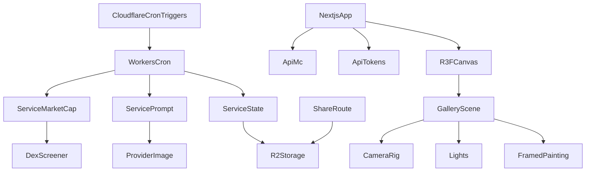
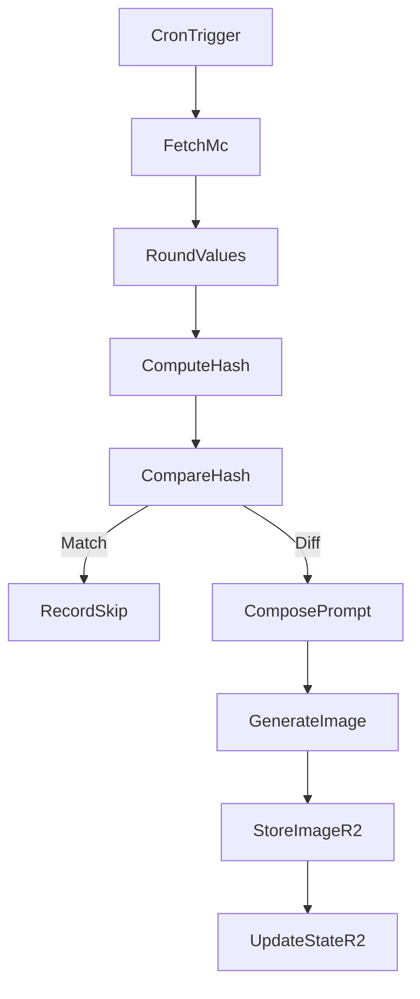
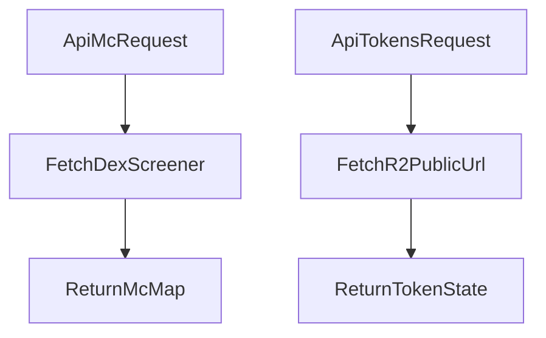
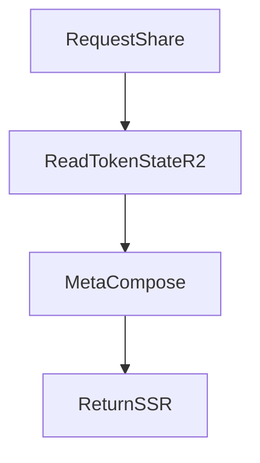
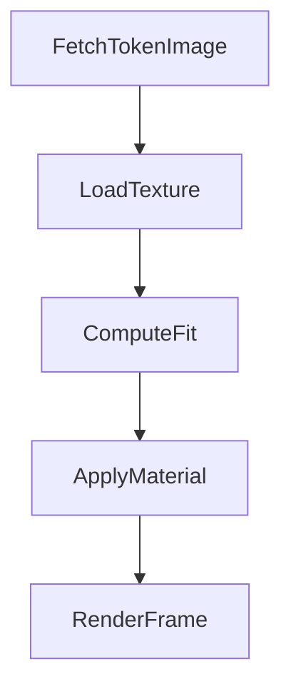
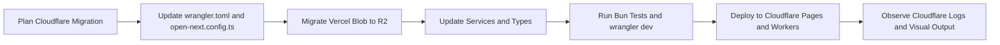

# Technical Design — doom-index

## Overview

DOOM INDEX は、Solana 上の 8 種類の指標トークン（`$CO2 / $ICE / $FOREST / $NUKE / $MACHINE / $PANDEMIC / $FEAR / $HOPE`）の Market Cap を 1 分単位で取得し、その瞬間の世界像を 1 枚の生成絵画として提示する Cloudflare Workers ベースのアート体験である。本設計書は、Cloudflare Workers Cron Triggers、Cloudflare R2、Cloudflare Pages（Next.js with @opennextjs/cloudflare）を活用し、要件で定義された差分検出・単一画像生成・収益推計を満たすための技術的アーキテクチャ、コンポーネント設計、データモデル、試験方針を詳細化する。

主対象ユーザーは、美術館的演出を体験するビューワーと、取引誘発による手数料収益を観測したい運営である。Cloudflare Workers の Cron Triggers による 1 分間隔実行と R2 の軽量ストレージを活用し、1 分あたり 1 枚のみ生成する前提でコスト最小化と再現性を両立させる。

### Goals

- 8 トークンの市場データを minute 粒度で正規化しつつハッシュ化し、変化時のみ生成する
- 生成画像とトークン state を原子的に更新し、全トークンが同一 URL を参照する体験を保証する
- React Three Fiber による暗闇の館内表現、カメラ移動、スポットライトで中央額縁を強調する
- OGP 共有ページが常に最新の生成画像 URL を返すよう SSR で更新する
- Vercel の Cron 制約（1日1回上限）を回避し、Cloudflare Workers で毎分実行を実現する

### Non-Goals

- トークン別の個別画像生成や複数キャンバス表示
- データベース導入、長期履歴参照、複雑なバッチ処理
- Workers 非互換の Provider SDK の採用
- Vercel 固有機能（Vercel Blob、Vercel Scheduled Functions）への依存

## Architecture

### Existing Architecture Analysis

- Next.js App Router を前提とし、API 層は I/O と Result → HTTP の写像に限定する既存方針を踏襲する。
- `lib/` は DexScreener や R2 に対する薄い防腐層および純関数群を保持し、`services/` に業務ロジックを集中させる構造を維持する。
- 既存コードベースでは `neverthrow.Result` とカスタム logger を使用するため、同じエラー戦略・ロガー API を採用する。
- Vercel Blob から Cloudflare R2 への移行、Vercel Scheduled Functions から Cloudflare Workers Cron Triggers への移行が必要。

### High-Level Architecture



**Architecture Integration**

- 既存パターン維持: App Router, services 層の Result 戻り、ストレージを継続利用する。
- 新規コンポーネント導入: フロントエンドに `GalleryScene`, `CameraRig`, `Lights`, `FramedPainting` を追加し、React Three Fiber による 3D 体験を構築する。
- 技術整合性: すべての外部コールを `fetch` ベースに揃え、Workers 制約を満たす Provider 限定で運用する。
- Cloudflare 統合: Workers Cron で書き込み、Next.js API Routes で読み取り専用アクセスを実現する。

### Technology Alignment

- Runtime: Cloudflare Workers（Cron Triggers で 1 分間隔実行）
- Frontend Hosting: Cloudflare Pages（Next.js with @opennextjs/cloudflare）
- Scheduling: Cloudflare Cron Triggers（`wrangler.toml` で `crons = ["* * * * *"]` 定義）
- Fetch Layer: `fetch`（DexScreener / Provider API）＋ `neverthrow` による Result 化
- Storage: Cloudflare R2（画像・グローバル state・トークン state・prompt registry）
- Client State: React Query（MC の 10 秒リフレッシュ、画像 URL の即時反映）
- Logging: `utils/logger`（info/ debug/ warn/ error）＋ JSON ライクな payload（Cloudflare Logs で確認）
- Testing: `bun test` / `bun:test` と Bun 組み込みモック、`wrangler dev` でローカル Workers テスト
- Secrets Management: Cloudflare Workers Secrets（`wrangler secret put`）

### Key Design Decisions

- **Decision: Cloudflare Workers Cron Triggers による 1 分間隔実行**
  - Context: Vercel Scheduled Functions は 1日1回の制約があり、1 分間隔実行が不可能。
  - Alternatives: Vercel Cron（制約あり）、外部 Cron サービス（Upstash Qstash など）、AWS Lambda + EventBridge。
  - Selected Approach: Cloudflare Workers Cron Triggers を使用し、`wrangler.toml` で `crons = ["* * * * *"]` を定義。`workers/cron.ts` の `scheduled` ハンドラで `GenerationService.runMinuteGeneration()` を実行。
  - Rationale: Cloudflare Workers は無料枠で 100,000 リクエスト/日、CPU 時間 10ms/リクエストを提供し、1 分間隔実行に十分。R2 との統合が容易で、レイテンシも低い。
  - Trade-offs: Vercel から Cloudflare への移行コストが発生するが、Cron 制約を回避できる。

- **Decision: Cloudflare R2 による永続化**
  - Context: Vercel Blob は Cloudflare Pages では利用できず、R2 への移行が必要。
  - Alternatives: Cloudflare KV（JSON のみ、画像保存に不向き）、外部 S3（レイテンシ高）、Supabase Storage（追加コスト）。
  - Selected Approach: Cloudflare R2 を使用。Workers 環境では R2 Binding（`env.R2_BUCKET`）、Next.js 環境では公開 URL（`https://your-bucket.r2.dev/...`）経由でアクセス。
  - Rationale: R2 は S3 互換 API で、egress 無料、低レイテンシ、Cloudflare Workers との統合が容易。
  - Trade-offs: Vercel Blob から R2 への移行が必要だが、コスト削減とパフォーマンス向上を実現。

- **Decision: @opennextjs/cloudflare による Next.js デプロイ**
  - Context: Next.js を Cloudflare Pages でホスティングするには、`@opennextjs/cloudflare` アダプターが必要。
  - Alternatives: Cloudflare Pages Functions（手動実装）、Vercel（Cron 制約あり）、AWS Amplify（追加コスト）。
  - Selected Approach: `@opennextjs/cloudflare` を使用し、`opennextjs-cloudflare build` で `.open-next/worker.js` と `.open-next/assets` を生成。`wrangler.toml` で `main = ".open-next/worker.js"`、`compatibility_flags = ["nodejs_compat"]` を設定。
  - Rationale: 公式サポートされたアダプターで、SSR、ISR、Server Actions、Middleware をサポート。`workerd` ランタイムで動作し、Node.js API も利用可能。
  - Trade-offs: Vercel 固有機能（Vercel Analytics、Vercel KV など）は利用不可だが、Cloudflare の代替サービスで対応可能。

- **Decision: 丸め済みハッシュによる単一画像生成制御**
  - Context: 無駄な生成を避けつつ、同一入力に対して同一画像を得る必要がある。
  - Alternatives: 変化閾値判定、統計的平滑化、取引イベントトリガー。
  - Selected Approach: 8 トークンの market cap を小数第 4 位で丸めて JSON → SHA256 → `nowHash` とし、R2 の `state/global.json` の `prevHash` と比較して生成/スキップを分岐する。
  - Rationale: 実装が単純で Workers 上でも低コスト、完全決定的な結果を保証できる。
  - Trade-offs: 非常に小さな変化は切り捨てられるが、コストモデル優先のため許容する。

- **Decision: R3F CameraRig による 800ms 補間移動**
  - Context: 中央額縁とダッシュボード間を 800ms 以内で移動し、酔いを避けつつ焦点を誘導したい。
  - Alternatives: instant jump、CSS ベース UI 切替、外部アニメーションライブラリ。
  - Selected Approach: Three.js の `Vector3.lerp` と easeInOutCubic を用いた明示的補間を `useFrame` で実装する。
  - Rationale: 依存を増やさず R3F のフレームループ内で滑らかな遷移を実現できる。
  - Trade-offs: 自前実装のため微細なチューニングが必要だが、制御性が高い。

- **Decision: GLB 額縁 ImageAnchor へ Plane テクスチャ挿入**
  - Context: 生成画像を額縁中央に歪みなくはめ込み、フラットで光学的に自然な表示を行いたい。
  - Alternatives: GLB マテリアル差し替え、`<Html>` 埋め込み、Sprite 表示。
  - Selected Approach: GLB 内 `ImageAnchor` ノードのローカル座標に `PlaneGeometry` を生成し、`useTexture` の sRGB + anisotropy を設定して contain フィットでスケールする。
  - Rationale: 3D 空間内で反射・陰影を保ちつつ差し替えを最小限の負荷で実現できる。
  - Trade-offs: GLB にアンカー命名規約が必要（モデリング段階で取り決め）。

## System Flows

### Minute Generation Flow (Cloudflare Workers Cron)



### Next.js API Routes Flow (Read-Only)



### OGP Share SSR Flow



### GLB Texture Update Flow



## Requirements Traceability

| Requirement | Summary                                        | Components                                                  | Interfaces / Flows                                                                 |
| ----------- | ---------------------------------------------- | ----------------------------------------------------------- | ---------------------------------------------------------------------------------- |
| 1           | 8 トークン市場データの取得と正規化             | `MarketCapService`, `lib/dexScreener`                       | `getMcMap`, `roundMc4`, `fetchPriceUsdByToken`, `FetchMc`                         |
| 2           | Cloudflare Workers Cron による分単位生成制御   | `GenerationService`, `workers/cron.ts`                      | `runMinuteGeneration`, `CronTrigger`, `CompareHash`                                |
| 3           | プロンプト合成と視覚パラメータ決定             | `PromptService`, `ImageProvider`                            | `composePrompt`, `generate`, `ComposePrompt`                                       |
| 4           | Cloudflare R2 永続化と Next.js API 公開        | `StateService`, `lib/r2`, `app/api/*`, `share`              | `putImageR2`, `GET /api/mc`, `StoreImageR2`, `UpdateStateR2`                       |
| 5           | 3D ミュージアムレンダリング UI                 | `GalleryScene`, `Lights`, `FramedPainting`                  | `GLB Texture Update Flow`                                                          |
| 6           | インタラクティブ制御とデータ同期               | `CameraRig`, `useMc`, `useTokenImage`                       | `GLB Texture Update Flow`, `Minute Generation Flow`                                |
| 7           | OGP 更新と共有（SSR）                          | `share/[ticker]`                                            | `OGP Share SSR Flow`                                                               |
| 8           | GLB 額縁への画像はめ込み                       | `FramedPainting`                                            | `GLB Texture Update Flow`                                                          |
| 9           | Cloudflare Pages デプロイと @opennextjs/cloudflare 統合 | `@opennextjs/cloudflare`, `wrangler.toml`, `open-next.config.ts` | `opennextjs-cloudflare build`, `wrangler deploy`                                   |
| 10          | Cloudflare Workers Secrets 管理                | `wrangler secret put`, `env.PROVIDER_API_KEY`               | `workers/cron.ts` での Secret 取得、`.dev.vars` でのローカル開発                  |

## Components and Interfaces

### 共通型とエラー

```typescript
import { Result } from "neverthrow";

export const TOKEN_TICKERS = ["CO2", "ICE", "FOREST", "NUKE", "MACHINE", "PANDEMIC", "FEAR", "HOPE"] as const;
export type TokenTicker = (typeof TOKEN_TICKERS)[number];

export type McMap = Record<TokenTicker, number>;
export type McMapRounded = Record<TokenTicker, number>;

export type ExternalApiError = {
  type: "ExternalApiError";
  provider: "DexScreener" | "Runware" | "Replicate" | "OpenAI";
  status?: number;
  message: string;
};

export type StorageError = {
  type: "StorageError";
  op: "get" | "put";
  key: string;
  message: string;
};

export type ValidationError = {
  type: "ValidationError";
  message: string;
  details?: unknown;
};

export type InternalError = {
  type: "InternalError";
  message: string;
  cause?: unknown;
};

export type AppError = ExternalApiError | StorageError | ValidationError | InternalError;
```

### Cloudflare Workers

#### workers/cron.ts

**Responsibility & Boundaries**

- **Primary Responsibility**: Cloudflare Cron Triggers で毎分実行され、`GenerationService.runMinuteGeneration()` を呼び出す。
- **Domain Boundary**: Cron orchestration。
- **Data Ownership**: なし（`services` に委譲）。
- **Transaction Boundary**: 1 分あたり 1 回の実行。

**Dependencies**

- **Inbound**: Cloudflare Cron Triggers。
- **Outbound**: `GenerationService`, `R2 Binding (env.R2_BUCKET)`。
- **External**: なし。

**Contract Definition**

```typescript
// workers/cron.ts
export interface Env {
  R2_BUCKET: R2Bucket;
  PROVIDER_API_KEY: string;
}

export default {
  async scheduled(event: ScheduledEvent, env: Env, ctx: ExecutionContext): Promise<void> {
    const startTime = Date.now();
    const result = await runMinuteGeneration(env.R2_BUCKET, env.PROVIDER_API_KEY);
    
    if (result.isErr()) {
      console.error("Cron failed", {
        error: result.error,
        durationMs: Date.now() - startTime,
      });
      return;
    }
    
    console.info("Cron success", {
      status: result.value.status,
      hash: result.value.hash,
      imageUrl: result.value.imageUrl,
      durationMs: Date.now() - startTime,
    });
  },
};
```

- **Preconditions**: `wrangler.toml` で `crons = ["* * * * *"]` が定義されている。R2 Binding と Secrets が設定されている。
- **Postconditions**: 生成成功時は R2 に画像と state が保存される。失敗時はログに記録される。
- **Invariants**: 1 分あたり 1 回のみ実行される。

**State Management**

- Workers は stateless。state は R2 の `state/global.json` に保存される。

### Services

#### MarketCapService

**Responsibility & Boundaries**

- **Primary Responsibility**: DexScreener から 8 トークンの価格を取得し、market cap を計算・丸めして返却する。
- **Domain Boundary**: Data acquisition / normalization。
- **Data Ownership**: 分間スナップショットとしての `mcMap` と `mcRounded`。
- **Transaction Boundary**: なし（純粋な計算）。

**Dependencies**

- **Inbound**: `GenerationService`。
- **Outbound**: `lib/dexScreener.fetchPriceUsdByToken`、トークン設定定数。
- **External**: DexScreener API。

**Contract Definition**

```typescript
export interface MarketCapService {
  getMcMap(): Promise<Result<McMap, AppError>>;
  roundMc4(input: McMap): McMapRounded;
}
```

- **Preconditions**: トークンアドレスと供給量設定が `constants/token.ts` に存在する。
- **Postconditions**: 取得失敗時は該当トークンを 0 として Result.ok を返し続行する。
- **Invariants**: 小数第 4 位で丸めた値のみが後段に渡される。

#### PromptService

**Responsibility & Boundaries**

- **Primary Responsibility**: 8 トークン指標を反映した決定的プロンプト・視覚パラメータ・ seed を生成する。
- **Domain Boundary**: Prompt composition / visual mapping。
- **Data Ownership**: `PromptComposition`（プロンプト、seed、視覚パラメータ、ハッシュ）。
- **Transaction Boundary**: なし（純粋な計算）。

**Dependencies**

- **Inbound**: `GenerationService`。
- **Outbound**: `lib/pure/{normalize, quantize, mapping, prompt, seed, paramsHash}`、R2 から `PromptVersion` 取得。
- **External**: R2（`prompts/registry.json` 読み取り専用）。

**Contract Definition**

```typescript
export type VisualParams = {
  fogDensity: number;
  skyTint: number;
  reflectivity: number;
  blueBalance: number;
  vegetationDensity: number;
  organicPattern: number;
  radiationGlow: number;
  debrisIntensity: number;
  mechanicalPattern: number;
  metallicRatio: number;
  fractalDensity: number;
  bioluminescence: number;
  shadowDepth: number;
  redHighlight: number;
  lightIntensity: number;
  warmHue: number;
};

export type PromptComposition = {
  pv: PromptVersion;
  seed: string;
  vp: VisualParams;
  prompt: {
    text: string;
    negative: string;
    size: { w: number; h: number };
    format: "webp";
    seed: string;
  };
  paramsHash: string;
};

export interface PromptService {
  composePrompt(input: McMapRounded, r2Bucket: R2Bucket): Promise<Result<PromptComposition, AppError>>;
}
```

- **Preconditions**: `mcRounded` が 0〜1 に正規化・丸め済み。
- **Postconditions**: 同一入力に対し seed・prompt 文字列・ paramsHash が完全一致する。
- **Invariants**: 出力画像は常に 1024×1024 の webp。

#### ImageProvider

**Responsibility & Boundaries**

- **Primary Responsibility**: PromptService で構築したリクエストをもとに画像を生成する。
- **Domain Boundary**: 外部 Provider 抽象化。
- **Data Ownership**: なし（外部 API に委譲）。
- **Transaction Boundary**: 1 分あたり最大 1 リクエスト。

**Dependencies**

- **Inbound**: `GenerationService`。
- **Outbound**: Runware / Replicate / OpenAI 等の HTTP API。
- **External**: 画像生成 Provider API。

**External Dependencies Investigation**

- **Runware API**: [https://docs.runware.ai/](https://docs.runware.ai/) を参照。HTTP POST で JSON リクエスト、レスポンスは base64 画像。Workers 互換。
- **Replicate API**: [https://replicate.com/docs/reference/http](https://replicate.com/docs/reference/http) を参照。HTTP POST で JSON リクエスト、レスポンスは画像 URL。Workers 互換。
- **OpenAI DALL-E API**: [https://platform.openai.com/docs/api-reference/images](https://platform.openai.com/docs/api-reference/images) を参照。HTTP POST で JSON リクエスト、レスポンスは画像 URL。Workers 互換。
- **Rate Limits**: Runware（100 req/min）、Replicate（60 req/min）、OpenAI（50 req/min）。1 分あたり 1 リクエストのため問題なし。
- **Authentication**: すべて API Key（Bearer Token）で認証。`env.PROVIDER_API_KEY` から取得。

**Contract Definition**

```typescript
export type ImageRequest = {
  prompt: string;
  negative: string;
  width: number;
  height: number;
  format: "webp";
  seed: string;
};

export type ImageResponse = {
  imageBuffer: ArrayBuffer;
  providerMeta: Record<string, unknown>;
};

export interface ImageProvider {
  name: "runware" | "replicate" | "openai";
  generate(input: ImageRequest, apiKey: string): Promise<Result<ImageResponse, AppError>>;
}
```

- **Preconditions**: Provider API が Workers 互換の HTTP fetch で利用可能である。
- **Postconditions**: 成功時は画像バッファとメタデータを返却、失敗時は Result.err。
- **Invariants**: 1 分あたり最大 1 リクエスト。

#### GenerationService

**Responsibility & Boundaries**

- **Primary Responsibility**: 分単位のハッシュ比較と生成トリガー、 skip 記録を直列で実行する。
- **Domain Boundary**: Minute orchestration。
- **Data Ownership**: `MinuteEvaluation`（生成結果）。
- **Transaction Boundary**: 1 分あたり 1 回の実行。

**Dependencies**

- **Inbound**: `workers/cron.ts`。
- **Outbound**: `MarketCapService`, `PromptService`, `ImageProvider`, `StateService`, ロガー。
- **External**: なし。

**Contract Definition**

```typescript
export type MinuteStatus = "skipped" | "generated";

export type MinuteEvaluation = {
  status: MinuteStatus;
  hash: string;
  roundedMap: McMapRounded;
  imageUrl?: string;
};

export interface GenerationService {
  runMinuteGeneration(r2Bucket: R2Bucket, apiKey: string): Promise<Result<MinuteEvaluation, AppError>>;
}
```

- **Preconditions**: `StateService` から `prevHash` が取得可能（無い場合は `null`）。
- **Postconditions**: 生成成功時のみ新しい `prevHash` と `imageUrl` が R2 に記録される。
- **Invariants**: 同一分内で `runMinuteGeneration` は単一回のみ実行され、並列呼び出しは排他（Cron 側で担保）。

#### StateService

**Responsibility & Boundaries**

- **Primary Responsibility**: 画像、グローバル state、トークン state を R2 に保存・取得する。
- **Domain Boundary**: Persistence consistency。
- **Data Ownership**: R2 の `state/global.json`、`state/{ticker}.json`、`images/{key}.webp`。
- **Transaction Boundary**: R2 の put/get 操作。

**Dependencies**

- **Inbound**: `GenerationService`。
- **Outbound**: `lib/r2`（R2 Binding）。
- **External**: Cloudflare R2。

**Contract Definition**

```typescript
export type GlobalState = {
  prevHash: string;
  lastTs: string;
};

export type TokenState = {
  ticker: TokenTicker;
  thumbnailUrl: string;
  updatedAt: string;
};

export interface StateService {
  storeImage(r2Bucket: R2Bucket, key: string, buf: ArrayBuffer): Promise<Result<string, AppError>>;
  readImage(r2Bucket: R2Bucket, key: string): Promise<Result<ArrayBuffer | null, AppError>>;
  readGlobalState(r2Bucket: R2Bucket): Promise<Result<GlobalState | null, AppError>>;
  writeGlobalState(r2Bucket: R2Bucket, state: GlobalState): Promise<Result<void, AppError>>;
  writeTokenStates(r2Bucket: R2Bucket, states: TokenState[]): Promise<Result<void, AppError>>;
}
```

- **Preconditions**: R2 Binding が Workers 環境で利用可能。
- **Postconditions**: グローバル state とトークン state の更新は同一トランザクション的順序で行う。
- **Invariants**: 8 トークンの `thumbnailUrl` は常に最新画像 URL で一致する。

### Next.js API Layer

**責務**: HTTP I/O を `services` へ委譲し、Result を HTTP ステータスと JSON に変換する。Next.js API Routes は読み取り専用。書き込みは `workers/cron.ts` が担当。

**エンドポイント契約**

| Method | Path                   | Request | Response                                                              | Errors                           |
| ------ | ---------------------- | ------- | --------------------------------------------------------------------- | -------------------------------- |
| GET    | `/api/mc`              | `none`  | `{ tokens: McMapRounded; generatedAt: string }`                       | `500`（Result.err → fallback 0） |
| GET    | `/api/tokens/[ticker]` | `none`  | `{ thumbnailUrl: string; updatedAt: string }` or `204`                | `500`                            |

**SSR `share/[ticker]`**: R2 公開 URL から最新の `thumbnailUrl` を取得し、OG/Twitter meta に設定（`cache: no-store` 推奨、フォールバック画像を用意）。

### Frontend Experience

**Responsibility**: 1 分ゲージ、MC ダッシュボード、最新画像テクスチャの額縁はめ込み、カメラ移動・照明を R3F でレンダリング。

**Dependencies**: `/api/mc` を 10 秒毎に再フェッチ、`/api/tokens/[ticker]` から画像 URL を更新。

**State Management**: React Query によるキャッシュとステータス管理、Canvas 内部で Suspense を活用。

**Navigation**: `CameraRig` による 800ms イージング遷移（`easeInOutCubic`）。

**Lighting**: `ambientLight 0.05` と `spotLight intensity 3.0, position [0,3.0,-2.0], angle 0.20, penumbra 0.6` を配置、ターゲットを中央額縁へ。

**GLB Integration**: `useGLTF('/models/frame.glb')` の `ImageAnchor` ノードに `Plane` を配置し、`useTexture(thumbnailUrl)` を sRGB + anisotropy で適用。内寸に対して contain フィット。

## Data Models

### Logical Data Model

| Entity          | Key                     | Attributes                                                   | Notes                                        |
| --------------- | ----------------------- | ------------------------------------------------------------ | -------------------------------------------- |
| `GlobalState`   | Singleton               | `prevHash: string`, `lastTs: string`                         | R2 key `state/global.json`                   |
| `TokenState`    | `ticker`                | `thumbnailUrl: string`, `updatedAt: string`                  | R2 key `state/{ticker}.json`                 |
| `ImageAsset`    | R2 key (`images/...`)   | Binary webp, metadata from provider                          | 最新のみ常備。履歴は 7 日保持想定。          |
| `PromptVersion` | `id`                    | プロンプトテンプレート、ネガティブプロンプト、視覚設定マップ | 別途 R2 / Git 管理、実行時に読み取り専用。   |

### Data Contracts & Integration

- **DexScreener**: `GET https://api.dexscreener.com/latest/dex/tokens/{address}` → `pairs` の最大 `liquidity.usd` を選択し `priceUsd` を取得。
- **Image Provider**: Provider ごとに `POST` JSON API（Runware/Replicate/OpenAI）へ `ImageRequest` を送信。レスポンスは base64 もしくはバイナリストリームを想定。
- **R2 Storage**: Workers 環境では R2 Binding（`env.R2_BUCKET`）で `put` / `get` API を使用。JSON は UTF-8 文字列で保存。画像は `image/webp` コンテンツタイプ指定。Next.js 環境では公開 URL（`https://your-bucket.r2.dev/...`）経由で `fetch` で取得。
- **Internal APIs**: JSON UTF-8、Next.js Response を返却。Result.err は 500 + `error` JSON を返す。`share/[ticker]` は SSR で最新 `thumbnailUrl` を OGP/Twitter meta に設定。

## Error Handling

### Error Strategy

- `services` は `Result<T, AppError>` を返却し、`workers/cron.ts` と `app/api` 層で HTTP ステータスに写像する。
- 予期可能な外部 API 失敗は `ExternalApiError` としてロガーへ記録し、フォールバック値（0, null）で処理継続する。
- R2 への書き込み失敗時は生成を中断し `prevHash` を更新しないことで整合性を守る。
- Provider 429 / 5xx には指数バックオフ付きの 1 回リトライ（Workers タイムアウトに収まる 2 秒以内）を導入する。

### Error Categories and Responses

- **外部 API エラー（DexScreener, Provider）**: 429/500 → Result.err、`logger.error` に provider・status・message を記録。
- **ストレージエラー**: R2 write/read 失敗 → Result.err、`StorageError` を返し Cron を終了、次分で再試行。
- **検証エラー**: トークン設定不備や正規化不能 → Result.err（ValidationError）、開発段階で検知しテストを強化。
- **内部エラー**: 予期しない例外 → Result.err（InternalError）、ログに cause を添付。

### Monitoring

- `logger.info` で `generation.skip` / `generation.generated` を出力し、`durationMs`, `hash`, `provider`, `imageUrl`（生成時）を含める。
- `logger.debug` は PromptService の組み立て結果やテクスチャ差し替え、OGP SSR メタ生成結果を記録（開発/検証環境のみ）。
- Cloudflare Logs で Workers の実行ログを確認。将来的に Cloudflare Analytics や Sentry を接続する余地を残す。

## Testing Strategy

### Unit Tests

- `lib/pure` の正規化・量子化・ハッシュ関数が 8 トークンで決定的に動作することを検証する。
- `MarketCapService.roundMc4` がすべてのトークンで小数第 4 位に丸めること。
- `PromptService.composePrompt` が同一入力で同一 seed/paramsHash を返すこと。
- `GenerationService.runMinuteGeneration` が `prevHash` の有無でスキップ／生成を分岐し、副作用呼び出し順序を担保すること。
- `share/[ticker]` のメタ生成が `thumbnailUrl` 変化に追随すること（フォールバックを含む）。

### Integration Tests

- `workers/cron.ts` をモック Provider と結合し、生成・スキップ両ケースを通じて R2 書き込みと state 更新を確認する。
- `/api/mc` が DexScreener エラー時に 0 フォールバックし HTTP 200 を返すこと。
- フロントエンドが `/api/mc` と `/api/tokens/[ticker]` を組み合わせて 1 分ゲージ更新と画像差し替えを行うこと。
- GLB 額縁の `ImageAnchor` に Plane を生成し、`useTexture` によるテクスチャ更新が 1 フレーム以内に反映されること。

### E2E / UI Tests

- 1 分ゲージが 60,000ms で満了→リセットし、生成完了イベントで即座に画像が更新されること。
- カメラ遷移が 800ms 以内に完了し、遷移中に入力を無視しても破綻しないこと。
- スポットライトが常に中央額縁をターゲットし、`ambient 0.05` / `spot 3.0` の照明条件を満たすこと。
- `/share/[ticker]` が最新画像 URL を OGP/Twitter meta へ反映すること。

### Workers Local Tests

- `wrangler dev` でローカル Workers を起動し、`workers/cron.ts` の `scheduled` ハンドラを手動実行。
- R2 Binding をローカル R2 エミュレータで代替し、画像保存と state 更新を確認。
- `.dev.vars` でローカル Secrets を設定し、Provider API Key を取得できることを確認。

### Performance / Load Tests

- `workers/cron.ts` 実行時間が DexScreener + Provider 呼び出し込みで 1 分周期内（理想 5 秒未満）に収まること。
- R2 書き込みサイズが 300KB を超えないこと、超過時は warn ログを確認する。
- `/api/mc` への 60rpm アクセスで Cloudflare Pages キャッシュが 100% ヒット、遅延が 200ms 以下であること。

## Security Considerations

- Provider API キーは Cloudflare Workers Secrets（`wrangler secret put PROVIDER_API_KEY`）で管理し、クライアントへ露出しない。
- 公開 API（Next.js）は読み取りのみ、書き込みは `workers/cron.ts` 内部処理の R2 のみ。
- R2 鍵は推測困難な名前空間（例: `images/DOOM_{timestamp}_{hash}.webp`）で管理し、一般公開は最新画像のみ。
- SSR `share/[ticker]` はキャッシュを短期化し、メタ生成に外部入力を用いない（XSS を避けるため文字列は固定テンプレートへ埋め込み）。
- R2 公開 URL は読み取り専用（Custom Domain で CORS 設定可能）。

## Performance & Scalability

- `MarketCapService` は fetch を直列化し待ち時間を最小化する。高頻度アクセスが必要になった場合は並列化＋ `Promise.allSettled` を検討。
- 生成スループットは minute 単位で 1 リクエスト以内に抑えられるため、Provider レート制限には十分余裕がある。
- R2 ストレージは 7 日前の画像を削除する軽量ジョブを後続タスクとして追加可能。
- React Three Fiber のレンダリングは 60fps を維持できるよう、テクスチャ更新のみを差し替え、再マウントを避ける。
- Cloudflare Workers の CPU 制限（無料: 10ms/リクエスト、有料: 30s/リクエスト）を考慮。画像生成は外部 API なので問題なし。

## Migration Strategy



- **Plan**: Vercel Blob、Vercel Scheduled Functions から Cloudflare R2、Cloudflare Workers Cron Triggers への移行計画を策定する。
- **UpdateConfig**: `wrangler.toml` で `crons = ["* * * * *"]`、R2 Binding、Secrets を設定。`open-next.config.ts` で `defineCloudflareConfig()` を定義。
- **MigrateStorage**: Vercel Blob の既存データを R2 に移行（`state/global.json`、`state/{ticker}.json`、`images/*.webp`）。
- **UpdateServices**: `lib/blob.ts` → `lib/r2.ts` に変更。`services` の R2 Binding 対応。`workers/cron.ts` を新規作成。
- **Validate**: `bun test` で既存テストを通過。`wrangler dev` でローカル Workers を起動し、Cron 実行を確認。
- **Deploy**: `opennextjs-cloudflare build` → `wrangler deploy` で Cloudflare Pages と Workers にデプロイ。
- **Observe**: Cloudflare Logs で Cron 実行ログを監視。初回 24 時間はログ監視を強化する。
