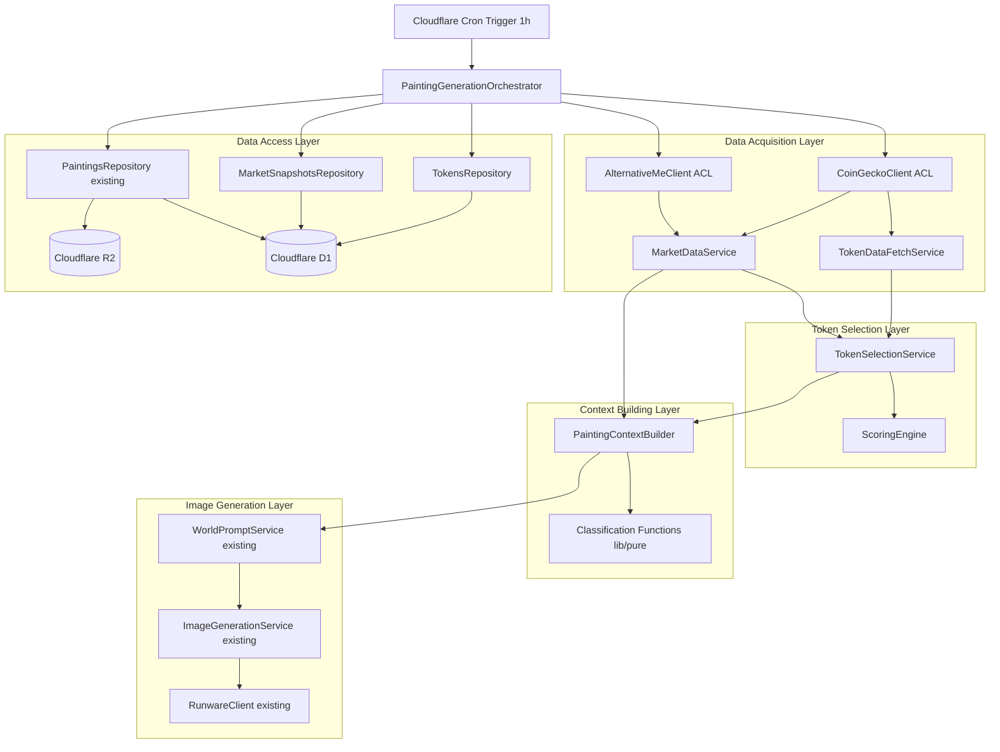
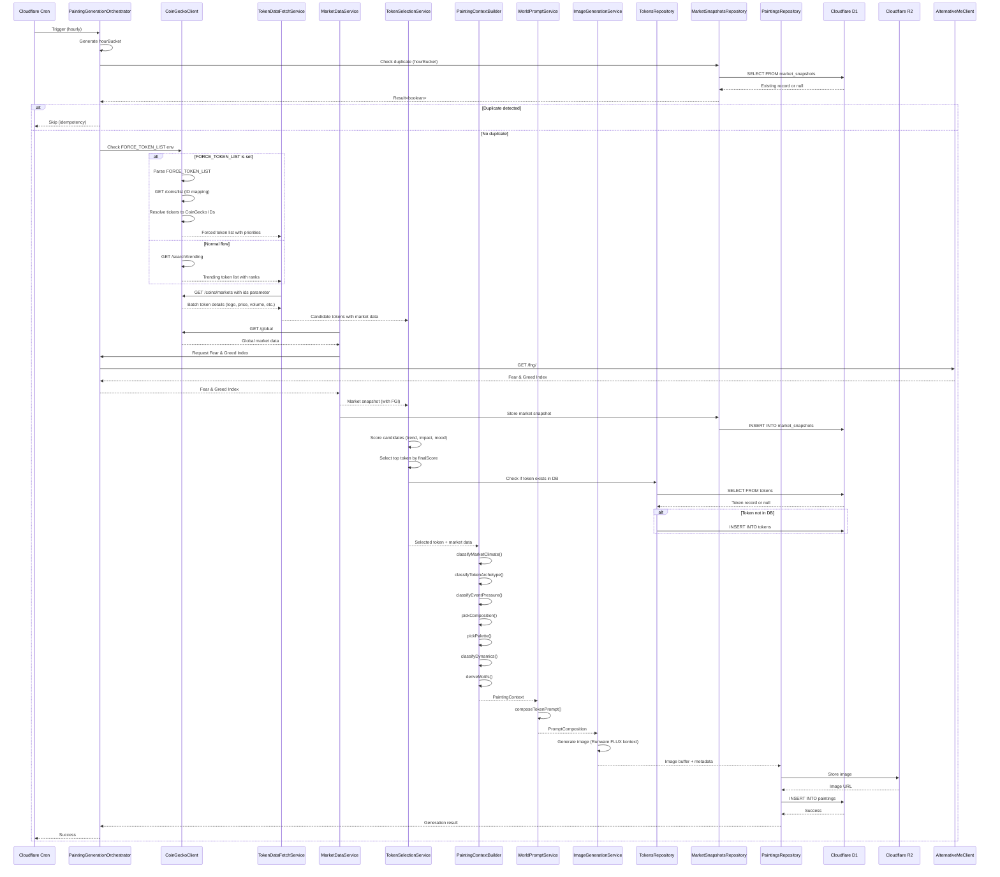
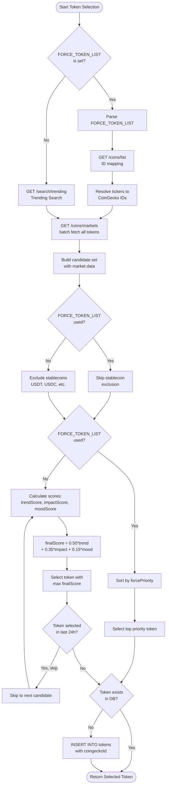
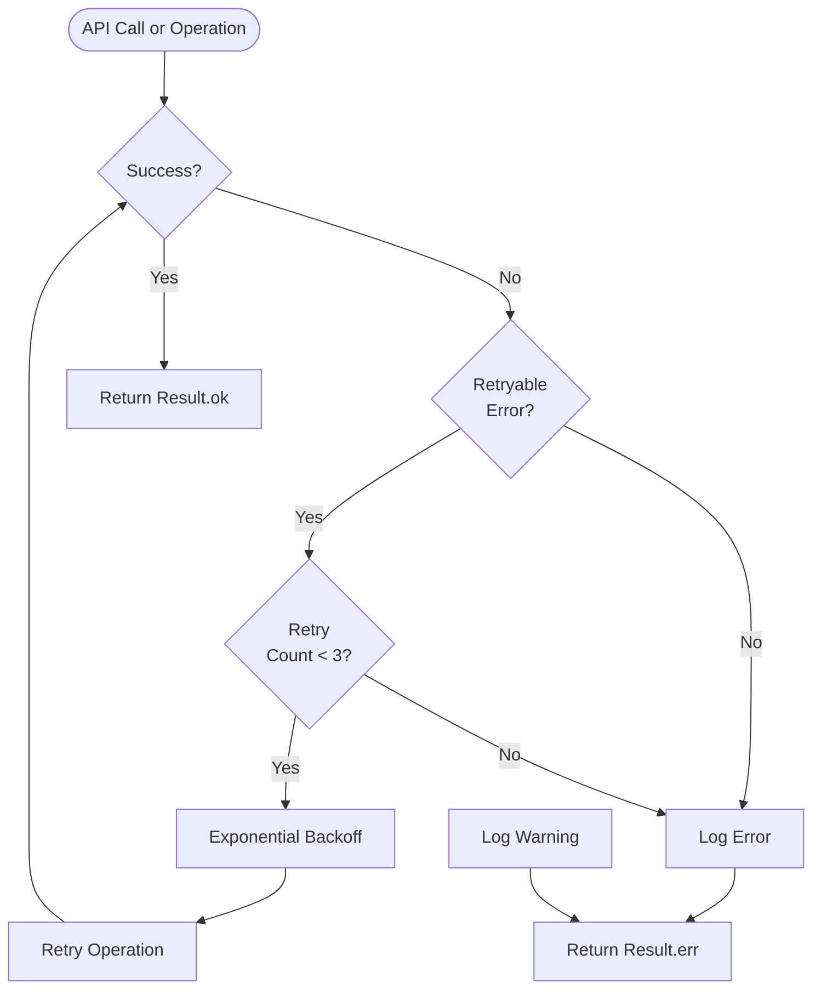

# Technical Design Document

## Overview

**Purpose**: この機能は、CoinGecko Trending Search からユーザー検索ベースのトレンドトークンを取得し（または管理者が環境変数で指定したトークンリストから）、主役トークンを自動選定し、市場データと型安全な分類ロジックを組み合わせて PaintingContext を構築し、dynamic-prompt サービス経由で Runware FLUX kontext に画像生成を依頼する 1 時間ごとのバックエンドパイプラインを提供します。

**Users**: システム管理者と運用エンジニアが、毎時の自律実行により継続的に新作アートをアーカイブへ供給し、後続の UI/OGP で再利用できる信頼できるメタデータを提供します。

**Impact**: 既存の 1 分ごとの生成 cron を削除し、1 時間ごとの生成パイプラインに置き換えます。JSON ファイルベースの state 管理を廃止し、D1 データベースによる構造化されたデータ管理に移行します。既存の `market-cap.ts` サービスを削除し、CoinGecko API による新しいデータ取得フローを確立します。

### Goals

- CoinGecko Trending Search からユーザー検索ベースのトレンドトークンを取得し、「今もっとも話題になれそうなトークン」を選定する
- 管理者が環境変数 `FORCE_TOKEN_LIST` 経由でトークンリストを強制的に上書きできる柔軟性を提供する
- TypeScript の純粋関数で PaintingContext の 10 要素を決定論的かつテスト可能に分類する
- D1 データベースで tokens テーブルと market_snapshots テーブルを管理し、型安全かつクエリ可能なデータ管理を実現する
- 毎時の自律実行と履歴管理により、アートアーカイブへ継続的に新作を供給する

### Non-Goals

- リアルタイムのトークン価格追跡（1 時間ごとのバッチ処理のみ）
- ユーザーインタラクティブなトークン選定 UI（管理者の環境変数設定のみ）
- 複数トークンの同時絵画生成（1 時間に 1 トークンのみ）
- CoinMarketCap API の統合（CoinGecko のみを使用）

## Architecture

### Existing Architecture Analysis

現在のシステムは以下の構造を持っています：

- **1 分ごとの生成 cron**: `src/cron.ts` で毎分トリガされ、DexScreener から市場データを取得し、8 種のインジケータートークンの時価総額をもとに画像を生成
- **JSON ファイルベースの state 管理**: R2 に `state/global.json` と `state/tokens/{ticker}.json` を保存
- **既存の market-cap service**: DexScreener API を使用してトークンの時価総額を取得
- **D1 データベース**: `paintings` テーブルと `tokens` テーブルが既に存在（`tokens` テーブルは既存の dynamic-prompt 用）
- **既存の WorldPromptService**: `composeTokenPrompt()` メソッドで PaintingContext と TokenContext を統合した最終プロンプトを生成

本機能では、以下の変更を行います：

- **1 時間ごとの生成 cron に切り替え**: `wrangler.toml` の cron トリガを `0 * * * *`（毎時 0 分）に変更
- **CoinGecko API への移行**: DexScreener から CoinGecko に切り替え、トレンドトークン選定とグローバル市場データ取得を実現
- **D1 データベースへの移行**: JSON ファイルベースの state 管理を廃止し、`tokens` テーブルと新規 `market_snapshots` テーブルで管理
- **既存の market-cap service を削除**: `src/services/market-cap.ts` を削除し、新しい CoinGecko ベースのデータ取得フローに置き換え

### High-Level Architecture



### Architecture Integration

**Existing patterns preserved**:

- tRPC v11 による型安全 API 通信（既存の tRPC ルーターとの統合）
- neverthrow による Result 型でのエラーハンドリング
- Drizzle ORM による D1 データベースアクセス
- サービス層とリポジトリ層の分離
- 純関数による決定論的分類（`lib/pure/` 配置）

**New components rationale**:

- **CoinGeckoClient ACL**: 公式 TypeScript SDK をラップし、腐敗防止層として外部 API の変更から内部ドメインを保護
- **AlternativeMeClient ACL**: Alternative.me Fear & Greed Index API をラップし、腐敗防止層として外部 API の変更から内部ドメインを保護
- **PaintingGenerationOrchestrator**: 既存の `cron.ts` を置き換え、1 時間ごとの生成フローを統括
- **TokenSelectionService**: トレンドトークンのスコアリングと選定ロジックを集約
- **PaintingContextBuilder**: 市場データとトークンデータから PaintingContext を構築
- **TokensRepository / MarketSnapshotsRepository**: D1 データベースへのアクセスを抽象化

**Technology alignment**:

- Cloudflare Workers Cron Triggers（既存）
- Cloudflare D1 + Drizzle ORM（既存）
- Cloudflare R2（既存）
- CoinGecko TypeScript SDK（新規）
- Alternative.me Fear & Greed Index API（新規、無料）
- TypeScript 5.9 + neverthrow（既存）

**Steering compliance**:

- `structure.md`: 外部統合は `lib/` に配置、純関数は `lib/pure/` に配置、サービス層は `services/` に配置
- `tech.md`: D1 データベース統合、tRPC 型安全 API、neverthrow Result 型、Edge ファースト
- `product.md`: 毎時の自律実行と履歴管理、型安全と結果型で堅牢なエラーハンドリング

### Technology Stack and Design Decisions

**Technology Alignment**:

本機能は既存の技術スタックに完全に統合されます：

- **Runtime**: Cloudflare Workers（既存）
- **Database**: Cloudflare D1 + Drizzle ORM（既存）
- **Storage**: Cloudflare R2（既存）
- **API Communication**: tRPC v11（既存、将来の UI 統合用）
- **Error Handling**: neverthrow Result 型（既存）
- **Type Safety**: TypeScript 5.9（既存）

**New Dependencies**:

- **CoinGecko TypeScript SDK** (`@coingecko/coingecko-typescript`): 公式 SDK を使用して CoinGecko API にアクセス
  - 選定理由: 公式サポート、型安全、自動リトライ、レート制限ハンドリング
  - 代替案: 直接 fetch 呼び出し（型安全性とメンテナンス性で劣る）
- **Alternative.me Fear & Greed Index API**: 無料 API を使用して暗号通貨市場のセンチメント指標を取得
  - 選定理由: 無料、API キー不要、シンプルな REST API
  - 代替案: なし（他の無料センチメント API は存在しない）

**Key Design Decisions**:

**Decision 1: CoinGecko 単一ソースへの統合**

- **Context**: 要件では当初 CoinMarketCap と CoinGecko の両方を使用する予定だったが、CoinMarketCap の無料プランでは Trending API が利用できないことが判明
- **Alternatives**:
  1. CoinMarketCap 有料プランを契約（コスト増加）
  2. CoinGecko のみを使用（シンプル化、コスト削減）
  3. 複数の無料 API を組み合わせ（複雑性増加、信頼性低下）
- **Selected Approach**: CoinGecko のみを使用し、Trending Search API でユーザー検索ベースのトレンドトークンを取得、`/coins/{id}` API でトークン詳細データを取得、`/global` API でグローバル市場データを取得
- **Rationale**: コスト削減とシンプル化を優先し、CoinGecko の豊富なデータと安定した API を活用
- **Trade-offs**: 単一ソースへの依存によるリスク増加（CoinGecko のダウンタイムやレート制限）vs. シンプルさとコスト削減

**Decision 2: 純関数による決定論的分類**

- **Context**: PaintingContext の 10 要素（Market Climate, Token Archetype, Event Pressure など）を決定する必要がある
- **Alternatives**:
  1. LLM による分類（Workers AI を使用、柔軟性高いが非決定論的）
  2. TypeScript の純関数による分類（決定論的、テスト容易、高速）
  3. ルールエンジンライブラリ（複雑性増加、オーバーエンジニアリング）
- **Selected Approach**: TypeScript の純関数で `classifyMarketClimate()`, `classifyTokenArchetype()`, `classifyEventPressure()` などを実装し、`lib/pure/painting-context-classification.ts` に配置
- **Rationale**: テスト容易性、決定論性、パフォーマンスを優先し、LLM の非決定性とコストを回避
- **Trade-offs**: 柔軟性の低下（ルールベースの分類）vs. テスト容易性とパフォーマンス

**Decision 3: D1 による状態管理**

- **Context**: 既存システムは R2 に JSON ファイルで state を保存していたが、クエリ性能とデータ整合性に課題
- **Alternatives**:
  1. JSON ファイルベースの state 管理を継続（既存パターン、クエリ困難）
  2. D1 データベースに移行（型安全、クエリ可能、トランザクション）
  3. KV Namespace を使用（シンプルだが複雑なクエリ不可）
- **Selected Approach**: D1 データベースに `tokens` テーブルと `market_snapshots` テーブルを追加し、Drizzle ORM で型安全にアクセス
- **Rationale**: 型安全性、クエリ性能、データ整合性を優先し、既存の D1 + Drizzle ORM パターンに統合
- **Trade-offs**: マイグレーションコスト vs. 長期的なメンテナンス性とクエリ性能

## System Flows

### Hourly Painting Generation Flow



### Token Selection and Scoring Flow



## Requirements Traceability

| Requirement | Summary                                                      | Components                                                  | Interfaces                                                 | Flows                  |
| ----------- | ------------------------------------------------------------ | ----------------------------------------------------------- | ---------------------------------------------------------- | ---------------------- |
| 1A          | CoinGecko Trending Search Intake                             | CoinGeckoClient, TokenDataFetchService                      | `GET /search/trending`                                     | Hourly Generation Flow |
| 1B          | 管理者による候補トークンリストの強制上書き                   | CoinGeckoClient, TokenSelectionService                      | `FORCE_TOKEN_LIST` env var, `GET /coins/list`              | Token Selection Flow   |
| 1C          | CoinGecko ID から詳細トークンデータの取得                    | CoinGeckoClient, TokenDataFetchService                      | `GET /coins/markets`                                       | Hourly Generation Flow |
| 1D          | CoinGecko Trending Search からの候補集合の構築とスコアリング | TokenSelectionService, ScoringEngine                        | `TokenCandidate`, `TokenScore`                             | Token Selection Flow   |
| 2           | 主役トークンの市場データ取得                                 | TokenDataFetchService, MarketDataService                    | `TokenSnapshot`                                            | Hourly Generation Flow |
| 3           | グローバル市場データ取得                                     | MarketDataService, AlternativeMeClient                      | `GET /global`, `GET /fng/`, `MarketSnapshot`               | Hourly Generation Flow |
| 4           | トークンメタ情報の管理と取得                                 | TokensRepository                                            | `tokens` table, Drizzle ORM                                | Hourly Generation Flow |
| 5           | PaintingContext の構築                                       | PaintingContextBuilder, Classification Functions            | `PaintingContext`, pure functions                          | Hourly Generation Flow |
| 6           | dynamic-prompt によるプロンプト生成                          | WorldPromptService (existing)                               | `composeTokenPrompt()`                                     | Hourly Generation Flow |
| 7           | Runware FLUX kontext による画像生成                          | ImageGenerationService (existing), RunwareClient (existing) | `generate()`, `referenceImageUrl`                          | Hourly Generation Flow |
| 8           | D1 データベーススキーマ設計                                  | TokensRepository, MarketSnapshotsRepository                 | `tokens` table, `market_snapshots` table                   | Data Models            |
| 9           | トークン情報と市場スナップショットの永続化                   | TokensRepository, MarketSnapshotsRepository                 | `insert()`, `update()`                                     | Hourly Generation Flow |
| 10          | 冪等性とエラーハンドリング                                   | PaintingGenerationOrchestrator                              | `Result<T, AppError>`, hourBucket check                    | Hourly Generation Flow |
| 11          | セキュリティと環境変数管理                                   | CoinGeckoClient, ImageGenerationService                     | `COINGECKO_API_KEY`, `RUNWARE_API_KEY`, `FORCE_TOKEN_LIST` | All flows              |
| 12          | ロギングと可観測性                                           | All services                                                | `logger.info()`, `logger.error()`, `logger.debug()`        | All flows              |

## Components and Interfaces

### Data Acquisition Layer

#### AlternativeMeClient (Anti-Corruption Layer)

**Responsibility & Boundaries**

- **Primary Responsibility**: Alternative.me Fear & Greed Index API をラップし、外部 API の変更から内部ドメインを保護する腐敗防止層として機能
- **Domain Boundary**: 外部統合層（`lib/alternative-me-client.ts`）
- **Data Ownership**: Alternative.me API レスポンスの変換と正規化
- **Transaction Boundary**: 単一 API 呼び出しごと（トランザクションなし）

**Dependencies**

- **Inbound**: MarketDataService
- **Outbound**: Alternative.me API (https://api.alternative.me/fng/)
- **External**: Alternative.me Fear & Greed Index API

**External Dependencies Investigation**

Alternative.me Fear & Greed Index API を調査しました：

- **Authentication**: API キー不要（完全無料）
- **Rate Limits**: 明示的な制限なし（常識的な範囲での使用を推奨）
- **Response Format**: JSON 形式で `{ data: [{ value: string, value_classification: string, timestamp: string }] }` を返却
- **Data Attribution**: データの表示箇所において Alternative.me からのデータであることを明示する必要あり
- **Commercial Use**: 商用利用可能（適切な帰属表示が必要）

**Contract Definition**

**Service Interface**:

```typescript
interface AlternativeMeClient {
  // Get latest Fear & Greed Index (Requirement 3)
  getFearGreedIndex(): Result<FearGreedIndexResponse, AppError>;
}

type FearGreedIndexResponse = {
  value: number; // 0-100
  valueClassification: "Extreme Fear" | "Fear" | "Neutral" | "Greed" | "Extreme Greed";
  timestamp: number; // Unix epoch seconds
};
```

- **Preconditions**: なし（API キー不要）
- **Postconditions**: Alternative.me API レスポンスを内部ドメイン型に変換し、`Result<FearGreedIndexResponse, AppError>` で返却
- **Invariants**: API 呼び出しが失敗した場合はエラーログを記録し、`Result.err<AppError>` を返却

**Integration Strategy**

- **Modification Approach**: 新規作成（`lib/alternative-me-client.ts`）
- **Backward Compatibility**: 既存コードへの影響なし（新規統合）
- **Migration Path**: なし（新規統合）

#### CoinGeckoClient (Anti-Corruption Layer)

**Responsibility & Boundaries**

- **Primary Responsibility**: CoinGecko TypeScript SDK をラップし、外部 API の変更から内部ドメインを保護する腐敗防止層として機能
- **Domain Boundary**: 外部統合層（`lib/coingecko-client.ts`）
- **Data Ownership**: CoinGecko API レスポンスの変換と正規化
- **Transaction Boundary**: 単一 API 呼び出しごと（トランザクションなし）

**Dependencies**

- **Inbound**: TokenDataFetchService, MarketDataService
- **Outbound**: `@coingecko/coingecko-typescript` SDK
- **External**: CoinGecko API (https://api.coingecko.com/api/v3)

**External Dependencies Investigation**

CoinGecko TypeScript SDK の公式ドキュメントとリポジトリ（https://github.com/coingecko/coingecko-typescript）を調査しました：

- **Authentication**: API キーは `x-cg-demo-api-key` ヘッダーまたは `x-cg-pro-api-key` ヘッダーで渡す（Demo API はレート制限あり）
- **Rate Limits**: Demo API は 10-30 calls/minute、Pro API は 500 calls/minute
- **Error Handling**: HTTP ステータスコードとエラーメッセージを返す
- **Version Compatibility**: TypeScript >= 4.9、Node.js 20 LTS、Cloudflare Workers 対応

**Contract Definition**

**Service Interface**:

```typescript
interface CoinGeckoClient {
  // Trending Search List (Requirement 1A)
  getTrendingSearch(): Result<TrendingSearchResponse, AppError>;

  // Coins List for ID mapping (Requirement 1B)
  getCoinsList(): Result<CoinsListResponse, AppError>;

  // Coins Markets - Batch fetch multiple coins with market data (Requirement 1C)
  getCoinsMarkets(ids: string[], options?: CoinsMarketsOptions): Result<CoinsMarketsResponse, AppError>;

  // Global Market Data (Requirement 3)
  getGlobalMarketData(): Result<GlobalMarketDataResponse, AppError>;
}

type TrendingSearchResponse = {
  coins: Array<{
    item: {
      id: string;
      symbol: string;
      name: string;
      market_cap_rank: number;
    };
  }>;
};

type CoinsListResponse = Array<{
  id: string;
  symbol: string;
  name: string;
}>;

type CoinsMarketsOptions = {
  vs_currency?: string; // default: "usd"
  order?: string; // default: "market_cap_desc"
  per_page?: number; // default: 100, max: 250
  page?: number; // default: 1
  sparkline?: boolean; // default: false
  price_change_percentage?: string; // e.g., "1h,24h,7d"
};

type CoinsMarketsResponse = Array<{
  id: string;
  symbol: string;
  name: string;
  image: string;
  current_price: number;
  market_cap: number;
  market_cap_rank: number;
  total_volume: number;
  high_24h: number;
  low_24h: number;
  price_change_24h: number;
  price_change_percentage_24h: number;
  market_cap_change_24h: number;
  market_cap_change_percentage_24h: number;
  circulating_supply: number;
  total_supply: number | null;
  max_supply: number | null;
  ath: number;
  ath_change_percentage: number;
  ath_date: string;
  atl: number;
  atl_change_percentage: number;
  atl_date: string;
  last_updated: string;
}>;

type GlobalMarketDataResponse = {
  data: {
    total_market_cap: { usd: number };
    total_volume: { usd: number };
    market_cap_change_percentage_24h_usd: number;
    market_cap_percentage: {
      btc: number;
      eth: number;
    };
    active_cryptocurrencies: number;
    markets: number;
    updated_at: number;
  };
};
```

- **Preconditions**: `COINGECKO_API_KEY` 環境変数が設定されている（オプション、Demo API の場合は不要）
- **Postconditions**: CoinGecko API レスポンスを内部ドメイン型に変換し、`Result<T, AppError>` で返却
- **Invariants**: API 呼び出しが失敗した場合はエラーログを記録し、`Result.err<AppError>` を返却

**Integration Strategy**

- **Modification Approach**: 新規作成（`lib/coingecko-client.ts`）
- **Backward Compatibility**: 既存の `market-cap.ts` サービスを削除し、CoinGecko ベースのデータ取得に完全移行
- **Migration Path**: 既存の DexScreener ベースのフローを CoinGecko ベースのフローに置き換え

#### TokenDataFetchService

**Responsibility & Boundaries**

- **Primary Responsibility**: CoinGeckoClient を使用してトークンの詳細データ（メタデータと市場データ）を取得し、候補集合を構築
- **Domain Boundary**: データ取得層（`services/paintings/token-data-fetch.ts`）
- **Data Ownership**: トークン候補集合（`TokenCandidate[]`）
- **Transaction Boundary**: 単一 API 呼び出しで複数トークンを取得

**Dependencies**

- **Inbound**: TokenSelectionService
- **Outbound**: CoinGeckoClient
- **External**: なし

**Contract Definition**

**Service Interface**:

```typescript
interface TokenDataFetchService {
  // Fetch token details for a list of CoinGecko IDs (Requirement 1C)
  // Uses /coins/markets endpoint to fetch multiple tokens in a single request
  fetchTokenDetails(ids: string[]): Promise<Result<TokenCandidate[], AppError>>;
}

type TokenCandidate = {
  id: string;
  symbol: string;
  name: string;
  logoUrl: string | null;
  priceUsd: number;
  priceChange24h: number;
  priceChange7d: number;
  volume24hUsd: number;
  marketCapUsd: number;
  categories: string[];
  source: "coingecko-trending-search" | "force-override";
  trendingRankCgSearch?: number;
  forcePriority?: number;
};
```

- **Preconditions**: CoinGecko ID のリストが提供される（最大 250 件）
- **Postconditions**: `/coins/markets` エンドポイントを使用して、1 回のリクエストで複数トークンの詳細データを取得し、`TokenCandidate[]` として返却
- **Invariants**: API 呼び出しが失敗した場合はエラーログを記録し、`Result.err<AppError>` を返却

#### MarketDataService

**Responsibility & Boundaries**

- **Primary Responsibility**: CoinGeckoClient を使用してグローバル市場データを取得し、`MarketSnapshot` を構築
- **Domain Boundary**: データ取得層（`services/paintings/market-data.ts`）
- **Data Ownership**: グローバル市場スナップショット（`MarketSnapshot`）
- **Transaction Boundary**: 単一 API 呼び出しごと

**Dependencies**

- **Inbound**: PaintingGenerationOrchestrator, TokenSelectionService, PaintingContextBuilder
- **Outbound**: CoinGeckoClient, AlternativeMeClient, MarketSnapshotsRepository
- **External**: なし

**Contract Definition**

**Service Interface**:

```typescript
interface MarketDataService {
  // Fetch global market data (Requirement 3)
  fetchGlobalMarketData(): Promise<Result<MarketSnapshot, AppError>>;

  // Store market snapshot to D1 (Requirement 9)
  storeMarketSnapshot(snapshot: MarketSnapshot, hourBucket: string): Promise<Result<void, AppError>>;
}

type MarketSnapshot = {
  totalMarketCapUsd: number;
  totalVolumeUsd: number;
  marketCapChangePercentage24hUsd: number;
  btcDominance: number;
  ethDominance: number;
  activeCryptocurrencies: number;
  markets: number;
  fearGreedIndex: number | null; // 0-100, from Alternative.me
  updatedAt: number; // Unix epoch seconds from CoinGecko
};
```

- **Preconditions**: CoinGeckoClient と AlternativeMeClient が初期化されている
- **Postconditions**: グローバル市場データと Fear & Greed Index を取得し、`MarketSnapshot` として返却（Fear & Greed Index の取得に失敗した場合は `null` を設定）
- **Invariants**: CoinGecko API 呼び出しが失敗した場合はエラーログを記録し、`Result.err<AppError>` を返却。Alternative.me API 呼び出しが失敗した場合は警告ログを記録して `fearGreedIndex: null` を設定し、処理を継続

### Token Selection Layer

#### TokenSelectionService

**Responsibility & Boundaries**

- **Primary Responsibility**: トレンドトークンの候補集合から主役トークンを選定し、スコアリングロジックを適用
- **Domain Boundary**: ビジネスロジック層（`services/paintings/token-selection.ts`）
- **Data Ownership**: 選定されたトークン（`SelectedToken`）
- **Transaction Boundary**: 単一選定プロセスごと

**Dependencies**

- **Inbound**: PaintingGenerationOrchestrator
- **Outbound**: TokenDataFetchService, MarketDataService, ScoringEngine, TokensRepository
- **External**: なし

**Contract Definition**

**Service Interface**:

```typescript
interface TokenSelectionService {
  // Select top token from candidates (Requirement 1D)
  selectToken(options: TokenSelectionOptions): Promise<Result<SelectedToken, AppError>>;
}

type TokenSelectionOptions = {
  forceTokenList?: string; // FORCE_TOKEN_LIST env var
  excludeRecentlySelected?: boolean; // Default: true
  recentSelectionWindowHours?: number; // Default: 24
};

type SelectedToken = {
  id: string;
  symbol: string;
  name: string;
  logoUrl: string | null;
  priceUsd: number;
  priceChange24h: number;
  priceChange7d: number;
  volume24hUsd: number;
  marketCapUsd: number;
  categories: string[];
  source: "coingecko-trending-search" | "force-override";
  scores: {
    trend: number;
    impact: number;
    mood: number;
    final: number;
  };
};
```

- **Preconditions**: `FORCE_TOKEN_LIST` 環境変数が設定されている場合は、カンマ区切りのティッカーまたは CoinGecko ID 文字列
- **Postconditions**: 最高スコアのトークンを選定し、`SelectedToken` として返却（強制リストの場合は最優先トークンを返却）
- **Invariants**: 強制リストが使用されている場合は、重複選出チェックとステーブルコイン除外をスキップ

**State Management**

- **State Model**: 選定されたトークンは D1 の `tokens` テーブルに保存され、`updatedAt` フィールドで最終選出時刻を記録
- **Persistence**: D1 データベース（`tokens` テーブル）
- **Concurrency**: 単一 Worker インスタンスで実行されるため、並行性制御は不要

#### ScoringEngine

**Responsibility & Boundaries**

- **Primary Responsibility**: トークン候補のスコアリングロジックを実装し、`trendScore`, `impactScore`, `moodScore`, `finalScore` を計算
- **Domain Boundary**: ビジネスロジック層（`services/paintings/scoring-engine.ts`）
- **Data Ownership**: トークンスコア（`TokenScore`）
- **Transaction Boundary**: 単一候補ごと

**Dependencies**

- **Inbound**: TokenSelectionService
- **Outbound**: なし（純粋関数）
- **External**: なし

**Contract Definition**

**Service Interface**:

```typescript
interface ScoringEngine {
  // Calculate trend score (Requirement 1D)
  calculateTrendScore(candidate: TokenCandidate): number;

  // Calculate impact score (Requirement 1D)
  calculateImpactScore(candidate: TokenCandidate): number;

  // Calculate mood score (Requirement 1D)
  calculateMoodScore(candidate: TokenCandidate, marketClimate: MarketClimate): number;

  // Calculate final score (Requirement 1D)
  calculateFinalScore(scores: { trend: number; impact: number; mood: number }): number;
}

type TokenScore = {
  trend: number; // 0-1
  impact: number; // 0-1
  mood: number; // 0-1
  final: number; // 0-1
};
```

- **Preconditions**: `TokenCandidate` と `MarketSnapshot` が提供される
- **Postconditions**: 各スコアを 0〜1 に正規化し、`finalScore = 0.50 * trend + 0.35 * impact + 0.15 * mood` で計算
- **Invariants**: すべてのスコアは 0〜1 の範囲内

### Context Building Layer

#### PaintingContextBuilder

**Responsibility & Boundaries**

- **Primary Responsibility**: 選定されたトークンと市場データから `PaintingContext` を構築し、分類関数を適用
- **Domain Boundary**: ビジネスロジック層（`services/paintings/painting-context-builder.ts`）
- **Data Ownership**: `PaintingContext` オブジェクト
- **Transaction Boundary**: 単一コンテキスト構築ごと

**Dependencies**

- **Inbound**: PaintingGenerationOrchestrator
- **Outbound**: Classification Functions (`lib/pure/painting-context-classification.ts`), TokensRepository
- **External**: なし

**Contract Definition**

**Service Interface**:

```typescript
interface PaintingContextBuilder {
  // Build PaintingContext from selected token and market data (Requirement 5)
  buildContext(input: PaintingContextInput): Promise<Result<PaintingContext, AppError>>;
}

type PaintingContextInput = {
  selectedToken: SelectedToken;
  marketSnapshot: MarketSnapshot;
};

// PaintingContext is defined in src/types/painting-context.ts (existing)
```

- **Preconditions**: `SelectedToken` と `MarketSnapshot` が提供される
- **Postconditions**: `PaintingContext` を構築し、すべての 10 要素（Market Climate, Token Archetype, Event Pressure, Composition, Palette, Dynamics, Motifs, Narrative Hints, Token Info, Market Snapshot, Token Snapshot）を決定
- **Invariants**: すべての分類関数は決定論的で、同じ入力に対して同じ出力を返す

#### Classification Functions (lib/pure)

**Responsibility & Boundaries**

- **Primary Responsibility**: 市場データとトークンデータから PaintingContext の各要素を決定論的に分類する純粋関数群
- **Domain Boundary**: 純関数層（`lib/pure/painting-context-classification.ts`）
- **Data Ownership**: なし（純粋関数）
- **Transaction Boundary**: なし（純粋関数）

**Dependencies**

- **Inbound**: PaintingContextBuilder
- **Outbound**: なし
- **External**: なし

**Contract Definition**

**Service Interface**:

```typescript
// Market Climate classification (Requirement 5)
function classifyMarketClimate(snapshot: MarketSnapshot): MarketClimate;

// Token Archetype classification (Requirement 5)
function classifyTokenArchetype(token: SelectedToken, categories: string[]): TokenArchetype;

// Event Pressure classification (Requirement 5)
function classifyEventPressure(token: SelectedToken): { k: EventKind; i: EventIntensity };

// Composition selection (Requirement 5)
function pickComposition(
  climate: MarketClimate,
  archetype: TokenArchetype,
  event: { k: EventKind; i: EventIntensity },
): Composition;

// Palette selection (Requirement 5)
function pickPalette(
  climate: MarketClimate,
  archetype: TokenArchetype,
  event: { k: EventKind; i: EventIntensity },
): Palette;

// Dynamics classification (Requirement 5)
function classifyDynamics(token: SelectedToken): { dir: TrendDirection; vol: VolatilityLevel };

// Motifs derivation (Requirement 5)
function deriveMotifs(archetype: TokenArchetype): MotifTag[];

// Narrative Hints derivation (Requirement 5)
function deriveNarrativeHints(climate: MarketClimate, event: { k: EventKind; i: EventIntensity }): string[];
```

- **Preconditions**: すべての入力パラメータが有効な値である
- **Postconditions**: 決定論的に分類結果を返却（同じ入力に対して同じ出力）
- **Invariants**: 副作用なし、外部状態に依存しない

### Image Generation Layer

#### WorldPromptService (existing)

**Responsibility & Boundaries**

- **Primary Responsibility**: `PaintingContext` と `TokenContext` を統合した最終プロンプトを生成（既存サービスを再利用）
- **Domain Boundary**: ビジネスロジック層（`services/world-prompt-service.ts`、既存）
- **Data Ownership**: `PromptComposition` オブジェクト
- **Transaction Boundary**: 単一プロンプト生成ごと

**Dependencies**

- **Inbound**: PaintingGenerationOrchestrator
- **Outbound**: TokenContextService (existing), WorkersAiClient (existing)
- **External**: Cloudflare Workers AI

**Contract Definition**

既存の `WorldPromptService.composeTokenPrompt()` メソッドを使用します（`src/services/world-prompt-service.ts` 参照）。

**Integration Strategy**

- **Modification Approach**: 既存サービスをそのまま使用（変更不要）
- **Backward Compatibility**: 既存の `composeTokenPrompt()` メソッドは `PaintingContext` と `TokenContext` を受け取り、最終プロンプトを生成
- **Migration Path**: なし（既存サービスを再利用）

#### ImageGenerationService (existing)

**Responsibility & Boundaries**

- **Primary Responsibility**: Runware FLUX kontext を使用して画像を生成（既存サービスを再利用）
- **Domain Boundary**: ビジネスロジック層（`services/image-generation.ts`、既存）
- **Data Ownership**: `ImageGenerationResult` オブジェクト
- **Transaction Boundary**: 単一画像生成ごと

**Dependencies**

- **Inbound**: PaintingGenerationOrchestrator
- **Outbound**: WorldPromptService (existing), ImageProvider (existing), RunwareClient (existing)
- **External**: Runware API

**Contract Definition**

既存の `ImageGenerationService.generateImage()` メソッドを使用します（`src/services/image-generation.ts` 参照）。

**Integration Strategy**

- **Modification Approach**: 既存サービスを拡張し、`referenceImageUrl` パラメータを追加
- **Backward Compatibility**: 既存の `generateImage()` メソッドは `McMapRounded` を受け取るが、新しいフローでは `PaintingContext` と `referenceImageUrl` を受け取る新しいメソッド `generateTokenImage()` を追加
- **Migration Path**: 既存の `generateImage()` メソッドは維持し、新しい `generateTokenImage()` メソッドを追加

#### RunwareClient (existing)

**Responsibility & Boundaries**

- **Primary Responsibility**: Runware API を呼び出して画像を生成（既存クライアントを再利用）
- **Domain Boundary**: 外部統合層（`lib/runware-client.ts`、既存）
- **Data Ownership**: Runware API レスポンス
- **Transaction Boundary**: 単一 API 呼び出しごと

**Dependencies**

- **Inbound**: ImageGenerationService
- **Outbound**: Runware API (https://api.runware.ai/v1)
- **External**: Runware API

**Contract Definition**

既存の `RunwareClient.requestImages()` メソッドを使用します（`src/lib/runware-client.ts` 参照）。

**Integration Strategy**

- **Modification Approach**: 既存クライアントをそのまま使用（`referenceImageUrl` パラメータは既にサポート済み）
- **Backward Compatibility**: 既存の `requestImages()` メソッドは `referenceImageUrl` パラメータをサポート
- **Migration Path**: なし（既存クライアントを再利用）

### Data Access Layer

#### TokensRepository

**Responsibility & Boundaries**

- **Primary Responsibility**: D1 の `tokens` テーブルへのアクセスを抽象化し、トークンメタ情報の CRUD 操作を提供
- **Domain Boundary**: データアクセス層（`repositories/tokens-repository.ts`）
- **Data Ownership**: `tokens` テーブルのレコード
- **Transaction Boundary**: 単一トークンごと

**Dependencies**

- **Inbound**: TokenSelectionService, PaintingContextBuilder
- **Outbound**: Cloudflare D1 (via Drizzle ORM)
- **External**: なし

**Contract Definition**

**Service Interface**:

```typescript
interface TokensRepository {
  // Find token by CoinGecko ID (Requirement 4)
  findById(id: string): Promise<Result<Token | null, AppError>>;

  // Insert new token (Requirement 9)
  insert(token: NewToken): Promise<Result<void, AppError>>;

  // Update token metadata (Requirement 9)
  update(id: string, updates: Partial<NewToken>): Promise<Result<void, AppError>>;

  // Find recently selected tokens (Requirement 1D)
  findRecentlySelected(windowHours: number): Promise<Result<Token[], AppError>>;
}

// Token types are defined in src/db/schema/tokens.ts (to be created)
```

- **Preconditions**: D1 バインディングが提供される
- **Postconditions**: トークンメタ情報を D1 から取得または保存し、`Result<T, AppError>` で返却
- **Invariants**: すべての操作は冪等性を保証（`onConflictDoNothing` または `onConflictDoUpdate`）

#### MarketSnapshotsRepository

**Responsibility & Boundaries**

- **Primary Responsibility**: D1 の `market_snapshots` テーブルへのアクセスを抽象化し、グローバル市場スナップショットの CRUD 操作を提供
- **Domain Boundary**: データアクセス層（`repositories/market-snapshots-repository.ts`）
- **Data Ownership**: `market_snapshots` テーブルのレコード
- **Transaction Boundary**: 単一スナップショットごと

**Dependencies**

- **Inbound**: MarketDataService, PaintingGenerationOrchestrator
- **Outbound**: Cloudflare D1 (via Drizzle ORM)
- **External**: なし

**Contract Definition**

**Service Interface**:

```typescript
interface MarketSnapshotsRepository {
  // Find snapshot by hourBucket (Requirement 10)
  findByHourBucket(hourBucket: string): Promise<Result<MarketSnapshot | null, AppError>>;

  // Insert or update snapshot (Requirement 9)
  upsert(hourBucket: string, snapshot: MarketSnapshot): Promise<Result<void, AppError>>;
}

// MarketSnapshot type is defined above
```

- **Preconditions**: D1 バインディングが提供される
- **Postconditions**: グローバル市場スナップショットを D1 から取得または保存し、`Result<T, AppError>` で返却
- **Invariants**: 同一 `hourBucket` のスナップショットは上書きされる（冪等性）

#### PaintingsRepository (existing)

**Responsibility & Boundaries**

- **Primary Responsibility**: D1 の `paintings` テーブルと R2 への画像保存を抽象化（既存リポジトリを再利用）
- **Domain Boundary**: データアクセス層（`repositories/paintings-repository.ts`、既存）
- **Data Ownership**: `paintings` テーブルのレコードと R2 オブジェクト
- **Transaction Boundary**: 単一絵画ごと

**Dependencies**

- **Inbound**: PaintingGenerationOrchestrator
- **Outbound**: Cloudflare D1 (via Drizzle ORM), Cloudflare R2
- **External**: なし

**Contract Definition**

既存の `PaintingsRepository` インターフェースを使用します（`src/repositories/paintings-repository.ts` 参照）。

**Integration Strategy**

- **Modification Approach**: 既存リポジトリをそのまま使用（変更不要）
- **Backward Compatibility**: 既存の `insert()` メソッドは `PaintingMetadata` と `r2Key` を受け取り、D1 と R2 に保存
- **Migration Path**: なし（既存リポジトリを再利用）

### Orchestration Layer

#### PaintingGenerationOrchestrator

**Responsibility & Boundaries**

- **Primary Responsibility**: 1 時間ごとの絵画生成フロー全体を統括し、各サービスを呼び出してエラーハンドリングとロギングを実行
- **Domain Boundary**: オーケストレーション層（`cron.ts` を置き換え）
- **Data Ownership**: なし（オーケストレーションのみ）
- **Transaction Boundary**: 単一 cron 実行ごと

**Dependencies**

- **Inbound**: Cloudflare Cron Trigger
- **Outbound**: TokenSelectionService, MarketDataService, AlternativeMeClient, PaintingContextBuilder, WorldPromptService, ImageGenerationService, TokensRepository, MarketSnapshotsRepository, PaintingsRepository
- **External**: なし

**Contract Definition**

**Service Interface**:

```typescript
interface PaintingGenerationOrchestrator {
  // Execute hourly painting generation (Requirement 10)
  execute(env: Cloudflare.Env): Promise<Result<PaintingGenerationResult, AppError>>;
}

type PaintingGenerationResult = {
  status: "skipped" | "generated";
  hourBucket: string;
  selectedToken?: SelectedToken;
  imageUrl?: string;
  paramsHash?: string;
  seed?: string;
};
```

- **Preconditions**: Cloudflare Cron が毎時 0 分にトリガ
- **Postconditions**: 絵画生成フローを実行し、成功または失敗を `Result<T, AppError>` で返却
- **Invariants**: 同一 `hourBucket` での重複実行は冪等性チェックでスキップ

**State Management**

- **State Model**: 冪等性チェックは `market_snapshots` テーブルの `hourBucket` で実行
- **Persistence**: D1 データベース（`market_snapshots` テーブル）
- **Concurrency**: 単一 Worker インスタンスで実行されるため、並行性制御は不要

## Data Models

### Domain Model

**Core Concepts**:

本システムは以下のドメイン概念を持ちます：

- **Token**: 暗号通貨トークンのメタデータ（CoinGecko ID, symbol, name, categories, logo URL）
- **MarketSnapshot**: グローバル市場の状態（時価総額、取引高、ドミナンス、変化率）
- **TokenCandidate**: トークン選定の候補（市場データとトレンドランクを含む）
- **SelectedToken**: 選定されたトークン（スコアリング結果を含む）
- **PaintingContext**: 絵画生成のコンテキスト（10 要素の分類結果）
- **Painting**: 生成された絵画（メタデータ、画像 URL、プロンプト）

**Business Rules & Invariants**:

- トークンは CoinGecko ID で一意に識別される
- MarketSnapshot は hourBucket（`YYYY-MM-DDTHH` 形式）で一意に識別される
- 同一 hourBucket での重複実行は冪等性チェックでスキップされる
- 強制リスト（`FORCE_TOKEN_LIST`）が設定されている場合は、通常のトレンド検出と除外ルールをバイパスする
- トークンが DB に存在しない場合は、CoinGecko API から詳細データを取得して保存する

### Physical Data Model

#### tokens テーブル（新規作成）

```sql
CREATE TABLE tokens (
  id TEXT PRIMARY KEY NOT NULL,       -- CoinGecko token ID (e.g., "bitcoin")
  symbol TEXT NOT NULL,               -- Token symbol (e.g., "BTC")
  name TEXT NOT NULL,                 -- Token name (e.g., "Bitcoin")
  coingecko_id TEXT NOT NULL,         -- CoinGecko ID (same as id, for explicit reference)
  logo_url TEXT,                      -- Token logo image URL
  categories TEXT NOT NULL,           -- JSON array string (e.g., '["l1", "store-of-value"]')
  created_at INTEGER NOT NULL,        -- Unix epoch seconds
  updated_at INTEGER NOT NULL         -- Unix epoch seconds
);

CREATE INDEX idx_tokens_symbol ON tokens(symbol);
CREATE INDEX idx_tokens_coingecko_id ON tokens(coingecko_id);
```

**Drizzle ORM Schema** (`src/db/schema/tokens.ts`):

```typescript
import { sqliteTable, text, integer, index } from "drizzle-orm/sqlite-core";

export const tokens = sqliteTable(
  "tokens",
  {
    id: text("id").primaryKey().notNull(),
    symbol: text("symbol").notNull(),
    name: text("name").notNull(),
    coingeckoId: text("coingecko_id").notNull(),
    logoUrl: text("logo_url"),
    categories: text("categories").notNull(), // JSON string array
    createdAt: integer("created_at").notNull(),
    updatedAt: integer("updated_at").notNull(),
  },
  table => [index("idx_tokens_symbol").on(table.symbol), index("idx_tokens_coingecko_id").on(table.coingeckoId)],
);

export type Token = typeof tokens.$inferSelect;
export type NewToken = typeof tokens.$inferInsert;
```

**Indexes**:

- `idx_tokens_symbol`: トークンシンボルでの高速検索
- `idx_tokens_coingecko_id`: CoinGecko ID での高速検索

**Migration Strategy**:

- 既存の `tokens` テーブル（`src/db/schema/tokens.ts`）を削除し、新しいスキーマで置き換え
- Drizzle Kit で新しいマイグレーションを生成: `bun run db:generate`
- ローカル D1 でマイグレーション実行: `bun run db:migrate`
- 本番 D1 でマイグレーション実行: `bun run db:migrate:prod`

#### market_snapshots テーブル（新規作成）

```sql
CREATE TABLE market_snapshots (
  hour_bucket TEXT PRIMARY KEY NOT NULL,           -- Hour bucket (e.g., "2025-11-21T15")
  total_market_cap_usd REAL NOT NULL,              -- Global market cap (USD)
  total_volume_usd REAL NOT NULL,                  -- Global volume (USD)
  market_cap_change_percentage_24h_usd REAL NOT NULL, -- Global market cap 24h change (%)
  btc_dominance REAL NOT NULL,                     -- BTC dominance (%)
  eth_dominance REAL NOT NULL,                     -- ETH dominance (%)
  active_cryptocurrencies INTEGER NOT NULL,        -- Active cryptocurrencies count
  markets INTEGER NOT NULL,                        -- Markets count
  updated_at INTEGER NOT NULL,                     -- CoinGecko data updated_at (Unix epoch seconds)
  created_at INTEGER NOT NULL                      -- Record created_at (Unix epoch seconds)
);

CREATE INDEX idx_market_snapshots_created_at ON market_snapshots(created_at);
```

**Drizzle ORM Schema** (`src/db/schema/market-snapshots.ts`):

```typescript
import { sqliteTable, text, real, integer, index } from "drizzle-orm/sqlite-core";

export const marketSnapshots = sqliteTable(
  "market_snapshots",
  {
    hourBucket: text("hour_bucket").primaryKey().notNull(),
    totalMarketCapUsd: real("total_market_cap_usd").notNull(),
    totalVolumeUsd: real("total_volume_usd").notNull(),
    marketCapChangePercentage24hUsd: real("market_cap_change_percentage_24h_usd").notNull(),
    btcDominance: real("btc_dominance").notNull(),
    ethDominance: real("eth_dominance").notNull(),
    activeCryptocurrencies: integer("active_cryptocurrencies").notNull(),
    markets: integer("markets").notNull(),
    fearGreedIndex: integer("fear_greed_index"), // Nullable
    updatedAt: integer("updated_at").notNull(),
    createdAt: integer("created_at").notNull(),
  },
  table => [index("idx_market_snapshots_created_at").on(table.createdAt)],
);

export type MarketSnapshot = typeof marketSnapshots.$inferSelect;
export type NewMarketSnapshot = typeof marketSnapshots.$inferInsert;
```

**Indexes**:

- `idx_market_snapshots_created_at`: 時系列データの高速検索

**Migration Strategy**:

- Drizzle Kit で新しいマイグレーションを生成: `bun run db:generate`
- ローカル D1 でマイグレーション実行: `bun run db:migrate`
- 本番 D1 でマイグレーション実行: `bun run db:migrate:prod`

#### paintings テーブル（既存）

既存の `paintings` テーブル（`src/db/schema/paintings.ts`）をそのまま使用します。変更は不要です。

### Data Contracts & Integration

**API Data Transfer**:

本機能はバックエンドパイプラインのため、外部 API データ転送は CoinGecko API のみです。将来的に tRPC ルーターを追加する場合は、以下のスキーマを使用します：

```typescript
// Future tRPC router schema (not implemented in this phase)
export const paintingsRouter = router({
  getRecentPaintings: publicProcedure
    .input(
      z.object({
        limit: z.number().min(1).max(100).default(10),
        cursor: z.string().optional(),
      }),
    )
    .query(async ({ input, ctx }) => {
      // Implementation using PaintingsRepository
    }),
});
```

**Cross-Service Data Management**:

本機能は単一 Worker 内で完結するため、分散トランザクションは不要です。すべてのデータ操作は D1 トランザクション内で実行されます。

## Error Handling

### Error Strategy

本システムは neverthrow の `Result` 型を使用して、明示的なエラーハンドリングを実現します。すべてのサービスメソッドは `Result<T, AppError>` を返却し、呼び出し元が `.isErr()` で判定してフォールバック戦略を選択できます。

**Error Categories**:

```typescript
type AppError =
  | { type: "ExternalApiError"; provider: string; status?: number; message: string; ticker?: string }
  | { type: "ValidationError"; message: string; field?: string }
  | { type: "ConfigurationError"; message: string; missingVar?: string }
  | { type: "StorageError"; op: "get" | "put" | "list"; key: string; message: string }
  | { type: "InternalError"; message: string; cause?: unknown };
```

### Error Categories and Responses

**External API Errors (CoinGecko, Alternative.me, Runware)**:

- **CoinGecko レート制限**: エラーログを記録し、cron 実行を停止
- **CoinGecko ネットワークエラー**: エラーログを記録し、cron 実行を停止
- **Alternative.me ネットワークエラー**: 警告ログを記録して `fearGreedIndex: null` を設定し、処理を継続
- **Runware タイムアウト**: エラーログを記録し、cron 実行を停止

**Validation Errors**:

- **FORCE_TOKEN_LIST パースエラー**: エラーログを記録し、cron 実行を停止
- **トークン ID 解決失敗**: 警告ログを記録し、そのティッカーをスキップして次のティッカーへ進む

**Configuration Errors**:

- **COINGECKO_API_KEY 未設定**: エラーログを記録し、cron 実行を停止（Demo API の場合は不要）
- **RUNWARE_API_KEY 未設定**: エラーログを記録し、cron 実行を停止
- **Alternative.me API は API キー不要**: 設定エラーなし

**Storage Errors (D1, R2)**:

- **D1 書き込みエラー**: エラーログを記録し、cron 実行を停止
- **R2 書き込みエラー**: エラーログを記録し、cron 実行を停止

**Internal Errors**:

- **予期しない例外**: スタックトレースを含むエラーログを記録し、cron 実行を停止

### Error Flow



### Monitoring

**Error Tracking**:

- すべてのエラーは `logger.error()` で記録され、Cloudflare Workers のログストリームに送信
- エラーログには `errorType`, `message`, `provider`, `status`, `ticker` などのコンテキスト情報を含む

**Logging**:

- `logger.info()`: 成功した操作（トークン選定、画像生成、D1 保存）
- `logger.warn()`: 警告（トークン ID 解決失敗、ステーブルコイン除外）
- `logger.error()`: エラー（API 呼び出し失敗、D1 書き込みエラー）
- `logger.debug()`: デバッグ情報（API レスポンス、スコアリング詳細）

**Health Monitoring**:

- Cloudflare Workers のダッシュボードで cron 実行の成功率とエラー率を監視
- エラーログの頻度が閾値を超えた場合はアラートを発火（将来的な実装）

## Testing Strategy

### Unit Tests

**Core Functions** (`lib/pure/painting-context-classification.ts`):

- `classifyMarketClimate()`: 各市場状態（euphoria, cooling, despair, panic, transition）のテストケース
- `classifyTokenArchetype()`: 各トークンカテゴリ（perp-liquidity, meme-ascendant, l1-sovereign, privacy, ai-oracle, political, unknown）のテストケース
- `classifyEventPressure()`: 各イベント種別（rally, collapse, ritual）と強度（1-3）のテストケース
- `pickComposition()`: 各組み合わせ（climate × archetype × event）のテストケース
- `pickPalette()`: 各組み合わせ（climate × archetype × event）のテストケース
- `classifyDynamics()`: 各トレンド方向（up, down, flat）とボラティリティレベル（low, medium, high）のテストケース
- `deriveMotifs()`: 各トークンアーキタイプのモチーフマッピングのテストケース
- `deriveNarrativeHints()`: 各組み合わせ（climate × event）のナラティブヒントのテストケース

**Scoring Engine** (`services/paintings/scoring-engine.ts`):

- `calculateTrendScore()`: トレンドランクと取引高の正規化テスト
- `calculateImpactScore()`: 価格変動率、時価総額、取引高、トークンアーキタイプの重み付けテスト
- `calculateMoodScore()`: 市場ムードとトークン価格変動の一致度テスト
- `calculateFinalScore()`: 最終スコア計算式のテスト

**Token Selection Service** (`services/paintings/token-selection.ts`):

- `selectToken()`: 通常フローと強制リストフローのテスト
- 重複選出チェックのテスト
- ステーブルコイン除外のテスト
- フォールバックロジックのテスト

### Integration Tests

**CoinGeckoClient** (`lib/coingecko-client.ts`):

- `getTrendingSearch()`: CoinGecko API 呼び出しと正規化のテスト（モック使用）
- `getCoinsList()`: CoinGecko API 呼び出しと ID マッピングのテスト（モック使用）
- `getCoinsMarkets()`: CoinGecko API 呼び出しと複数トークンのバッチ取得のテスト（モック使用）
- `getGlobalMarketData()`: CoinGecko API 呼び出しとグローバルデータ取得のテスト（モック使用）
- エラーハンドリングのテスト（レート制限エラー、ネットワークエラー）

**AlternativeMeClient** (`lib/alternative-me-client.ts`):

- `getFearGreedIndex()`: Alternative.me API 呼び出しと正規化のテスト（モック使用）
- エラー時の `Result.err<AppError>` 返却のテスト

**TokensRepository** (`repositories/tokens-repository.ts`):

- `findById()`: D1 からのトークン取得のテスト（メモリ D1 使用）
- `insert()`: D1 へのトークン挿入のテスト（メモリ D1 使用）
- `update()`: D1 でのトークン更新のテスト（メモリ D1 使用）
- `findRecentlySelected()`: 最近選出されたトークンの取得のテスト（メモリ D1 使用）

**MarketSnapshotsRepository** (`repositories/market-snapshots-repository.ts`):

- `findByHourBucket()`: D1 からのスナップショット取得のテスト（メモリ D1 使用）
- `upsert()`: D1 へのスナップショット挿入/更新のテスト（メモリ D1 使用）

**PaintingGenerationOrchestrator** (`cron.ts`):

- 正常フローのエンドツーエンドテスト（モックサービス使用）
- 冪等性チェックのテスト（重複 hourBucket）
- エラーハンドリングのテスト（API 失敗、D1 失敗）

### Manual Execution Tests (scripts/generate.ts)

**Manual Generation Script**:

- `scripts/generate.ts` を使用して一連のフローを手動実行し、結果が `out/` ディレクトリに出力されるかを確認
- 正常フロー: トークン選定 → コンテキスト構築 → プロンプト生成 → 画像生成 → ローカル保存
- 強制リストフロー: `FORCE_TOKEN_LIST` 環境変数を設定してトークン選定をテスト
- 画像検証: 生成された画像ファイルが正しいフォーマット（webp）で保存され、ヘッダーが有効であることを確認
- メタデータ検証: `params.json` にすべての必要なメタデータ（paramsHash, seed, prompt, visualParams など）が含まれることを確認

## Security Considerations

### Threat Modeling

**Threats**:

- **API キー漏洩**: `COINGECKO_API_KEY` と `RUNWARE_API_KEY` が漏洩すると、不正利用やコスト増加のリスク
- **環境変数改ざん**: `FORCE_TOKEN_LIST` が改ざんされると、意図しないトークンが選定されるリスク
- **レート制限攻撃**: CoinGecko API のレート制限を超えると、サービス停止のリスク
- **D1 インジェクション**: Drizzle ORM を使用しているため、SQL インジェクションのリスクは低いが、動的クエリ構築時には注意が必要

### Security Controls

**API キー管理**:

- すべての API キーは Cloudflare Workers の Secrets で管理し、コード内にハードコードしない
- 環境変数は `@t3-oss/env-nextjs` で型安全に検証し、未設定の場合はエラーを返却

**環境変数検証**:

- `FORCE_TOKEN_LIST` はカンマ区切りの文字列として検証し、不正な形式の場合は警告ログを記録してフォールバック

**レート制限対策**:

- CoinGecko API 呼び出しはレート制限エラーを適切にハンドリングし、エラーログを記録
- 並列 API 呼び出しは最大 15 トークンに制限

**D1 セキュリティ**:

- Drizzle ORM を使用してパラメータ化クエリを実行し、SQL インジェクションを防止
- すべてのユーザー入力は zod スキーマで検証（将来的な tRPC ルーター実装時）

### Compliance

**データプライバシー**:

- 本システムは個人情報を収集しないため、GDPR や CCPA のコンプライアンスは不要
- CoinGecko API から取得したトークンデータは公開情報のみ

**API 利用規約**:

- CoinGecko API の利用規約に準拠し、レート制限とデータ使用ポリシーを遵守
- Alternative.me API の利用規約に準拠し、データの表示箇所において Alternative.me からのデータであることを明示
- Runware API の利用規約に準拠し、生成画像の著作権とライセンスを確認

## Performance & Scalability

### Target Metrics

**Hourly Execution Time**:

- 目標: 60 秒以内（1 時間ごとの cron 実行）
- 内訳:
  - CoinGecko API 呼び出し: 2-5 秒（トレンド検索 + `/coins/markets` バッチ取得 + グローバルデータ）
  - トークン選定とスコアリング: 1-2 秒
  - コンテキスト構築とプロンプト生成: 2-3 秒
  - Runware 画像生成: 10-15 秒
  - D1/R2 保存: 2-3 秒

**API レート制限**:

- CoinGecko Demo API: 10-30 calls/minute（トレンド検索 + `/coins/markets` バッチ取得 + グローバルデータ = 3 calls）
- CoinGecko Pro API: 500 calls/minute（十分な余裕）
- Alternative.me API: 明示的な制限なし（無料、常識的な範囲での使用）
- Runware API: 制限なし（有料プラン）

**D1 クエリ性能**:

- `tokens` テーブル: 1 ms 以内（インデックス使用）
- `market_snapshots` テーブル: 1 ms 以内（インデックス使用）
- `paintings` テーブル: 既存のインデックスを使用

### Scaling Approaches

**Horizontal Scaling**:

- Cloudflare Workers は自動的に水平スケールするため、追加の設定は不要
- 1 時間ごとの cron 実行は単一 Worker インスタンスで実行されるため、並行性制御は不要

**Vertical Scaling**:

- Cloudflare Workers の CPU 時間制限（10 ms CPU time per request）は、本システムの処理時間（60 秒以内）に対して十分
- D1 データベースのストレージ容量は、トークン数（数千件）とスナップショット数（1 時間ごと = 年間 8,760 件）に対して十分

### Caching Strategies

**CoinGecko API キャッシング**:

- トークン詳細データ（`/coins/{id}`）は D1 の `tokens` テーブルにキャッシュし、`updatedAt` フィールドで更新時刻を記録
- グローバル市場データ（`/global`）は D1 の `market_snapshots` テーブルにキャッシュし、`hourBucket` で冪等性を保証

**Cloudflare Cache API**:

- 将来的に Cloudflare Cache API を使用して CoinGecko API レスポンスをエッジキャッシュ（開発中）

## Migration Strategy

### Phase 1: Preparation (Week 1)

**Tasks**:

1. 外部 API クライアントの実装
   - `bun add @coingecko/coingecko-typescript`
   - `lib/coingecko-client.ts` の実装
   - `lib/alternative-me-client.ts` の実装
   - ユニットテストの作成
2. D1 データベーススキーマの作成
   - `src/db/schema/tokens.ts` の作成（既存を削除して置き換え）
   - `src/db/schema/market-snapshots.ts` の作成
   - `src/db/schema/index.ts` の更新
   - Drizzle Kit でマイグレーション生成: `bun run db:generate`
   - ローカル D1 でマイグレーション実行: `bun run db:migrate`
3. リポジトリ層の実装
   - `repositories/tokens-repository.ts` の実装
   - `repositories/market-snapshots-repository.ts` の実装
   - ユニットテストの作成

**Validation Checkpoints**:

- CoinGeckoClient と AlternativeMeClient のユニットテストが全て合格
- D1 マイグレーションがローカル環境で正常に実行
- リポジトリ層のユニットテストが全て合格

### Phase 2: Core Implementation (Week 2)

**Tasks**:

1. データ取得層の実装
   - `services/paintings/token-data-fetch.ts` の実装
   - `services/paintings/market-data.ts` の実装
   - 統合テストの作成
2. トークン選定層の実装
   - `services/paintings/token-selection.ts` の実装
   - `services/paintings/scoring-engine.ts` の実装
   - ユニットテストの作成
3. コンテキスト構築層の実装
   - `lib/pure/painting-context-classification.ts` の実装
   - `services/paintings/painting-context-builder.ts` の実装
   - ユニットテストの作成

**Validation Checkpoints**:

- データ取得層の統合テストが全て合格
- トークン選定層のユニットテストが全て合格
- コンテキスト構築層のユニットテストが全て合格

### Phase 3: Orchestration and Deployment (Week 3)

**Tasks**:

1. オーケストレーション層の実装
   - `cron.ts` を `PaintingGenerationOrchestrator` に置き換え
   - 既存の `market-cap.ts` サービスを削除
   - `scripts/generate.ts` を使用した手動実行テストの作成
2. Cron トリガの更新
   - `wrangler.toml` の cron トリガを `0 * * * *`（毎時 0 分）に変更
3. 本番デプロイ
   - D1 マイグレーションを本番環境で実行: `bun run db:migrate:prod`
   - Cloudflare Workers をデプロイ: `bun run wrangler:deploy`
   - 初回実行を監視し、ログを確認

**Validation Checkpoints**:

- `scripts/generate.ts` を使用した手動実行テストが成功し、`out/` ディレクトリに画像とメタデータが出力される
- ローカル環境で cron が正常に実行される（`bun run preview --test-scheduled`）
- 本番環境で初回 cron が正常に実行され、絵画が生成される

---

**Document Version**: 1.0  
**Last Updated**: 2025-11-21  
**Status**: Ready for Review
