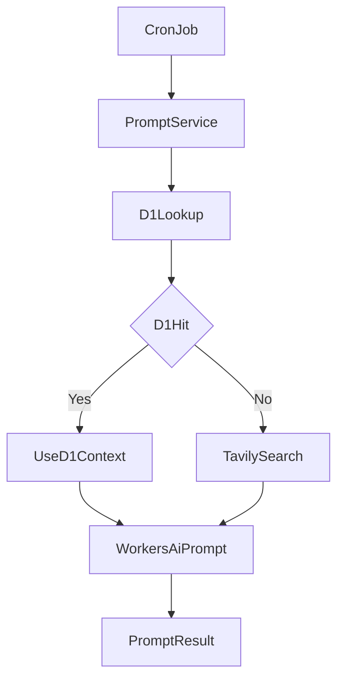
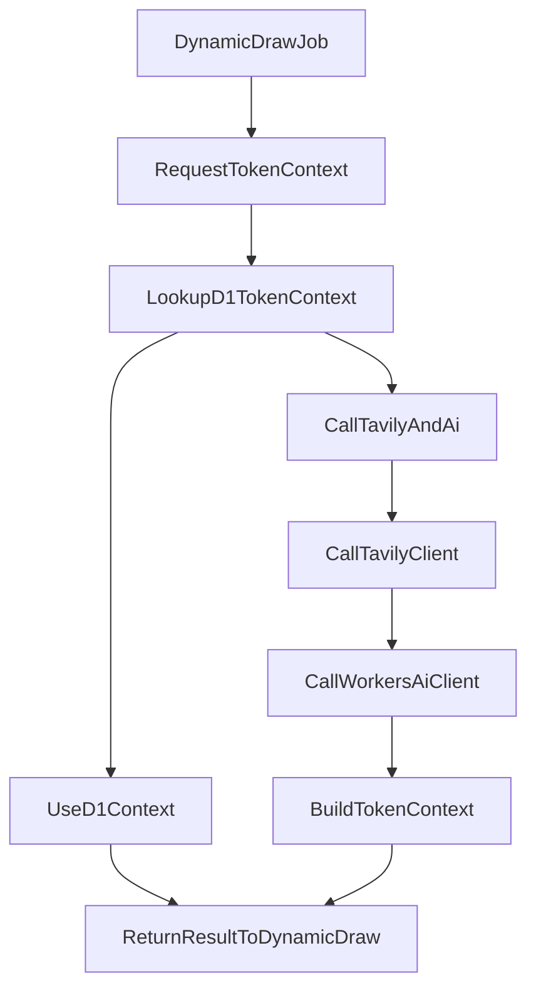

# Design Document - dynamic-prompt

## Overview

dynamic-prompt は、DOOM INDEX の自動生成パイプラインの一部として動作する内部サービスであり、トークン固有のナラティブ・性質・象徴性を付与するためのテキストコンテキスト生成を担当する。  
このサービスは Cloudflare Workers AI に対する汎用的かつ型安全なテキスト生成クライアントと、Tavily Search を利用したトークン情報の検索・要約ロジックを提供し、dynamic-draw フローから主役トークンのコンテキストを取得するために利用される。

dynamic-prompt は dynamic-draw 要件で定義された PromptService を置き換える形で導入され、PaintingContext とトークンコンテキストを統合した最終プロンプト生成を担う。既存のコードベースでは `src/services/prompt.ts` がプロンプト組み立てを担当しているが、将来的には dynamic-prompt ベースの PromptService 実装に差し替えることを前提とする。

dynamic-prompt 自体は HTTP API エンドポイントを公開せず、`src/services` レイヤーの一サービスとして、cron ジョブやバックグラウンド処理からのみ呼び出される。D1 へのコンテキスト保存は上位レイヤーに委ねるが、Tavily 呼び出しの前に D1 上の token_contexts テーブルを参照し、既知トークンについては D1 に保存済みの short_context を優先利用する。

### Goals

- Cloudflare Workers AI をラップした汎用テキスト生成クライアントを提供し、モデル ID とプロンプト構成を柔軟に変更可能にする。
- Tavily Search を利用してトークンに関する Web 情報を取得し、トークンコンテキスト JSON（`short_context`, `category`, `tags`）を生成する内部サービスを提供する。
- dynamic-draw フローから、主役トークンに対応する `short_context` を型安全かつエラー分類付きで取得できるようにする。
- dynamic-draw 要件で定義された PromptService を dynamic-prompt ベースの実装に置き換え、PaintingContext とトークンコンテキストを統合した最終プロンプト生成を行う。

### Non-Goals

- HTTP API エンドポイントの公開（REST/tRPC など）は行わない。
- D1 へのコンテキストキャッシュ保存や HTTP ステータスコード制御は行わない（dynamic-draw など上位モジュールの責務とする）。
- 画像生成（Runware 経由の FLUX kontext 呼び出し）やアーカイブ保存処理は扱わない。

## Architecture

### Existing Architecture Analysis

- DOOM INDEX は `src/services` にビジネスロジックを集約しており、`market-cap`, `prompt`, `image-generation`, `state`, `archive` といったサービスが、`cron.ts` から組み合わされる構造になっている。
- 各サービスは `createXxxService` ファクトリ関数で生成され、`neverthrow` の `Result` 型でエラーを伝播し、`utils/logger` による構造化ログを共通利用している。
- 外部 API の呼び出しは `market-cap` サービス内の Dexscreener 呼び出しのように、バインドされた `fetch` と `logger` を明示的に依存として注入するパターンが採用されている。
- dynamic-draw は別 spec として、Cron トリガでのトークン選定・市場データ取得・PaintingContext 構築・PromptService 連携・画像生成・永続化を司る。dynamic-prompt はこのフローの一部として「トークンの短い英語コンテキスト」を提供するサブモジュールと位置づける。

この前提から、dynamic-prompt も `src/services/dynamic-prompt.ts`（もしくはこれに準ずる構成）として、「サービスパターン＋neverthrow＋logger」を踏襲する。

### High-Level Architecture

高レベル構成は次のとおりである。



- **DynamicDrawCron**: 1時間ごとのジョブ評価や PaintingContext 構築などを行う既存フロー。主役トークンのメタ情報を dynamic-prompt に渡す。
- **PromptService**: dynamic-draw 要件で定義されたプロンプト生成サービス。PaintingContext と TokenContext を受け取り、最終的な英語プロンプト文字列を生成する。
- **DynamicPromptService**: dynamic-prompt のメインサービス。D1 上のトークンコンテキストを参照しつつ、必要に応じて Tavily 検索と Workers AI による要約を組み合わせて TokenContext を生成する。
- **TokenContextRepo**: Cloudflare D1 上の token_contexts テーブルを参照するリポジトリ。トークンごとの short_context 等を取得する。
- **WorkersAiClient**: Cloudflare Workers AI への汎用テキスト生成クライアント。plain text と structured JSON の両方に対応する。
- **TavilyClient**: Tavily Search API ラッパー。displayName, symbol, chain からクエリを構築し、LLM 入力用の長文テキストを返す。

### Technology Stack and Design Decisions

本機能は既存スタック（TypeScript 5.9, neverthrow, Cloudflare Workers, `utils/logger`）の上に、以下のコンポーネントを追加する拡張である。

#### Key Design Decisions

- **Decision**: Workers AI 呼び出しを汎用テキスト生成クライアントとして抽象化する。
  - **Context**: dynamic-prompt 以外でも今後 Workers AI を利用する可能性があり、モデル ID やプロンプト形式を柔軟に変更したい。
  - **Alternatives**:
    - dynamic-prompt 専用の LLM 呼び出し関数を実装する。
    - dynamic-draw 側に AI 呼び出しロジックを置き、dynamic-prompt はインターフェイスだけを規定する。
    - `lib/providers` 配下の Provider 抽象に完全統合する。
  - **Selected Approach**: `WorkersAiClient` 相当のインターフェイスを dynamic-prompt 内に定義し、将来的に `lib/providers` へ切り出せる構成とする。呼び出し元からモデル ID・システムプロンプト・ユーザープロンプトを受け取り、`Result` 型でテキストまたは JSON を返す。
  - **Rationale**: dynamic-prompt の要件（汎用テキスト生成）を満たしつつ、実装の境界を明確にし、再利用性とテスト容易性を高めるため。
  - **Trade-offs**: 初期段階では dynamic-prompt 内にのみ利用されるため、抽象化コストがやや高いが、将来の拡張性と一貫性を優先する。

- **Decision**: Tavily 検索結果の正規化とトークンコンテキスト生成を dynamic-prompt 内で完結させる。
  - **Context**: dynamic-draw 側では主に PaintingContext や画像生成に集中させたい一方で、Tavily 結果のパースや長文テキスト構築は dynamic-prompt 専用の関心事である。
  - **Alternatives**:
    - Tavily 生レスポンスを dynamic-draw に返し、そこで要約を行う。
    - Tavily クライアントのみ dynamic-prompt に実装し、要約ロジックは別サービスに持たせる。
  - **Selected Approach**: dynamic-prompt 内に `TavilyClient` と `TokenContextService` を持ち、Tavily 結果から LLM 入力用テキストを組み立てたうえで、Workers AI による JSON 生成までを一括で担当する。
  - **Rationale**: トークンコンテキスト生成の責務を一箇所に閉じ込め、dynamic-draw 側からは「トークンメタ → short_context 取得」というシンプルな API に見えるようにするため。
  - **Trade-offs**: dynamic-prompt 内の責務がやや増えるが、他モジュールの単純化とテスト境界の明確化を優先する。

- **Decision**: すべての外部呼び出し結果を `Result` 型で返し、フォールバックコンテキストは呼び出し元で選択可能とする。
  - **Context**: dynamic-draw 側では、外部サービス障害時に「エラーでスキップする」か「フォールバックコンテキストで継続する」かを柔軟に決めたい。
  - **Alternatives**:
    - dynamic-prompt 内で常にフォールバックを適用し、エラーを外に漏らさない。
    - 例外スローでエラーを伝播させ、上位で try-catch する。
  - **Selected Approach**: dynamic-prompt は `Result.err` でエラー種別・メッセージを返しつつ、フォールバック用の定数コンテキストもエクスポートする。呼び出し側は要件や運用方針に応じてどちらを使用するかを決定する。
  - **Rationale**: 既存コードベースが `neverthrow` を採用しており、一貫したエラーハンドリング戦略を維持できるため。
  - **Trade-offs**: 呼び出し側の実装が一段増えるが、挙動が明示的になり運用ポリシーを柔軟に調整できる。

## System Flows

### Token Context Generation Flow



1. **DynamicDrawJob**: dynamic-draw フローが主役トークンのメタ情報（`id`, `symbol`, `displayName`, `chain` など）を決定する。
2. **RequestTokenContext**: dynamic-draw が dynamic-prompt サービスに対して、トークンメタ情報とオプションの設定（使用モデルIDなど）を渡してコンテキスト生成を要求する。
3. **LookupD1TokenContext**: TokenContextRepo が Cloudflare D1 の token_contexts テーブルを参照し、対象トークンの short_context などが既に保存されているかを確認する。
4. **UseD1Context**: レコードが存在する場合、dynamic-prompt は D1 上の short_context, category, tags を TokenContext としてそのまま返却する（Tavily は呼び出さない）。
5. **CallTavilyClient**: レコードが存在しない場合、dynamic-prompt 内の Tavily クライアントが `displayName + symbol + chain` を組み合わせたクエリで Tavily API を呼び出し、関連する記事情報を取得する。
6. **CallWorkersAiClient**: Workers AI クライアントが Tavily 結果のテキストを入力として、`short_context`, `category`, `tags` を含む JSON を生成する。
7. **BuildTokenContext**: dynamic-prompt が JSON をパースし、内部型にマッピングする。エラー時は `Result.err` を返し、フォールバック候補も別途利用可能にする。
8. **ReturnResultToDynamicDraw**: dynamic-draw 側は Result を評価し、成功時は `short_context` を PaintingContext や PromptService に渡す。失敗時は要件に応じてフォールバックやスキップを選択する。

## Components and Interfaces

### Domain: dynamic-prompt

#### Component: WorkersAiClient

**Responsibility & Boundaries**

- Cloudflare Workers AI に対する汎用テキスト生成クライアントを提供する。
- モデル ID、システムメッセージ、ユーザーメッセージを入力として、プレーンテキストまたは JSON 構造を返す。
- 外部 API 呼び出しの詳細（HTTP エンドポイント、認証ヘッダ）はこのコンポーネント内部に閉じ込め、上位サービスには漏らさない。

**Dependencies**

- Outbound:
  - Cloudflare Workers の `fetch` API。
  - Cloudflare Workers AI のモデルエンドポイント。
- External:
  - Cloudflare Workers AI サービス（`@cf/ibm-granite/granite-4.0-h-micro` などの LLM モデル）。

**Contract Definition**

```typescript
export type TextGenerationRequest = {
  modelId?: string;
  systemPrompt: string;
  userPrompt: string;
};

export type TextGenerationResult = {
  modelId: string;
  text: string;
};

export type JsonGenerationResult<T> = {
  modelId: string;
  value: T;
};

export interface WorkersAiClient {
  generateText(input: TextGenerationRequest): Promise<Result<TextGenerationResult, AppError>>;

  generateJson<T>(input: TextGenerationRequest): Promise<Result<JsonGenerationResult<T>, AppError>>;
}
```

- **Preconditions**
  - `systemPrompt` と `userPrompt` は空文字列ではない。
  - `modelId` が未指定の場合、環境変数から有効なモデル ID が取得可能である。
- **Postconditions**
  - 成功時、`Result.ok` で `modelId` と生成テキスト（またはパース済み JSON オブジェクト）を返す。
  - 失敗時、`Result.err` で `ExternalApiError` または `AiGenerationError` を含む `AppError` を返す。

#### Component: TavilyClient

**Responsibility & Boundaries**

- Tavily Search API を呼び出し、トークンに関する Web 情報を検索する。
- レスポンスから `title`, `content`, `url` を抽出し、LLM 入力用の長文テキストへ正規化する。

**Dependencies**

- Outbound:
  - `fetch`（Cloudflare 環境のグローバル fetch）。
- External:
  - Tavily Search API エンドポイント（`https://api.tavily.com/search`）。

**Contract Definition**

```typescript
export type TavilyQueryInput = {
  id: string;
  name: string;
  symbol: string;
  chainId: string;
  contractAddress: string | null;
  maxResults?: number;
};

export type TavilyArticle = {
  title: string;
  content: string;
  url: string;
};

export type TavilySearchResult = {
  articles: TavilyArticle[];
  combinedText: string;
};

export interface TavilyClient {
  searchToken(input: TavilyQueryInput): Promise<Result<TavilySearchResult, AppError>>;
}
```

- **Preconditions**
  - `displayName` と `symbol` は空文字列ではない。
  - 環境変数 `TAVILY_API_KEY` が設定されている。
- **Postconditions**
  - 成功時、`articles` と 6000 文字以内に切り詰められた `combinedText` を返す。
  - Tavily 側エラーやネットワークエラー時は、`Result.err` で `ExternalApiError` を返す。

#### Component: TokenContextService

**Responsibility & Boundaries**

- TavilyClient と WorkersAiClient を組み合わせて、トークンコンテキスト JSON を生成する。
- dynamic-draw からは「トークンメタ情報 → `short_context`, `category`, `tags`」という単一のユースケースとして提供する。
- D1 キャッシュや HTTP レスポンス制御には関与しない。

**Dependencies**

- Inbound:
  - dynamic-draw や将来の他サービス。
- Outbound:
  - WorkersAiClient。
  - TavilyClient。
  - TokenContextRepository。

**Contract Definition**

```typescript
export type TokenMetaInput = {
  id: string;
  name: string;
  symbol: string;
  chainId: string;
  contractAddress: string | null;
  createdAt: string;
};

export type TokenContext = {
  shortContext: string;
  category: string;
  tags: string[];
};

export interface TokenContextService {
  generateTokenContext(input: TokenMetaInput): Promise<Result<TokenContext, AppError>>;
}
```

- **Preconditions**
  - `id`, `symbol`, `displayName`, `chain` はすべて空ではない。
- **Postconditions**
  - 成功時、`TokenContext` を含む `Result.ok` を返す。
  - Tavily または Workers AI が失敗した場合、`Result.err` を返し、エラー種別によってフォールバック利用可否を示す。

#### Component: DynamicPromptService (Facade)

**Responsibility & Boundaries**

- WorkersAiClient と TavilyClient、TokenContextService を束ねるファサード。
- dynamic-draw などの呼び出し元に対して、単一の依存としてエクスポートされる。

**Contract Definition**

```typescript
export interface DynamicPromptService extends TokenContextService {
  readonly workersAi: WorkersAiClient;
  readonly tavily: TavilyClient;
  readonly tokenContextRepo: TokenContextRepository;
}

export type CreateDynamicPromptServiceDeps = {
  workersAiClient?: WorkersAiClient;
  tavilyClient?: TavilyClient;
  log?: typeof logger;
};

export function createDynamicPromptService(
  deps?: CreateDynamicPromptServiceDeps,
): DynamicPromptService;
```

- **Integration Strategy**
  - 既存の `createMarketCapService`, `createPromptService`, `createImageGenerationService` と同様に、`createDynamicPromptService` ファクトリで依存を注入しやすくする。
  - テスト時には `workersAiClient` と `tavilyClient` にモックを渡せるようにする。

#### Component: TokenContextRepository

**Responsibility & Boundaries**

- Cloudflare D1 上の token_contexts テーブルを参照し、トークンごとの short_context, category, tags を取得する。
- dynamic-prompt では読み取り専用リポジトリとして設計し、書き込みや更新は上位レイヤーまたは別モジュールの責務とする。

**Dependencies**

- Outbound:
  - Cloudflare D1 バインディング（`env.DB`）または Drizzle ORM 経由の D1 クライアント。

**Contract Definition**

```typescript
export type TokenContextRecord = {
  id: string;
  name: string;
  symbol: string;
  chainId: string;
  contractAddress: string | null;
  category: string | null;
  tags: string[] | null;
  shortContext: string;
  createdAt: number;
  updatedAt: number;
};

export interface TokenContextRepository {
  findById(id: string): Promise<Result<TokenContextRecord | null, AppError>>;
}
```

- **Preconditions**
  - D1 バインディングが有効であり、token_contexts テーブルが存在する。
- **Postconditions**
  - 該当レコードが存在する場合は TokenContextRecord を返し、存在しない場合は `null` を返す。
  - D1 アクセスエラー時は `Result.err` で `AppError` を返す。

#### Component: PromptService (AI Based)

**Responsibility & Boundaries**

- dynamic-draw 要件で定義された PromptService を AI ベースの実装として提供する。
- PaintingContext と TokenContext を統合し、Workers AI を用いて最終的な英語プロンプト文字列を生成する。

**Dependencies**

- Inbound:
  - dynamic-draw フロー（PaintingContext を構築済み）。
- Outbound:
  - DynamicPromptService（TokenContext の取得）。
  - WorkersAiClient（最終プロンプト生成）。

**Contract Definition**

```typescript
export interface AiPromptService {
  generatePrompt(ctx: PaintingContext, tokenContext: TokenContext): Promise<Result<string, AppError>>;
}
```

- **Preconditions**
  - PaintingContext が完全に構築されている。
  - TokenContext が D1 または Tavily + AI によって取得済みである。
- **Postconditions**
  - 成功時、DOOM INDEX 向けの最終英語プロンプト文字列を `Result.ok` で返す。
  - Workers AI 呼び出しに失敗した場合は `Result.err` を返す。

## Data Models

### Domain Model

- **TokenMetaInput**
  - dynamic-draw で選定された主役トークンのメタ情報を表現する入力型。
- **TokenContext**
  - DOOM INDEX 用のトークンコンテキストを表現する値オブジェクトであり、`shortContext`, `category`, `tags` の 3要素を持つ。
- **TextGenerationRequest / Result**
  - Workers AI への汎用的なテキスト生成要求と応答を表す。
- **TavilySearchResult**
  - Tavily から取得した記事一覧と、LLM 入力用に結合されたテキストを表す。

これらはすべて値オブジェクトとして扱い、副作用や外部 I/O はサービス層に閉じ込める。

### Logical Data Model

- dynamic-prompt 自体は D1 への書き込みを行わないが、Cloudflare D1 上の token_contexts テーブルを **読み取り専用** で参照する。
- token_contexts は「トークンごとの象徴的な短い英語コンテキスト」と付随メタデータをキャッシュするテーブルであり、TokenContextRepository から参照される。

### Physical Data Model（D1 / Drizzle Schema）

#### D1 テーブル定義

- **テーブル名**: `token_contexts`
- **目的**: 各トークンの短い英語コンテキストと属性メタデータをキャッシュし、Tavily 呼び出しを初回のみとする。

論理スキーマは次のとおりである。

- `token_id` TEXT PRIMARY KEY  
  - 例: `"trump-official"` など、dynamic-draw 側で定義する一意のトークン ID。
- `symbol` TEXT NOT NULL  
  - 例: `"TRUMP"`。
- `display_name` TEXT NOT NULL  
  - 例: `"Official Trump Meme"`。
- `chain` TEXT NOT NULL  
  - 例: `"ethereum"`。
- `category` TEXT NULL  
  - 例: `"meme"`, `"political"` など 1語カテゴリ。
- `tags` TEXT NULL  
  - JSON 文字列として保存（例: `["official-meme","president-related"]`）。
- `short_context` TEXT NOT NULL  
  - 2〜4文程度の英語テキスト（200〜400文字程度を推奨）。
- `updated_at` INTEGER NOT NULL  
  - UNIX epoch（秒）として保存。将来的な再サマリ判定に利用可能。

推奨インデックス:

- `idx_token_contexts_symbol_chain` (`symbol`, `chain`)  
  - 将来的にシンボル＋チェーンから検索するユースケースを想定し、カバリングインデックスとして定義する。

#### Drizzle Schema 例（SQLite / D1）

物理スキーマは Drizzle ORM の sqliteTable を用いて次のように定義する。

```typescript
import { sqliteTable, text, integer, index } from "drizzle-orm/sqlite-core";

export const tokenContexts = sqliteTable(
  "token_contexts",
  {
    tokenId: text("token_id").primaryKey().notNull(),
    symbol: text("symbol").notNull(),
    displayName: text("display_name").notNull(),
    chain: text("chain").notNull(),
    category: text("category"),
    tags: text("tags"),
    shortContext: text("short_context").notNull(),
    updatedAt: integer("updated_at").notNull(),
  },
  table => [
    index("idx_token_contexts_symbol_chain").on(table.symbol, table.chain),
  ],
);

export type TokenContextRow = typeof tokenContexts.$inferSelect;
export type NewTokenContextRow = typeof tokenContexts.$inferInsert;
```

- **TokenContextRepository** は原則として `token_id` による単一レコード取得を行い、`tags` は JSON.parse を通じて `string[] | null` にマッピングする。
- 将来的に dynamic-draw 側で INSERT/UPDATE を実装する場合も、このスキーマを基準として利用する。

### Data Contracts & Integration

- Tavily API:
  - リクエストは JSON（`query`, `max_results`, `search_depth`）を含む POST ボディ。
  - レスポンスは記事リストを含む JSON。dynamic-prompt 側では title, content, url のみを使用する。
  - 認証は Bearer トークン（`Authorization: Bearer TAVILY_API_KEY`）。
- Workers AI:
  - リクエストはモデル ID とmessages などを含む JSON（詳細なスキーマは公式ドキュメントに依存）。
  - レスポンスはテキスト出力を含む JSON。JSON 生成モードでは strict JSON のみを期待する。
  - Pending discovery: Cloudflare Workers AI の JSON モードにおける厳密なレスポンスフィールド構造は実装フェーズで確認する。

## Error Handling

### Error Strategy

- すべての公開メソッドは `Promise<Result<*, AppError>>` を返し、例外スローはライブラリレベルエラーなどの予期しないケースに限定する。
- エラー種別は既存の `AppError` 型に準拠しつつ、必要に応じて以下を追加する。
  - `ExternalApiError`（Tavily/Workers AI 呼び出し失敗）
  - `ConfigurationError`（環境変数未設定やモデル ID 不正）
  - `ParsingError`（Workers AI からの JSON パース失敗）
  - `TimeoutError`（Tavily または Workers AI のタイムアウト）

### Error Categories and Responses

- **外部 API エラー（ExternalApiError）**
  - Tavily または Workers AI が HTTP エラーを返した場合。
  - 戻り値は `Result.err` とし、`provider`, `status`, `message` を含める。
- **構成エラー（ConfigurationError）**
  - `TAVILY_API_KEY` やデフォルトモデル ID が未設定の場合。
  - dynamic-prompt は即座に `Result.err` を返し、上位フローが早期に異常を検知できるようにする。
- **パースエラー（ParsingError）**
  - Workers AI が JSON 以外の文字列を返した場合、または必須フィールドが欠落している場合。
  - `Result.err` を返し、フォールバックコンテキストの利用を推奨するエラータグを付与する。
- **タイムアウトエラー（TimeoutError）**
  - Tavily 呼び出しで 5 秒を超過した場合、Workers AI 呼び出しで 10 秒を超過した場合。
  - タイムアウト内容と経過時間をログ出力したうえで `Result.err` を返す。

### Monitoring

- `utils/logger` を用いて、以下を最低限ログ出力する。
  - トークンコンテキスト生成開始時の `token.id`, `symbol`, `chain`。
  - Tavily 呼び出しの成功/失敗ステータスと記事件数。
  - Workers AI 呼び出しの成功/失敗ステータスと使用モデル ID。
  - `Result.err` 返却時のエラー種別・メッセージ。
  - 予期しない例外発生時のスタックトレース。

## Testing Strategy

### Unit Tests

- **WorkersAiClient**
  - モデル ID 未指定時にデフォルトモデルが使用されること。
  - 正常応答時に `Result.ok` が返り、テキストが欠落していないこと。
  - 不正な JSON 応答を受け取った場合に `ParsingError` が返されること。
- **TavilyClient**
  - 正常なレスポンスから title, content, url を抽出し、combinedText が 6000 文字以内にトリムされること。
  - HTTP エラーやネットワーク例外時に `ExternalApiError` が返されること。
- **TokenContextService**
  - Tavily と Workers AI の両方が成功した場合に、`TokenContext` が期待どおりに構築されること。
  - Tavily または Workers AI いずれかが失敗した場合に `Result.err` が返されること。
  - `short_context` が極端に短い／長いケースで適切なエラーまたはフラグが付与されること。
- **TokenContextRepository**
  - D1 に対象トークンのレコードが存在する場合に、正しい TokenContextRecord が返されること。
  - レコードが存在しない場合に `null` を含む `Result.ok` が返されること。
  - D1 アクセスエラー時に `Result.err` が返されること。

### Integration Tests
 
- Tavily と Workers AI をモックした統合テストを行い、dynamic-draw 相当の呼び出しから `TokenContext` 取得までのフローを検証する。
- 実際の Tavily API と Cloudflare Workers AI に対する統合テストを別スイートとして用意し、環境変数（例: `ENABLE_EXTERNAL_API_TESTS=true`）が設定されている場合のみ実際の API コールを実行する。
  - Tavily 統合テストでは、実在するトークン名を用いて検索を行い、記事リストが 1 件以上返ることと combinedText が空でないことを確認する。
  - Workers AI 統合テストでは、簡単なプロンプトを用いてテキスト生成を行い、応答が空文字列ではないことと、必要に応じて JSON 形式の応答がパース可能であることを確認する。
- 統合テストでは API キーや機密情報をログに出力しないようにし、レートリミットに配慮してテストケース数と呼び出し頻度を制御する。

### Performance/Load

- 単一ジョブ内で複数トークンに対して dynamic-prompt を連続呼び出しした場合でも、Tavily と Workers AI の呼び出し回数が要件の上限（トークンごとに Tavily 1 回 + AI 1 回）を超えないことを確認する。
- タイムアウト設定が正しく機能し、外部 API 側のレイテンシ増大時にもジョブ全体が無限待ちになることがないことを検証する。

## Security Considerations

- Tavily API キーおよび Workers AI 用のモデル ID は、Cloudflare Workers の環境変数から取得し、コード内にハードコードしない。
- ログに API キーや完全な応答ボディなどの機密情報を出力しない。
- Workers AI から返却されるテキストは基本的に内部でのみ利用されるが、将来的に UI へ露出する場合に備えて、HTML やスクリプトを直接解釈・レンダリングしない前提で扱う。

## Performance & Scalability

- Tavily 呼び出しはトークンごとに 1 回に限定し、同一トークンに対する過剰な再検索は dynamic-draw 側のキャッシュ戦略（D1 等）で抑制する。
- Workers AI 呼び出しもトークンごとに 1 回とし、必要に応じて dynamic-draw 側で結果をキャッシュする前提とする。
- タイムアウト値（Tavily 5 秒、Workers AI 10 秒）を明示し、ジョブ全体の実行時間を制御する。
