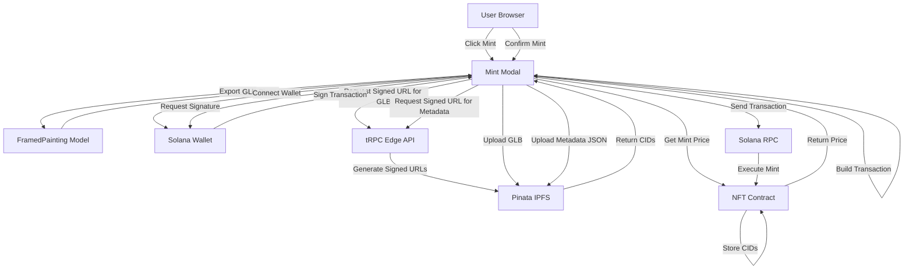
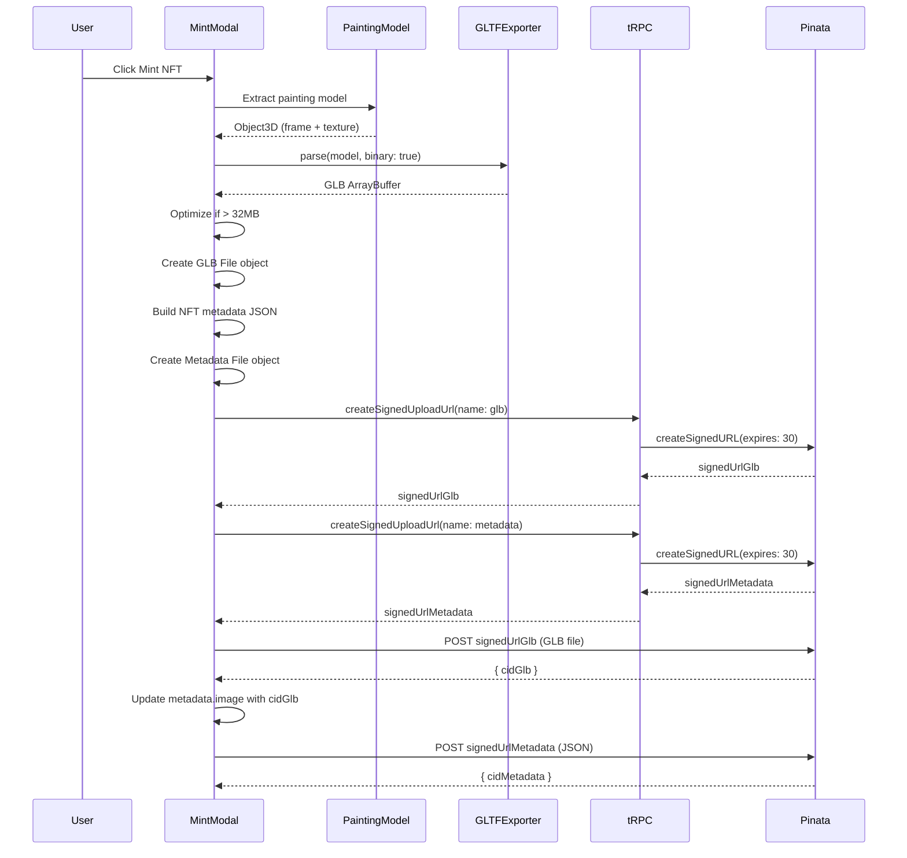
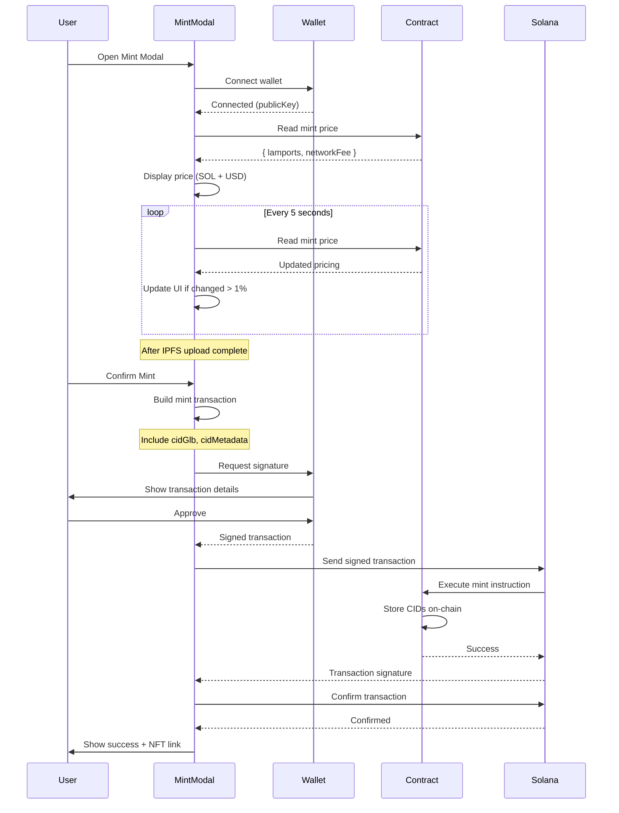
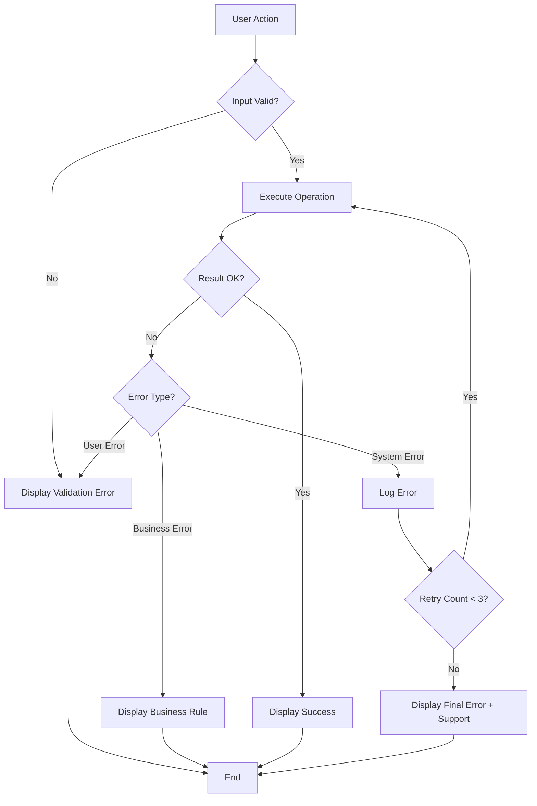

# Mint NFT 機能 - 技術設計書

## Overview

本機能は DOOM INDEX の絵画モデル（FramedPainting の 3D オブジェクト）を GLB 形式でエクスポートし、NFT メタデータと共に Pinata 経由で IPFS に永続化したうえで、ユーザーが直接ブラウザから Solana ウォレットを接続して NFT としてミントする機能を提供します。

**Purpose**: ユーザーが生成されたアートワークを所有可能な NFT として取得できる体験を提供し、DOOM INDEX のアートワークに永続的な価値と所有権を付与します。すべてのデータはオンチェーン（Solana コントラクト + IPFS）に保存され、中央集権的なデータベースに依存しません。

**Users**: DOOM INDEX のギャラリー訪問者が、気に入ったアートワークを自身の Solana ウォレットに NFT としてミントできます。

**Impact**: 既存のギャラリー表示機能に対して以下の変更を加えます：
- FramedPainting コンポーネントから絵画モデルのみを GLB 形式でエクスポート
- tRPC ルーターに Pinata 署名付き URL 生成エンドポイントを追加（メタデータ・GLB 用）
- クライアントサイドで Solana ウォレット接続と直接トランザクション送信を実装
- すべてのデータ（GLB, メタデータ, ミント情報）をオンチェーンに保存

### Goals

- 絵画モデル（フレーム + テクスチャ）のみを GLB としてエクスポートし、最大 32MB に最適化
- NFT メタデータ JSON と GLB ファイルの両方を Pinata 経由で IPFS にアップロード
- ユーザーがブラウザから直接 Solana ウォレットを接続し、トランザクションに署名・送信
- コントラクトから動的にミント料金を取得し、ユーザーに透明性の高い料金情報を提供
- すべてのデータをオンチェーン（コントラクト + IPFS）に保存し、完全な分散化を実現

### Non-Goals

- NFT コントラクトの実装（別リポジトリで管理）
- マーケットプレイス機能の実装
- NFT 転送・バーン機能
- GLB ファイルの編集・カスタマイズ機能

## Architecture

### Existing Architecture Analysis

DOOM INDEX は以下の既存アーキテクチャパターンを採用しています：

- **tRPC v11 による型安全 API**: エンドツーエンドの型推論、zod バリデーション、neverthrow Result 型によるエラーハンドリング
- **Cloudflare Workers Edge Runtime**: Edge ファースト実行、D1 Database、KV Namespace、R2 Bindings の活用
- **React Three Fiber による 3D レンダリング**: FramedPainting コンポーネントが `/frame.glb` と動的テクスチャを組み合わせて表示
- **@t3-oss/env-nextjs による環境変数管理**: 型安全な環境変数検証、サーバー・クライアント・共有の明確な分離

本機能はこれらの既存パターンを尊重し、以下の統合を行います：

- **tRPC ルーター拡張**: `src/server/trpc/routers/ipfs.ts` を新規作成し、Pinata 署名付き URL 生成のみを提供
- **クライアントサイド中心設計**: GLB エクスポート、IPFS アップロード、ウォレット接続、トランザクション送信をすべてブラウザで実行
- **環境変数追加**: `src/env.ts` に Pinata JWT（サーバー）と Solana RPC URL（クライアント）を追加
- **コンポーネント拡張**: FramedPainting から絵画モデルのみを抽出して GLB エクスポート
- **完全分散化**: データベース・ストレージを使用せず、すべて IPFS + Solana オンチェーンに保存

### High-Level Architecture



### Technology Stack and Design Decisions

#### Technology Alignment

本機能は既存の技術スタックに完全に準拠します：

**Frontend**:
- React 19 + Next.js 16（App Router, Edge Runtime）
- React Three Fiber + Three.js（GLTFExporter 追加）
- TanStack Query + tRPC Client（既存パターン踏襲）

**Backend**:
- tRPC v11（新規ルーター `ipfs.ts` 追加）
- Cloudflare Workers（Edge Runtime）
- neverthrow Result 型（既存エラーハンドリングパターン）

**New Dependencies**:
- `pinata` (v3): Pinata SDK for IPFS uploads
- `@solana/web3.js` (v1.95+): Solana RPC client
- `@solana/wallet-adapter-react` (v0.15+): Solana wallet integration
- `three-stdlib` (v2.33+): GLTFExporter for Three.js

#### Key Design Decisions

**Decision 1: Pinata 署名付き URL 方式の採用**

- **Context**: Next.js の 4MB ボディサイズ制限により、tRPC 経由で直接 GLB をアップロードできない
- **Alternatives**:
  1. チャンク分割アップロード（1MB ずつ分割して tRPC 経由で送信）
  2. 署名付き URL 方式（サーバーで URL 生成、クライアントから直接 Pinata へアップロード）
  3. Next.js API Route + FormData（Edge Runtime で multipart/form-data を処理）
- **Selected Approach**: 署名付き URL 方式
  - サーバー: `pinata.upload.public.createSignedURL({ expires: 30 })` で署名付き URL を生成
  - クライアント: `fetch(signedUrl, { method: 'POST', body: formData })` で直接 Pinata へアップロード
- **Rationale**:
  - Pinata 公式推奨パターンで、Next.js の 4MB 制限を完全に回避
  - チャンク分割よりシンプルで、Pinata SDK がストリーミングアップロードを最適化
  - API キーをクライアントに公開せず、サーバーサイドで安全に管理
- **Trade-offs**:
  - 利点: シンプルな実装、Pinata の最適化を活用、セキュア
  - 欠点: 署名付き URL の有効期限管理が必要（30 秒）、リトライ時に再生成

**Decision 2: GLB エクスポートのクライアントサイド実行**

- **Context**: React Three Fiber の Object3D を GLB 形式に変換する必要がある
- **Alternatives**:
  1. クライアントサイドで GLTFExporter を実行
  2. サーバーサイドで Three.js を実行して GLB 生成
  3. Web Worker で GLB エクスポートを実行
- **Selected Approach**: クライアントサイドで GLTFExporter を実行
  - `GLTFExporter.parse(scene, callback, { binary: true })` で GLB バイナリを生成
  - メッシュ簡略化とテクスチャ圧縮で 32MB 以下に最適化
- **Rationale**:
  - React Three Fiber のシーンは既にクライアントサイドに存在
  - サーバーサイドで Three.js を実行するとヘッドレスレンダリングが必要で複雑
  - GLTFExporter はブラウザ環境で最適化されている
- **Trade-offs**:
  - 利点: シンプルな実装、既存のシーンを直接利用、サーバー負荷なし
  - 欠点: クライアントの CPU/メモリに依存、大容量ファイルでブラウザが重くなる可能性

**Decision 3: クライアントサイド中心のアーキテクチャ**

- **Context**: NFT ミントはユーザーがウォレットで署名する必要があり、トランザクション送信はクライアントから直接実行すべき
- **Alternatives**:
  1. サーバーサイドでトランザクションを構築・送信し、クライアントは署名のみ提供
  2. クライアントサイドでウォレット接続・トランザクション構築・送信をすべて実行
  3. ハイブリッド: トランザクション構築はサーバー、送信はクライアント
- **Selected Approach**: クライアントサイドで完結
  - tRPC は署名付き URL 生成のみを提供（`createSignedUploadUrl`）
  - GLB エクスポート、IPFS アップロード、メタデータ構築、ウォレット接続、トランザクション送信はすべてブラウザで実行
  - コントラクトへのデータ保存もトランザクション内で完結
- **Rationale**:
  - Solana のベストプラクティス: ユーザーが秘密鍵を保持し、ブラウザで直接署名
  - サーバーがトランザクションを扱うとセキュリティリスクが増加
  - 完全な分散化: サーバーはデータを保存せず、すべてオンチェーン
  - ユーザー体験: ウォレットアプリで明示的に内容を確認して署名
- **Trade-offs**:
  - 利点: セキュリティ、分散化、ユーザー主権、サーバー負荷削減
  - 欠点: クライアント側の実装が複雑、ネットワーク状態に依存

## System Flows

### GLB Export and IPFS Upload Flow



### NFT Mint Flow with Dynamic Pricing



## Requirements Traceability

| Requirement | Summary | Components | Interfaces | Flows |
|-------------|---------|------------|------------|-------|
| 1.1-1.4 | GLB エクスポートと最適化 | GlbExportService, PaintingModel | exportPaintingGlb(model) | GLB Export Flow |
| 2.1-2.6 | Pinata 署名付き URL 生成 | IpfsRouter, PinataClient | createSignedUploadUrl() | IPFS Upload Flow |
| 3.1-3.7 | クライアント直接アップロード | MintModal, useIpfsUpload | uploadToIpfs(file, signedUrl) | IPFS Upload Flow |
| 4.1-4.5 | IPFS メタデータ構築とアップロード | MintModal, MetadataBuilder | buildMetadata(), uploadMetadata() | IPFS Upload Flow |
| 5.1-5.4 | ミント料金の動的取得 | MintModal, useSolanaContract | getMintPricing() | Mint Flow |
| 6.1-6.4 | NFT ミントフロー | MintModal, useSolanaWallet | buildMintTx(), sendTransaction() | Mint Flow |

## Components and Interfaces

### Frontend Layer

#### MintModal Component

**Responsibility & Boundaries**

- **Primary Responsibility**: NFT ミントフローの UI 制御とステート管理
- **Domain Boundary**: UI/プレゼンテーション層
- **Data Ownership**: モーダルの表示状態、アップロード進行状況、ミント処理状態
- **Transaction Boundary**: なし（UI コンポーネント）

**Dependencies**

- **Inbound**: Gallery Scene からユーザーアクションで開かれる
- **Outbound**: FramedPainting（GLB エクスポート）、useMintUpload hook、tRPC Client
- **External**: Pinata API（署名付き URL 経由）、Solana Wallet Adapter

**Contract Definition**

```typescript
interface MintModalProps {
  isOpen: boolean;
  onClose: () => void;
  paintingMetadata: {
    timestamp: string;
    paintingHash: string;
    thumbnailUrl: string;
  };
}

interface MintModalState {
  step: 'export' | 'upload' | 'verify' | 'pricing' | 'mint' | 'success' | 'error';
  progress: number;
  glbFile: File | null;
  ipfsData: { cid: string; gatewayUrl: string } | null;
  pricingData: { lamports: number; usdPrice: number; networkFee: number } | null;
  error: string | null;
}
```

**State Management**

- **State Model**: export → upload → verify → pricing → mint → success/error
- **Persistence**: なし（モーダルを閉じると状態リセット）
- **Concurrency**: 同時実行防止（ステップ進行中は UI をブロック）

#### GlbExportService

**Responsibility & Boundaries**

- **Primary Responsibility**: FramedPainting から絵画モデル（フレーム + テクスチャ）のみを抽出し、GLB 形式にエクスポート
- **Domain Boundary**: 3D レンダリング層
- **Data Ownership**: GLB バイナリデータの生成と最適化
- **Transaction Boundary**: なし（純粋な変換処理）

**Dependencies**

- **Inbound**: MintModal
- **Outbound**: Three.js GLTFExporter, SimplifyModifier（メッシュ簡略化）
- **External**: Three.js, three-stdlib

**Contract Definition**

```typescript
interface GlbExportService {
  exportPaintingModel(paintingRef: RefObject<Group>): Promise<Result<File, AppError>>;
  optimizeGlb(glbBuffer: ArrayBuffer, targetSizeMB: number): Promise<Result<ArrayBuffer, AppError>>;
}

interface GlbExportOptions {
  binary: boolean; // true for GLB
  maxSizeMB: number; // Default: 32
  includeFrame: boolean; // Default: true
  includeTexture: boolean; // Default: true
  onProgress?: (progress: number) => void;
}
```

**Preconditions**: paintingRef は FramedPainting の Group を参照
**Postconditions**: 絵画モデルのみの GLB File オブジェクトが生成され、maxSizeMB 以下に最適化される
**Invariants**: GLB のバイナリ構造が GLTF 2.0 仕様に準拠、フレームと絵画プレーンのみを含む

#### useIpfsUpload Hook

**Responsibility & Boundaries**

- **Primary Responsibility**: Pinata への GLB とメタデータ JSON のアップロードロジックとリトライ制御
- **Domain Boundary**: データ取得層（React Hook）
- **Data Ownership**: アップロード進行状況、リトライカウント、CID 管理
- **Transaction Boundary**: なし（Hook）

**Dependencies**

- **Inbound**: MintModal
- **Outbound**: tRPC Client（署名付き URL 取得）、Pinata API（fetch）
- **External**: TanStack Query, fetch API

**Contract Definition**

```typescript
interface UseIpfsUploadResult {
  uploadGlbAndMetadata: (glbFile: File, metadata: NftMetadata) => Promise<Result<IpfsUploadResult, AppError>>;
  isUploading: boolean;
  progress: number;
  error: AppError | null;
  reset: () => void;
}

interface NftMetadata {
  name: string;
  description: string;
  image: string; // Will be updated with GLB CID
  external_url: string;
  attributes: Array<{ trait_type: string; value: string | number }>;
  properties: {
    files: Array<{ uri: string; type: string }>;
    category: string;
  };
}

interface IpfsUploadResult {
  cidGlb: string;
  cidMetadata: string;
  sizeGlb: number;
  sizeMetadata: number;
}
```

**Preconditions**: glbFile.size <= 32MB, metadata は Metaplex 標準に準拠
**Postconditions**: GLB と Metadata の両方の CID が返される
**Invariants**: アップロード中は isUploading が true、GLB アップロード完了後に Metadata をアップロード

### Backend Layer

#### IpfsRouter (tRPC)

**Responsibility & Boundaries**

- **Primary Responsibility**: Pinata 署名付き URL 生成のみを提供（IPFS アップロードとミント処理はクライアントサイドで完結）
- **Domain Boundary**: API 層
- **Data Ownership**: なし（ステートレス）
- **Transaction Boundary**: なし（署名付き URL 生成のみ）

**Dependencies**

- **Inbound**: tRPC Client（フロントエンド）
- **Outbound**: PinataClient
- **External**: Pinata SDK

**Contract Definition**

**API Contract**:

| Method | Endpoint | Request | Response | Errors |
|--------|----------|---------|----------|--------|
| mutation | createSignedUploadUrl | CreateSignedUrlInput | SignedUrlOutput | 500 |

**Detailed Schemas**:

```typescript
// createSignedUploadUrl
const createSignedUrlInput = z.object({
  filename: z.string().min(1).max(255),
  contentType: z.enum(['application/octet-stream', 'application/json']),
  keyvalues: z.object({
    walletAddress: z.string().optional(),
    timestamp: z.string(),
    paintingHash: z.string(),
    network: z.enum(['devnet', 'mainnet-beta']),
  }).optional(),
  group: z.string().optional(),
});

type SignedUrlOutput = {
  url: string;
  expires: number; // Unix timestamp (30 seconds from now)
};
```

**Integration Strategy**

- **Modification Approach**: 新規ルーター作成（`src/server/trpc/routers/ipfs.ts`）
- **Backward Compatibility**: 既存ルーターに影響なし
- **Migration Path**: `_app.ts` に `ipfsRouter` を追加
- **Simplification**: 署名付き URL 生成のみに責任を限定し、IPFS アップロードとミント処理はクライアントサイドで実行

#### PinataClient

**Responsibility & Boundaries**

- **Primary Responsibility**: Pinata SDK のラッパーとして、署名付き URL 生成と Gateway URL 変換を提供
- **Domain Boundary**: 外部統合層（Anti-Corruption Layer）
- **Data Ownership**: なし（Pinata API のプロキシ）
- **Transaction Boundary**: なし（ステートレス）

**Dependencies**

- **Inbound**: IpfsRouter
- **Outbound**: Pinata SDK
- **External**: Pinata API (https://uploads.pinata.cloud)

**External Dependencies Investigation**:

Pinata SDK v3 は以下の API を提供：
- `upload.public.createSignedURL({ expires, name, keyvalues, group })`: 署名付き URL を生成
- `gateways.public.convert(cid)`: CID を署名付き Gateway URL に変換
- 認証: `pinataJwt` による Bearer トークン認証
- レート制限: Free プランは 100 requests/month、Paid プランは制限なし
- バージョン互換性: v3.0.0+ が必要（v2 からの破壊的変更あり）

**Contract Definition**

```typescript
interface PinataClient {
  createSignedUploadUrl(options: CreateSignedUrlOptions): Promise<Result<SignedUrl, AppError>>;
  convertToGatewayUrl(cid: string): Promise<Result<string, AppError>>;
}

interface CreateSignedUrlOptions {
  expires: number; // Seconds
  name: string;
  keyvalues?: Record<string, string>;
  group?: string;
}

interface SignedUrl {
  url: string;
  expires: number; // Unix timestamp
}
```

**Preconditions**: PINATA_JWT 環境変数が設定されている
**Postconditions**: 署名付き URL が有効期限内に生成される
**Invariants**: JWT が有効である限り、API コールは成功する

#### useSolanaContract Hook

**Responsibility & Boundaries**

- **Primary Responsibility**: Solana コントラクトとの通信（料金取得、トランザクション構築）をクライアントサイドで提供
- **Domain Boundary**: データ取得層（React Hook）
- **Data Ownership**: なし（Solana RPC のプロキシ）
- **Transaction Boundary**: なし（トランザクション構築のみ、送信は useSolanaWallet が担当）

**Dependencies**

- **Inbound**: MintModal
- **Outbound**: Solana web3.js
- **External**: Solana RPC (https://api.devnet.solana.com, https://api.mainnet-beta.solana.com)

**External Dependencies Investigation**:

Solana web3.js v1.95+ は以下の API を提供：
- `Connection.getAccountInfo()`: コントラクトアカウント情報を取得
- `Connection.getRecentBlockhash()`: 最新のブロックハッシュを取得
- `Connection.getFeeForMessage(message)`: トランザクション手数料を推定
- `Transaction`: トランザクションオブジェクトを構築
- レート制限: Public RPC は 100 requests/10s、Private RPC は制限なし
- タイムアウト: デフォルト 30 秒、設定可能

**Contract Definition**

```typescript
interface UseSolanaContractResult {
  getMintPricing: () => Promise<Result<MintPricing, AppError>>;
  buildMintTransaction: (params: BuildMintTxParams) => Promise<Result<Transaction, AppError>>;
  isLoading: boolean;
  error: AppError | null;
}

interface MintPricing {
  lamports: number;
  sol: number;
  usdPrice: number;
  networkFee: number;
  totalLamports: number;
}

interface BuildMintTxParams {
  cidGlb: string;
  cidMetadata: string;
  walletPublicKey: PublicKey;
  contractAddress: string;
}
```

**Preconditions**: Solana RPC エンドポイントが利用可能、環境変数で RPC URL が設定されている
**Postconditions**: トランザクションオブジェクトが構築され、署名待ち状態
**Invariants**: ネットワーク手数料は常に正の値

### Service Layer

#### useSolanaWallet Hook

**Responsibility & Boundaries**

- **Primary Responsibility**: Solana ウォレット接続、トランザクション署名・送信をクライアントサイドで提供
- **Domain Boundary**: データ取得層（React Hook）
- **Data Ownership**: ウォレット接続状態、トランザクション署名
- **Transaction Boundary**: トランザクション送信と確認

**Dependencies**

- **Inbound**: MintModal
- **Outbound**: @solana/wallet-adapter-react, Solana web3.js
- **External**: Solana Wallet (Phantom, Solflare, etc.), Solana RPC

**Contract Definition**

```typescript
interface UseSolanaWalletResult {
  publicKey: PublicKey | null;
  connected: boolean;
  connecting: boolean;
  connect: () => Promise<void>;
  disconnect: () => Promise<void>;
  signAndSendTransaction: (transaction: Transaction) => Promise<Result<string, AppError>>;
  confirmTransaction: (signature: string) => Promise<Result<boolean, AppError>>;
}
```

**Preconditions**: ユーザーのブラウザに Solana ウォレット拡張機能がインストールされている
**Postconditions**: トランザクションが署名・送信され、シグネチャが返される
**Invariants**: connected が true の場合、publicKey は非 null

#### MetadataBuilder Utility

**Responsibility & Boundaries**

- **Primary Responsibility**: NFT メタデータ JSON を Metaplex 標準に準拠して構築
- **Domain Boundary**: ユーティリティ層
- **Data Ownership**: NFT メタデータ JSON の構造と内容
- **Transaction Boundary**: なし（純粋な変換処理）

**Dependencies**

- **Inbound**: MintModal
- **Outbound**: なし
- **External**: なし

**Contract Definition**

```typescript
interface MetadataBuilder {
  buildNftMetadata(params: BuildMetadataParams): NftMetadata;
}

interface BuildMetadataParams {
  cidGlb: string;
  paintingHash: string;
  timestamp: string;
  walletAddress?: string;
}

interface NftMetadata {
  name: string;
  symbol: string;
  description: string;
  image: string; // ipfs://{cidGlb}
  external_url: string;
  attributes: Array<{
    trait_type: string;
    value: string | number;
  }>;
  properties: {
    files: Array<{
      uri: string;
      type: string;
    }>;
    category: string;
  };
}
```

**Preconditions**: cidGlb が有効な IPFS CID
**Postconditions**: メタデータが Metaplex 標準に準拠した JSON として生成される
**Invariants**: メタデータの image フィールドは常に `ipfs://{cidGlb}` 形式

## Data Models

### Logical Data Model

#### MintMetadata Entity

NFT メタデータを表現するエンティティ：

- **Attributes**:
  - `cid` (string, PK): IPFS CID
  - `gatewayUrl` (string): 署名付き Gateway URL
  - `walletAddress` (string): ミント実行者のウォレットアドレス
  - `paintingHash` (string): 元の絵画のハッシュ
  - `timestamp` (string, ISO 8601): ミント実行時刻
  - `network` (enum): devnet | mainnet-beta
  - `signature` (string, nullable): トランザクション署名
  - `mintAddress` (string, nullable): ミントされた NFT のアドレス

- **Relationships**:
  - 1 MintMetadata → 1 IPFS GLB File
  - 1 MintMetadata → 0..1 Solana NFT

#### UploadSession Entity

アップロードセッションを管理するエンティティ（将来的なチャンク対応用）：

- **Attributes**:
  - `sessionId` (string, PK): UUID
  - `signedUrl` (string): Pinata 署名付き URL
  - `expiresAt` (number): 有効期限（Unix timestamp）
  - `status` (enum): pending | uploading | completed | failed
  - `createdAt` (string, ISO 8601): 作成時刻

### Physical Data Model

#### IPFS Storage Structure (Pinata)

```
ipfs://{cidGlb}
  - GLB binary (painting model with frame and texture)

ipfs://{cidMetadata}
  - NFT metadata JSON (Metaplex standard)
```

**IPFS Key Design**:
- CID による内容ベースアドレッシング
- GLB ファイルと Metadata JSON を個別に IPFS にアップロード
- Metadata JSON の `image` フィールドに `ipfs://{cidGlb}` を含める

**Pinata Metadata (keyvalues)**:
- `timestamp`: アップロード時刻
- `paintingHash`: 元の絵画のハッシュ
- `network`: devnet | mainnet-beta
- `walletAddress`: ミント実行者のウォレットアドレス（オプション）

#### Solana Contract Storage

```
NFT Account (on-chain):
  - mint: PublicKey (NFT Mint Address)
  - metadata: PublicKey (Metadata Account Address)
  - uri: string (ipfs://{cidMetadata})
  
Metadata Account (on-chain):
  - name: string
  - symbol: string
  - uri: string (ipfs://{cidMetadata})
  - seller_fee_basis_points: number
  - creators: Array<Creator>
```

**On-chain Data Design**:
- すべてのミント情報はコントラクトに保存
- IPFS CID は Metadata Account の `uri` フィールドに保存
- 中央集権的なデータベース（D1, R2）は使用しない

### Data Contracts & Integration

#### Pinata Upload Response Schema

```typescript
interface PinataUploadResponse {
  data: {
    id: string;
    name: string;
    cid: string;
    size: number;
    number_of_files: number;
    mime_type: string;
    group_id: string | null;
  };
}
```

#### Solana NFT Metadata Standard (Metaplex)

```typescript
interface MetaplexMetadata {
  name: string; // Max 32 chars
  symbol: string; // Max 10 chars
  uri: string; // Max 200 chars, points to off-chain JSON
  seller_fee_basis_points: number; // 0-10000 (0-100%)
  creators: Array<{
    address: string; // Solana public key
    verified: boolean;
    share: number; // 0-100
  }>;
}
```

**Schema Versioning Strategy**:
- Metaplex Standard v1.1.0 に準拠
- 将来的な拡張のため `properties.category` に "glb" を指定
- Backward compatibility: 既存の NFT ビューアーとの互換性を維持

## Error Handling

### Error Strategy

本機能は既存の neverthrow Result 型パターンを踏襲し、以下のエラーハンドリング戦略を採用します：

1. **Service Layer**: Result<T, AppError> を返し、エラーを明示的に伝播
2. **tRPC Layer**: `resultOrThrow` ヘルパーで Result を TRPCError に変換
3. **Client Layer**: TanStack Query のエラーハンドリングで UI にエラーを表示

### Error Categories and Responses

#### User Errors (4xx)

**Invalid Input**:
- **Trigger**: GLB ファイルサイズが 32MB を超える、無効な CID フォーマット
- **Response**: フィールドレベルのバリデーションエラーを表示、リトライ不可
- **Example**: "GLB file size exceeds 32MB limit. Please reduce texture quality."

**Wallet Not Connected**:
- **Trigger**: ウォレット未接続状態でミント実行
- **Response**: ウォレット接続モーダルを表示、接続後にリトライ
- **Example**: "Please connect your Solana wallet to continue."

**Insufficient Funds**:
- **Trigger**: ウォレット残高がミント料金 + ネットワーク手数料を下回る
- **Response**: 必要額と不足額を表示、ウォレットへの入金を促す
- **Example**: "Insufficient funds. Required: 0.05 SOL, Available: 0.02 SOL"

#### System Errors (5xx)

**Pinata API Failure**:
- **Trigger**: Pinata API がタイムアウト、レート制限、サーバーエラー
- **Response**: エラーメッセージを表示、3 回まで自動リトライ、Circuit Breaker で過負荷防止
- **Example**: "IPFS upload failed. Retrying... (Attempt 2/3)"

**Solana RPC Timeout**:
- **Trigger**: Solana RPC が 2 秒以内に応答しない
- **Response**: タイムアウトメッセージを表示、リトライボタンを提供
- **Example**: "Solana network is slow. Please retry."

**Solana Transaction Error**:
- **Trigger**: トランザクション送信が失敗（ネットワークエラー、残高不足、コントラクトエラー）
- **Response**: エラーメッセージを表示、リトライボタンを提供、エラーログを記録
- **Example**: "Transaction failed: Insufficient funds. Please add SOL to your wallet."

#### Business Logic Errors (422)

**Duplicate Mint Attempt**:
- **Trigger**: 同じ CID で既にミント済み
- **Response**: 既存の NFT 情報を表示、新規ミント不可を通知
- **Example**: "This artwork has already been minted. View your NFT in wallet."

**Expired Signed URL**:
- **Trigger**: 署名付き URL の有効期限（30 秒）が切れた
- **Response**: 新しい署名付き URL を自動取得、アップロードを再開
- **Example**: "Upload session expired. Restarting upload..."

### Error Flow Visualization



### Monitoring

#### Error Tracking

- **Logger Integration**: 既存の `src/utils/logger.ts` を使用
- **Log Levels**:
  - ERROR: システムエラー、R2 書き込み失敗、Pinata API エラー
  - WARN: リトライ実行、タイムアウト、レート制限接近
  - INFO: 正常なミント完了、アップロード成功
  - DEBUG: 各ステップの詳細情報

#### Health Monitoring

- **Cloudflare Workers Analytics**: tRPC プロシージャの実行時間とエラー率を監視
- **Custom Metrics**:
  - `mint.glb_export.duration_ms`: GLB エクスポート時間
  - `mint.ipfs_upload.duration_ms`: IPFS アップロード時間
  - `mint.transaction.duration_ms`: Solana トランザクション時間
  - `mint.error.rate`: エラー発生率（カテゴリ別）

## Testing Strategy

### Unit Tests

**GlbExportService**:
- `exportGlb()` が有効な GLB バイナリを生成することを検証
- `optimizeGlb()` がファイルサイズを targetSizeMB 以下に削減することを検証
- エラーケース: 無効なシーン、メモリ不足

**PinataClient**:
- `createSignedUploadUrl()` が有効な署名付き URL を返すことを検証（モック）
- `convertToGatewayUrl()` が正しい Gateway URL を生成することを検証（モック）
- エラーケース: JWT 無効、ネットワークエラー

**useSolanaContract**:
- `getMintPricing()` が正しい lamports と networkFee を返すことを検証（モック）
- `buildMintTransaction()` が有効な Transaction オブジェクトを構築することを検証（モック）
- エラーケース: RPC タイムアウト、コントラクトアカウント不正

**useSolanaWallet**:
- `connect()` がウォレット接続を正しく実行することを検証（モック）
- `signAndSendTransaction()` がトランザクション署名を返すことを検証（モック）
- エラーケース: ウォレット未インストール、ユーザー拒否、残高不足

**MetadataBuilder**:
- `buildNftMetadata()` が Metaplex 標準に準拠した JSON を生成することを検証
- `image` フィールドが `ipfs://{cidGlb}` 形式であることを検証
- エラーケース: 無効な CID フォーマット

### Integration Tests

**tRPC IpfsRouter**:
- `createSignedUploadUrl` プロシージャが Pinata SDK を正しく呼び出すことを検証
- エラーケース: Pinata API エラー、JWT 無効

**GLB Export to IPFS Flow**:
- PaintingModel → GLB エクスポート → 署名付き URL 取得（GLB） → Pinata アップロード（GLB） → 署名付き URL 取得（Metadata） → Metadata 構築 → Pinata アップロード（Metadata） → CID 取得の一連のフローを検証
- エラーケース: 署名付き URL 有効期限切れ、アップロード失敗

**Mint Flow with Wallet**:
- ウォレット接続 → 料金取得 → IPFS アップロード完了 → トランザクション構築 → ウォレット署名 → トランザクション送信 → 確認の一連のフローを検証
- エラーケース: ウォレット未接続、料金変動、残高不足、ユーザー拒否、トランザクション失敗

### E2E Tests

**Complete Mint Flow**:
- ユーザーがギャラリーで "Mint NFT" をクリック → ウォレット接続 → 絵画モデル GLB エクスポート → IPFS アップロード（GLB + Metadata） → 料金確認 → トランザクション構築 → ウォレット署名 → トランザクション送信 → 確認 → 成功モーダル表示
- エラーケース: ウォレット未接続、ネットワークエラー、ユーザー拒否、トランザクション失敗

**Retry and Recovery**:
- IPFS アップロード失敗時のリトライ動作を検証
- 署名付き URL 有効期限切れ時の自動再取得を検証
- トランザクション失敗時のエラーメッセージ表示とリトライを検証

**Wallet Integration**:
- Phantom/Solflare Wallet 接続 → トランザクション構築 → 署名リクエスト → ユーザー確認 → 署名 → トランザクション送信を検証
- エラーケース: ウォレット未インストール、ユーザー拒否、署名キャンセル、残高不足

### Performance Tests

**GLB Export Performance**:
- 10MB, 20MB, 30MB の GLB エクスポート時間を測定（目標: 30MB で 5 秒以内）
- メモリ使用量を測定（目標: 100MB 以内）

**IPFS Upload Performance**:
- 10MB, 20MB, 30MB のアップロード時間を測定（目標: 30MB で 30 秒以内）
- ネットワーク帯域幅の影響を評価

**Pricing Update Latency**:
- 5 秒間隔での料金更新レイテンシを測定（目標: 500ms 以内）
- Solana RPC のレスポンスタイムを監視

**Concurrent Mints**:
- 10 ユーザーが同時にミントを実行した場合のシステム負荷を測定
- tRPC プロシージャのスループットを評価（目標: 100 requests/sec）

## Security Considerations

### Authentication and Authorization

**Pinata JWT Management**:
- サーバーサイドのみで PINATA_JWT を管理、クライアントに公開しない
- 署名付き URL の有効期限を 30 秒に制限し、不正利用を防止
- 環境変数検証で JWT の存在を必須化（`@t3-oss/env-nextjs`）

**Solana Wallet Verification**:
- ミント実行時にウォレット署名を必須化
- トランザクションペイロードにウォレットアドレスを含め、改ざんを防止
- クライアントサイドでウォレット接続状態を検証

### Data Protection

**IPFS Data Integrity**:
- CID による内容ベースアドレッシングで、GLB ファイルの改ざんを検出
- Gateway URL に署名を含め、不正アクセスを防止
- R2 メタデータに CID と paintingHash を保存し、整合性を保証

**Metadata Privacy**:
- ウォレットアドレスを keyvalues に含めるが、公開 IPFS には含めない
- R2 メタデータは Cloudflare 内部に保存し、外部アクセスを制限
- 個人情報（メールアドレス等）は一切保存しない

### Threat Modeling

**Threat 1: 署名付き URL の不正利用**:
- **Attack Vector**: 署名付き URL を盗んで大量のファイルをアップロード
- **Mitigation**: 有効期限を 30 秒に制限、1 URL につき 1 回のみ使用可能
- **Detection**: Pinata のアップロードログを監視、異常なアップロード数を検出

**Threat 2: NFT メタデータの改ざん**:
- **Attack Vector**: IPFS メタデータを改ざんして不正な NFT を生成
- **Mitigation**: CID による内容ベースアドレッシングで改ざんを検出、コントラクトが CID を検証
- **Detection**: CID が変更されると異なるアドレスになるため、改ざんは自動的に検出される

**Threat 3: トランザクションのリプレイ攻撃**:
- **Attack Vector**: 同じトランザクションを複数回送信してミントを重複実行
- **Mitigation**: Solana の nonce メカニズムと blockhash による有効期限で自動的に防止、コントラクトが重複ミントをチェック
- **Detection**: Solana RPC が重複トランザクションを拒否、コントラクトが Mint Account の一意性を保証

### Compliance

**GDPR Compliance**:
- ウォレットアドレスは公開鍵であり、個人情報ではない（GDPR 適用外）
- ユーザーの同意なしに個人情報を収集しない
- すべてのデータはオンチェーン（Solana + IPFS）に保存され、中央集権的なデータベースを使用しない

**Copyright and Licensing**:
- ミントされた NFT は DOOM INDEX の生成アートワークの派生物
- ユーザーは NFT の所有権を持つが、著作権は DOOM INDEX に帰属
- メタデータに creator 情報を含め、クリエイターを明示（Metaplex 標準）

## Performance & Scalability

### Target Metrics

**GLB Export**:
- 30MB GLB エクスポート時間: 5 秒以内
- メモリ使用量: 100MB 以内
- CPU 使用率: 80% 以内（クライアント）

**IPFS Upload**:
- 30MB アップロード時間: 30 秒以内（平均ネットワーク速度 10Mbps）
- アップロード成功率: 99% 以上
- リトライ成功率: 95% 以上（3 回リトライ後）

**Mint Transaction**:
- トランザクション送信時間: 2 秒以内
- トランザクション確認時間: 30 秒以内（Solana の確認時間に依存）
- 料金更新レイテンシ: 500ms 以内

**tRPC API**:
- `createSignedUploadUrl`: 200ms 以内
- `verifyIpfsUpload`: 500ms 以内
- `getMintPricing`: 1 秒以内
- `mintNft`: 2 秒以内（トランザクション送信のみ）

### Scaling Approaches

**Horizontal Scaling**:
- Cloudflare Workers は自動的に Edge ロケーションにデプロイされ、グローバルにスケール
- tRPC プロシージャはステートレスで、リクエストごとに独立して実行
- R2 と Pinata は無制限にスケール可能

**Vertical Scaling**:
- GLB エクスポートはクライアントサイドで実行されるため、サーバーリソースを消費しない
- Solana RPC は Private RPC（Helius, QuickNode）を使用することでレート制限を緩和可能

**Load Distribution**:
- Pinata へのアップロードはクライアントから直接実行され、サーバー負荷を分散
- 署名付き URL 生成のみサーバーで実行し、アップロード自体は Pinata が処理

### Caching Strategies

**Mint Pricing Cache**:
- Solana コントラクトの料金は頻繁に変更されないため、クライアントサイドで 5 秒間キャッシュ
- TanStack Query のキャッシュメカニズムを使用
- キャッシュキー: `['mintPricing', network, contractAddress]`

**IPFS CID Cache**:
- アップロード済みの CID をクライアントサイドで一時保存
- 同じ絵画を再度ミントする場合、IPFS アップロードをスキップ可能
- localStorage または sessionStorage に保存
- キャッシュキー: `ipfs:cid:{paintingHash}`

**GLB Export Optimization**:
- 絵画モデルの GLB エクスポート結果をクライアントサイドで一時キャッシュ
- 同じ絵画を再度エクスポートする場合、キャッシュから取得
- メモリキャッシュ（React state）に保存
- キャッシュキー: `glb:export:{paintingHash}`
