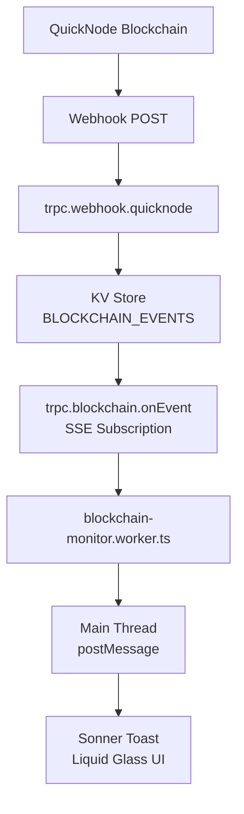
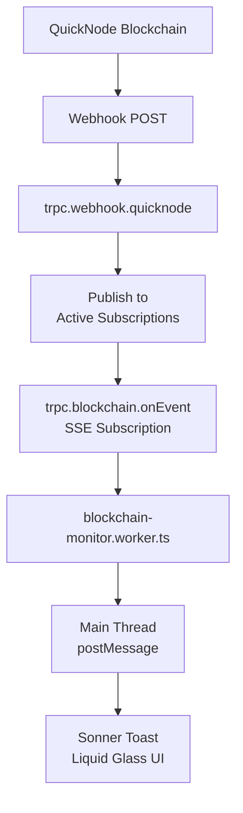
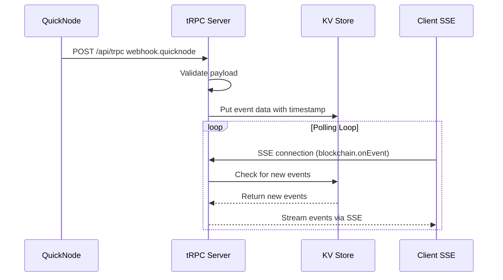
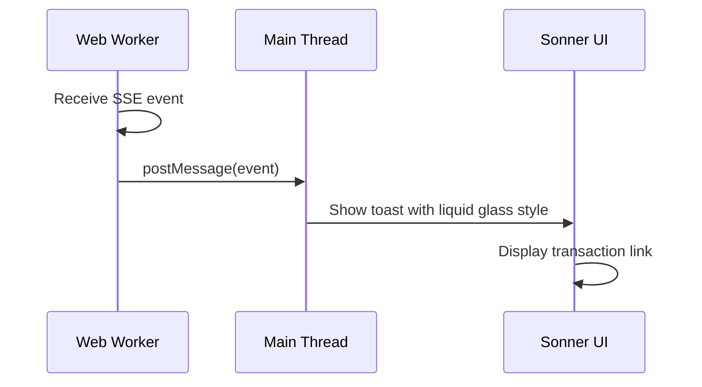

# Technical Design Document

## Overview

Web Worker と Server-Sent Events (SSE) を使用した Solana ブロックチェーン監視システムを構築します。このシステムは、QuickNode Webhook を介して特定の NFT コントラクトと SPL トークンのイベントをサーバーサイドで受信し、tRPC Subscription を通じて Web Worker にリアルタイム通知を行います。これにより、API キーの隠蔽と効率的な接続管理を実現し、ユーザーに即時性の高いブロックチェーンイベント通知を提供します。

### Goals

- QuickNode Webhook を使用した安全なブロックチェーンイベント受信
- tRPC Subscription を使用したリアルタイムクライアント通知
- Web Worker によるメインスレッドパフォーマンス維持
- Liquid glass UI を使用した視覚的に魅力的なトースト通知
- 既存の viewer システムと同様の堅牢なアーキテクチャパターン

### Non-Goals

- ブロックチェーンイベントの永続化（KV バッファのみ）
- 複雑なイベントフィルタリング（基本的な NFT mint / Token 購入のみ）
- マルチネットワーク対応（Solana のみ）
- Webhook 認証の複雑化（基本的なペイロード検証のみ）

## Architecture

### Existing Architecture Analysis

現在のシステムは以下の既存パターンを有しています：

- **tRPC Subscription パターン**: `viewer.onCountUpdate` で KV をポーリングし SSE で配信
- **Web Worker 通信**: `viewer.worker.ts` が tRPC Subscription を購読し `postMessage` でメインスレッドに通知
- **KV 状態管理**: `VIEWER_KV` を使用した一時的な状態保存
- **サービス層パターン**: `createViewerService` で依存性注入されたサービス実装
- **Liquid glass UI**: `globals.css` とコンポーネントで実装された glassmorphism スタイル

### High-Level Architecture

**Option 1: With KV Store (Current Design)**



**Option 2: Direct Event Streaming (Simplified)**



### Technology Stack and Design Decisions

**Technology Alignment**:

- **Backend Runtime**: Cloudflare Workers (既存の viewer システムと同じ)
- **State Management**: Cloudflare KV (既存の VIEWER_KV パターン拡張)
- **API Layer**: tRPC v11 (既存の型安全パターン維持)
- **Client Communication**: SSE over tRPC Subscription (viewer.onCountUpdate パターン)
- **Worker Communication**: postMessage API (viewer.worker.ts パターン)
- **UI Framework**: Sonner + Liquid Glass CSS (既存の glassmorphism 拡張)

**Key Design Decisions**:

**Decision**: Webhook エンドポイントを tRPC mutation に集約
**Context**: すべての API エンドポイントを型安全な tRPC に統一するため
**Alternatives**: 1) 別途 REST API エンドポイント、2) tRPC subscription の直接使用
**Selected Approach**: tRPC mutation `webhook.quicknode` で受信
**Rationale**: 既存の tRPC パターンを維持し、型安全性を確保
**Trade-offs**: Webhook URL が tRPC エンドポイントになるため設定が複雑になる

**Decision**: KV Store をイベントバッファとして使用 (再検討中)
**Context**: ブロックチェーンイベントの一時保存とクライアント配信の分離
**Alternatives**:

1. **Direct streaming**: Webhook受信時に直接接続中のクライアントにイベントをプッシュ
2. **In-memory buffer**: Workers 内で一時的に保持
3. **Durable Objects**: ステートフルなイベント共有
   **Selected Approach**: Cloudflare KV (既存パターン準拠) - ただし簡素化の可能性を検討
   **Rationale**: 既存の viewer.onCountUpdate パターンを再利用できる
   **Trade-offs**: アーキテクチャの複雑化 vs. イベントの信頼性確保

**Decision**: SSE ポーリング方式を採用
**Context**: リアルタイムイベント配信が必要
**Alternatives**: 1) WebSocket 直接接続、2) Long polling、3) Push notifications
**Selected Approach**: tRPC Subscription で KV をポーリング
**Rationale**: 既存の viewer.onCountUpdate パターンを再利用でき、SSE の信頼性が高い
**Trade-offs**: ポーリング間隔による遅延が発生する可能性

## System Flows

### Webhook Event Flow



### Notification Flow



## Requirements Traceability

| Requirement | Requirement Summary              | Components                   | Interfaces                      | Flows              |
| ----------- | -------------------------------- | ---------------------------- | ------------------------------- | ------------------ |
| 1.1         | QuickNode Webhook ペイロード検証 | tRPC webhook router          | webhook.quicknode mutation      | Webhook Event Flow |
| 1.2         | イベントデータ解析               | Blockchain service           | parseEvent function             | Webhook Event Flow |
| 1.3         | KV ストア保存                    | KV Store                     | putBlockchainEvent              | Webhook Event Flow |
| 1.4         | tRPC エンドポイント定義          | webhook router               | trpc.webhook.quicknode          | Webhook Event Flow |
| 1.5         | 不正ペイロード拒否               | Validation middleware        | validateWebhookPayload          | Webhook Event Flow |
| 2.1         | SSE 接続確立                     | blockchain router            | blockchain.onEvent subscription | Notification Flow  |
| 2.2         | KV ストアポーリング              | Blockchain service           | pollEvents                      | Notification Flow  |
| 2.3         | 新規イベント送信                 | SSE stream                   | yield event                     | Notification Flow  |
| 2.4         | 自動再接続                       | Retry logic                  | exponential backoff             | Notification Flow  |
| 2.5         | 初回イベント送信                 | Initial yield                | sendLatestEvents                | Notification Flow  |
| 3.1         | Worker 起動                      | blockchain-monitor.worker.ts | Worker initialization           | Notification Flow  |
| 3.2         | tRPC Subscription 開始           | Worker subscription          | setupBlockchainSubscription     | Notification Flow  |
| 3.3         | イベントタイプ確認               | Event handler                | checkEventType                  | Notification Flow  |
| 3.4         | メインスレッド通知               | postMessage                  | sendToMainThread                | Notification Flow  |
| 3.5         | Worker エラー通知                | Error handler                | notifyError                     | Notification Flow  |
| 3.6         | パフォーマンス維持               | Worker isolation             | separate execution context      | Notification Flow  |
| 4.1         | NFT mint トースト                | Sonner component             | toast.nftMint                   | Notification Flow  |
| 4.2         | トークン購入トースト             | Sonner component             | toast.tokenPurchase             | Notification Flow  |
| 4.3         | Liquid glass スタイル適用        | CSS classes                  | liquid-glass-effect             | Notification Flow  |
| 4.4         | トランザクション署名表示         | Toast content                | showSignature                   | Notification Flow  |
| 4.5         | Solscan リンク提供               | Toast actions                | solscanLink                     | Notification Flow  |
| 4.6         | UI 一貫性維持                    | Design system                | consistent glassmorphism        | Notification Flow  |
| 5.1         | Webhook URL 管理                 | Environment variables        | QUICKNODE_WEBHOOK_URL           | Configuration      |
| 5.2         | 監視対象アドレス管理             | Constants                    | WATCHED_ADDRESSES               | Configuration      |
| 5.3         | 不正リクエスト拒否               | Security middleware          | validateRequest                 | Security           |
| 5.4         | 機密情報管理                     | Environment variables        | API keys                        | Security           |
| 5.5         | 認証トークン検証                 | Auth middleware              | verifyWebhookToken              | Security           |

## Components and Interfaces

### Backend Components

#### Webhook Router (`src/server/trpc/routers/webhook.ts`)

**Responsibility & Boundaries**

- **Primary Responsibility**: QuickNode Webhook の受信とイベントデータの処理
- **Domain Boundary**: 外部ブロックチェーンイベントの受信境界
- **Data Ownership**: Webhook ペイロードの検証と変換
- **Transaction Boundary**: 各 Webhook リクエストの独立した処理単位

**Dependencies**

- **Inbound**: QuickNode Webhook POST リクエスト
- **Outbound**: Blockchain service, KV Store
- **External**: QuickNode Webhook API

**Contract Definition**

```typescript
interface WebhookRouter {
  quicknode: publicProcedure
    .input(quicknodeWebhookSchema)
    .mutation((opts) => Promise<Result<void, WebhookError>>);
}

interface QuicknodeWebhookPayload {
  account: string;
  signature: string;
  slot: number;
  timestamp: number;
  events: SolanaEvent[];
}

interface SolanaEvent {
  type: 'nft_mint' | 'token_purchase';
  contractAddress: string;
  transactionSignature: string;
  metadata?: Record<string, unknown>;
}
```

#### Blockchain Service (`src/services/blockchain.ts`)

**Responsibility & Boundaries**

- **Primary Responsibility**: ブロックチェーンイベントの保存と取得
- **Domain Boundary**: ブロックチェーンイベントのビジネスロジック
- **Data Ownership**: KV ストア内のイベントデータ
- **Transaction Boundary**: イベント保存と取得の原子性

**Dependencies**

- **Inbound**: Webhook router, Blockchain router
- **Outbound**: KV Store
- **External**: なし

**Contract Definition**

```typescript
interface BlockchainService {
  saveEvent(event: BlockchainEvent): Promise<Result<void, BlockchainError>>;
  getLatestEvents(since?: number): Promise<Result<BlockchainEvent[], BlockchainError>>;
  pollEvents(lastTimestamp: number): Promise<Result<BlockchainEvent[], BlockchainError>>;
}

interface BlockchainEvent {
  id: string;
  type: "nft_mint" | "token_purchase";
  contractAddress: string;
  transactionSignature: string;
  timestamp: number;
  slot: number;
}
```

#### Blockchain Router (`src/server/trpc/routers/blockchain.ts`)

**Responsibility & Boundaries**

- **Primary Responsibility**: クライアントへのリアルタイムイベント配信
- **Domain Boundary**: クライアント通知の配信境界
- **Data Ownership**: アクティブな SSE 接続
- **Transaction Boundary**: 各クライアント接続の独立した配信ストリーム

**Dependencies**

- **Inbound**: Client subscription requests
- **Outbound**: Blockchain service
- **External**: なし

**Contract Definition**

```typescript
interface BlockchainRouter {
  onEvent: publicProcedure
    .subscription((opts) => AsyncGenerator<BlockchainEvent, void, unknown>);
}
```

### Frontend Components

#### Blockchain Monitor Worker (`src/workers/blockchain-monitor.worker.ts`)

**Responsibility & Boundaries**

- **Primary Responsibility**: tRPC Subscription の購読とメインスレッドへのイベント転送
- **Domain Boundary**: バックグラウンドイベント監視の実行境界
- **Data Ownership**: アクティブな Subscription 接続
- **Transaction Boundary**: Worker プロセス全体のライフサイクル

**Dependencies**

- **Inbound**: SSE events from server
- **Outbound**: Main thread via postMessage
- **External**: tRPC client

#### Blockchain Events Hook (`src/hooks/use-blockchain-events.ts`)

**Responsibility & Boundaries**

- **Primary Responsibility**: Web Worker との通信とイベント状態管理
- **Domain Boundary**: React コンポーネントと Worker の統合境界
- **Data Ownership**: クライアントサイドのイベント状態
- **Transaction Boundary**: React コンポーネントのライフサイクル

**Dependencies**

- **Inbound**: Worker postMessage events
- **Outbound**: Sonner toast notifications
- **External**: Web Worker API

## Data Models

### Logical Data Model

**Blockchain Events**:

- **Event ID**: UUID string (クライアント生成)
- **Event Type**: 'nft_mint' | 'token_purchase'
- **Contract Address**: Solana address string
- **Transaction Signature**: Solana transaction signature
- **Timestamp**: Unix timestamp (milliseconds)
- **Slot**: Solana slot number
- **Metadata**: Optional additional data (JSON)

### Physical Data Model

**KV Store Structure**:

- **Key**: `blockchain-events:${timestamp}:${eventId}`
- **Value**: JSON string of BlockchainEvent
- **TTL**: 300 seconds (5 minutes, Webhook 到着から一定時間保持)

## Error Handling

### Error Strategy

**Webhook Errors (Server-side)**:

- ペイロード検証エラー → 400 Bad Request
- 処理失敗 → 500 Internal Server Error

**Client Connection Errors**:

- SSE 接続失敗 → 指数バックオフ再接続 (viewer.worker.ts パターン)
- イベント処理エラー → ログ記録し継続

**UI Errors**:

- トースト表示失敗 → サイレント失敗 (ユーザー影響最小化)

### Error Categories and Responses

**Webhook Validation Errors (4xx)**:

- Invalid payload format → "Invalid webhook payload"
- Missing required fields → "Missing required fields: [fields]"
- Invalid signature → "Invalid webhook signature"

**System Errors (5xx)**:

- KV store failure → "Failed to save event"
- Service unavailable → "Blockchain service unavailable"

**Client Errors**:

- Connection timeout → Automatic reconnection with backoff
- Parse errors → Log and skip invalid events

## Testing Strategy

### Unit Tests

- Webhook payload validation logic
- Blockchain event parsing functions
- KV store operations (save/get events)
- Worker postMessage handling
- Sonner toast rendering with liquid glass styles

### Integration Tests

- Webhook router end-to-end flow
- tRPC subscription SSE delivery
- Web Worker to main thread communication
- KV store event polling and cleanup

### E2E Tests

- Complete webhook to toast notification flow
- SSE connection reliability under network conditions
- Liquid glass UI consistency across browsers

## Security Considerations

**Webhook Authentication**:

- QuickNode Webhook シグネチャ検証
- Request origin validation
- Rate limiting implementation

**Data Protection**:

- No sensitive user data storage
- Event data TTL enforcement
- KV access logging

**API Security**:

- tRPC endpoint access control
- Client-side API key isolation
- CORS policy enforcement

## Migration Strategy

### Phase 1: Infrastructure Setup

- **Option 1**: 新しい KV namespace 作成 (`BLOCKCHAIN_EVENTS_KV`)
- **Option 2**: KV 不要 (Direct streaming)
- 環境変数追加 (`QUICKNODE_WEBHOOK_SECRET`)
- QuickNode Webhook 設定

### Phase 2: Backend Implementation

- Webhook router 実装
- Blockchain service 作成
- Blockchain router 実装
- KV store 統合

### Phase 3: Frontend Implementation

- Web Worker 作成
- React hook 実装
- Sonner 統合
- Liquid glass UI 適用

### Phase 4: Testing & Deployment

- 単体テスト実装
- 統合テスト実行
- 本番環境デプロイ
- モニタリング設定

### Rollback Plan

- Feature flag で機能無効化
- KV namespace 削除
- QuickNode Webhook 無効化
