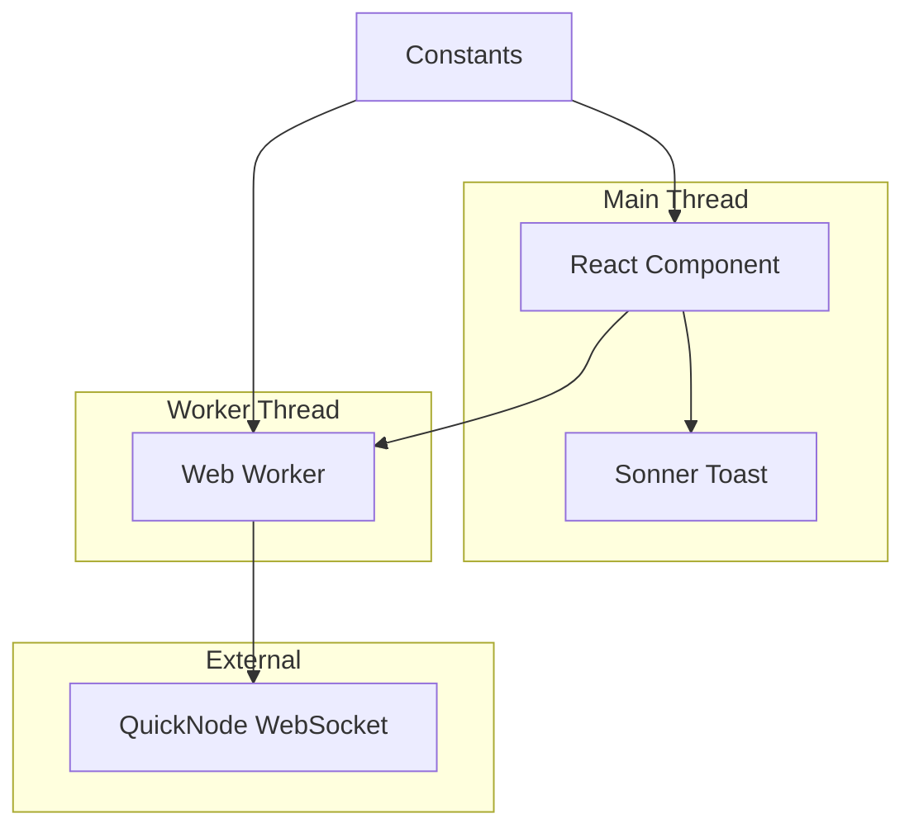
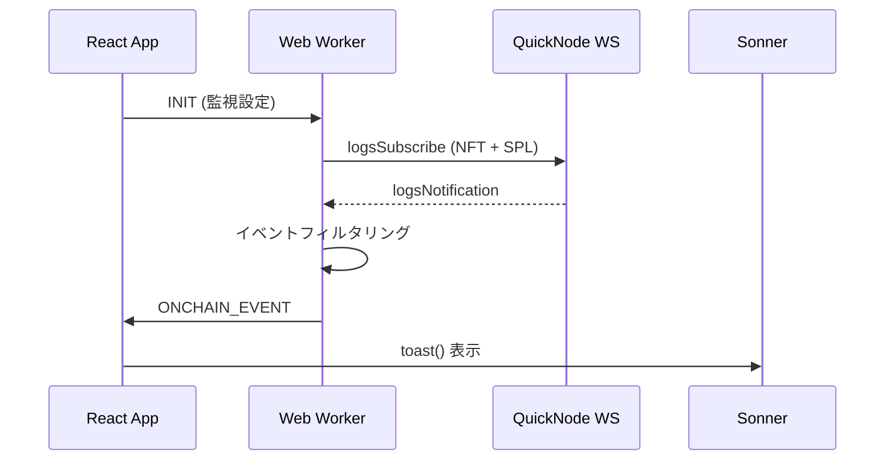
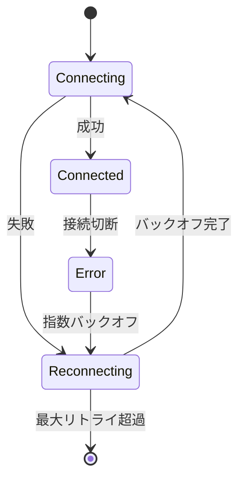

# Design Document

## Overview

この機能は、Web Worker を使用して Solana ブロックチェーンの特定の NFT コントラクトと SPL トークンのリアルタイムイベントを監視し、Sonner を使用したトースト通知を表示するシステムを提供します。QuickNode WebSocket に直接接続することでバックエンド不要の構成を実現し、監視対象は公開定数として管理します。

### Goals

- メインスレッドのパフォーマンスを維持しつつ、リアルタイムブロックチェーン監視を実現
- NFT mint と SPL トークン購入イベントを即時検知・通知
- 監視対象の限定により負荷を最小化
- Sonner を使用した liquid glass スタイルの通知表示

### Non-Goals

- 複数 NFT/SPL トークンの同時監視（今回は 1 NFT + 1 SPL のみ）
- バックエンドを介した認証・認可
- イベントデータの永続化
- 高度なログ解析・集計機能

## Architecture

### Existing Architecture Analysis

現在のアプリケーションは Next.js + tRPC + Three.js の構成です。この機能は既存のフロントエンドに Web Worker を追加し、ブロックチェーン監視機能を統合します。

### High-Level Architecture



**Architecture Integration**:
- Existing patterns preserved: Next.js フロントエンドパターン、React Hooks
- New components rationale: SolanaOnchainWorker - QuickNode 接続とイベントフィルタリング担当
- Technology alignment: 既存の TypeScript/React スタックに統合
- Steering compliance: lib/pure への純粋関数配置、テスト容易性の確保

### Technology Stack and Design Decisions

| Layer                    | Choice / Version | Role in Feature | Notes |
| ------------------------ | ---------------- | --------------- | ----- |
| Frontend / CLI           | React + TypeScript | メインスレッド UI と Worker 管理 | 既存コンポーネントに統合 |
| Backend / Services       | なし | - | QuickNode 直接接続 |
| Data / Storage           | なし | - | イベントはメモリのみ |
| Messaging / Events       | Web Worker Message API | スレッド間通信 | postMessage/onmessage |
| Infrastructure / Runtime | QuickNode WebSocket | Solana RPC 接続 | wss:// endpoint |

**Key Design Decisions**:

- **Decision**: Web Worker を使用したブロックチェーン監視
- **Context**: メインスレッドのパフォーマンスを維持しつつリアルタイム監視を実現する必要性
- **Alternatives**: メインスレッド直接監視、Service Worker、Shared Worker
- **Selected Approach**: Dedicated Web Worker で QuickNode WebSocket を管理
- **Rationale**: Three.js のレンダリングを妨げない独立したスレッド処理が可能
- **Trade-offs**: スレッド間通信のオーバーヘッド vs パフォーマンス分離の利点

## System Flows

### イベント検知・通知フロー



### WebSocket 再接続フロー



## Requirements Traceability

| Requirement | Summary | Components | Interfaces | Flows |
|-------------|---------|------------|------------|-------|
| 1.1 | QuickNode WebSocket 接続 | SolanaOnchainWorker | WebSocket API | イベント検知フロー |
| 1.2 | NFT/SPL 監視開始 | SolanaOnchainWorker | logsSubscribe | イベント検知フロー |
| 1.3 | NFT mint 検知 | SolanaOnchainWorker | Event filtering | イベント検知フロー |
| 1.4 | SPL 購入検知 | SolanaOnchainWorker | Event filtering | イベント検知フロー |
| 2.1 | Web Worker 生成 | OnchainMonitor | Worker constructor | 初期化フロー |
| 3.1 | NFT mint 通知 | OnchainMonitor | Sonner toast | 通知フロー |
| 3.2 | SPL 購入通知 | OnchainMonitor | Sonner toast | 通知フロー |
| 4.1 | 定数読み込み | SolanaConstants | Export constants | 初期化フロー |

## Components and Interfaces

| Component | Domain/Layer | Intent | Req Coverage | Key Dependencies | Contracts |
|-----------|-------------|--------|--------------|------------------|-----------|
| SolanaOnchainWorker | Worker | QuickNode 接続とイベント監視 | 1, 2 | QuickNode WS | Message API |
| OnchainMonitor | UI Hook | Worker 管理と通知表示 | 3, 4 | Web Worker, Sonner | React Hook |
| SolanaConstants | Config | 監視対象定義 | 4 | - | Export |

### Worker Layer

#### SolanaOnchainWorker

**Responsibility & Boundaries**

- **Primary Responsibility**: Solana ブロックチェーンイベントのリアルタイム監視とフィルタリング
- **Domain Boundary**: Web Worker スレッド内のブロックチェーン監視ドメイン
- **Data Ownership**: イベントフィルタリング結果と接続状態
- **Transaction Boundary**: 単一イベント処理のスコープ

**Dependencies**

- **Inbound**: メインスレッド — 初期化メッセージ (Critical)
- **External**: QuickNode WebSocket — Solana RPC 接続 (Critical)

**External Dependencies Investigation**

QuickNode Solana WebSocket の公式ドキュメントを確認した結果：
- JSON-RPC 2.0 プロトコルを使用
- logsSubscribe メソッドでリアルタイムログ監視が可能
- mentions パラメータでフィルタリング可能
- 接続エラー時の自動再接続推奨

**Contract Definition**

**Event Contract** (for event-driven components):

- **Published Events**: ONCHAIN_EVENT, STATUS
- **Subscribed Events**: logsNotification (QuickNode)
- **Ordering**: イベント到着順に処理、メッセージ損失なし
- **Delivery**: At-least-once（WebSocketの特性上）

### UI Layer

#### OnchainMonitor Hook

**Responsibility & Boundaries**

- **Primary Responsibility**: Web Worker の管理とイベント通知の表示
- **Domain Boundary**: React コンポーネント層の監視機能
- **Data Ownership**: Worker 接続状態と通知履歴
- **Transaction Boundary**: 単一通知表示のスコープ

**Dependencies**

- **Outbound**: SolanaOnchainWorker — イベント監視 (Critical)
- **External**: Sonner — トースト表示 (Critical)

**Contract Definition**

**State Management** (only if component maintains state):

- **State Model**: Worker 接続状態、イベント履歴
- **Persistence & consistency**: メモリのみ、ページリロードでリセット
- **Concurrency strategy**: React useEffect/useMemo で管理

### Config Layer

#### SolanaConstants

**Responsibility & Boundaries**

- **Primary Responsibility**: 監視対象と接続設定の公開定数定義
- **Domain Boundary**: アプリケーション設定ドメイン
- **Data Ownership**: 監視対象アドレスと接続情報
- **Transaction Boundary**: 設定読み込みのスコープ

**Contract Definition**

**Service Interface** (for business logic components):

```typescript
interface SolanaConstants {
  readonly QUICKNODE_WS_URL: string;
  readonly NFT_CONTRACT_ADDRESS: string;
  readonly SPL_TOKEN_MINT: string;
  readonly DEX_PROGRAM_ID: string;
}
```

## Data Models

### Domain Model

```typescript
type OnchainEventType = 'NFT_MINT' | 'TOKEN_BUY';

interface BaseOnchainEvent {
  type: OnchainEventType;
  signature: string;
  slot: number;
}

interface NftMintEvent extends BaseOnchainEvent {
  type: 'NFT_MINT';
  minter?: string;
  mint?: string;
  collection?: string;
}

interface TokenBuyEvent extends BaseOnchainEvent {
  type: 'TOKEN_BUY';
  buyer?: string;
  tokenMint: string;
  amount?: string;
}

type OnchainEvent = NftMintEvent | TokenBuyEvent;
```

### Logical Data Model

**Structure Definition**:

- OnchainEvent: ブロックチェーンイベントの共通インターフェース
- NftMintEvent: NFT mint イベントの詳細情報
- TokenBuyEvent: SPL トークン購入イベントの詳細情報

**Consistency & Integrity**:

- 必須フィールド: type, signature, slot
- オプショナルフィールド: イベント種別による追加情報

## Error Handling

### Error Strategy

**WebSocket エラー**: 指数バックオフ再接続（1s, 2s, 4s, max 30s）
**メッセージ解析エラー**: ログ出力のみ、処理継続
**Worker 初期化エラー**: UI に接続失敗を表示

### Error Categories and Responses

**System Errors (5xx)**: WebSocket 接続失敗 → 自動再接続 + UI ステータス表示
**User Errors (4xx)**: 無効な設定 → 初期化失敗 + エラーメッセージ

### Monitoring

- WebSocket 接続状態のログ出力
- イベント検知数のカウント（開発者ツール用）
- 再接続試行のログ記録

## Testing Strategy

### Unit Tests

- SolanaOnchainWorker のメッセージ処理ロジック
- イベントフィルタリング関数のパターンマッチング
- 再接続バックオフアルゴリズム
- 定数値の検証

### Integration Tests

- Web Worker とメインスレッドのメッセージ通信
- QuickNode WebSocket 接続とイベント受信（モック使用）
- Sonner トースト表示の統合

### E2E Tests

- 完全なイベント検知から通知表示までの一連フロー
- WebSocket 切断時の自動再接続動作
- 複数イベントの連続処理
