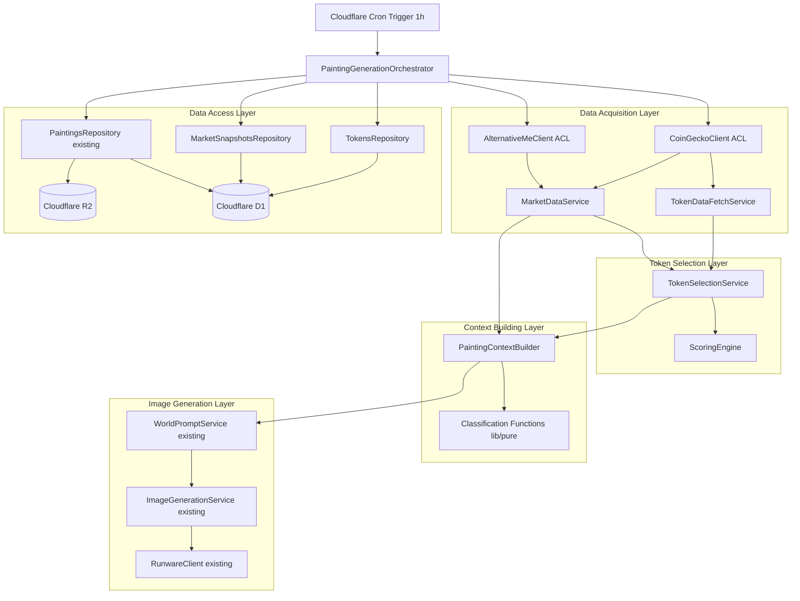
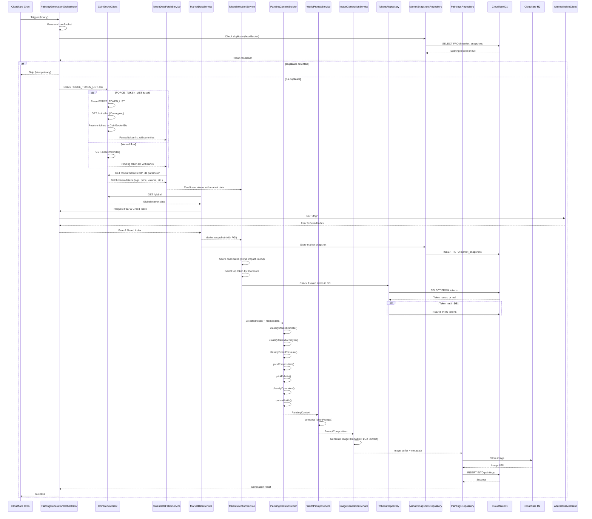
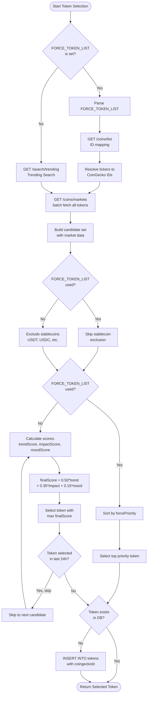
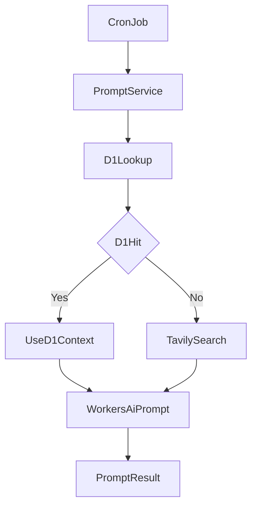

# DOOM INDEX

A decentralized archive of financial emotions. AI generates one painting every hour, translating the collective psychology of trending tokens into visual art.

## Overview

DOOM INDEX dynamically selects trending tokens from CoinGecko and generates a unique artwork every hour based on their market data, fear & greed index, and contextual analysis.

## Tools

- [Tavily](https://app.tavily.com/home)
- [Alternative.me](https://alternative.me/fear-and-greed-index)
- [CoinGecko](https://www.coingecko.com/en/api)
- [Cloudflare](https://dash.cloudflare.com/)
- [Runware](https://runware.com/)

## Development

### Setup

```bash
bun install
```

### Environment Variables

Create a `.env` file:

```bash
# Base URL (required)
NEXT_PUBLIC_BASE_URL=http://localhost:8787

# Image Generation Model (optional)
# Default: runware:106@1
# Options: runware:106@1, etc.
IMAGE_MODEL=runware:106@1

# Log Level (optional)
# Options: ERROR, WARN, INFO, DEBUG, LOG
# Default: DEBUG in development, INFO in production
LOG_LEVEL=DEBUG

# API Keys (required)
RUNWARE_API_KEY=your_runware_api_key_here

# External API Keys (optional)
COINGECKO_API_KEY=your_coingecko_api_key_here  # Optional, for higher rate limits
TAVILY_API_KEY=your_tavily_api_key_here  # Optional, for web search

# Force Token List (optional, for testing)
# Comma-separated list of CoinGecko token IDs to force selection from
# FORCE_TOKEN_LIST=bitcoin,ethereum,solana
```

For Cloudflare Workers, create a `.dev.vars` file:

```bash
# Same as .env but for local Cloudflare Workers development
RUNWARE_API_KEY=your_runware_api_key_here
COINGECKO_API_KEY=your_coingecko_api_key_here
TAVILY_API_KEY=your_tavily_api_key_here
FORCE_TOKEN_LIST=bitcoin,ethereum,solana

# R2 Batch Upload (optional, for faster OpenNext build/deploy)
# These variables enable faster batch upload for remote R2 during build/deploy
# Get these values from Cloudflare Dashboard:
# 1. R2 API Tokens: https://dash.cloudflare.com/<account-id>/r2/api-tokens
# 2. Account ID: Found in Cloudflare Dashboard URL or Workers overview
# R2_ACCESS_KEY_ID="your_r2_access_key_id"
# R2_SECRET_ACCESS_KEY="your_r2_secret_access_key"
# CF_ACCOUNT_ID="your_cloudflare_account_id"
```

**Note**: R2 batch upload environment variables are optional. If not set, OpenNext will use slower individual uploads but functionality will still work.

### Running the App

```bash
# Development (Next.js)
bun run dev

# Development (Cloudflare Workers Preview - Local R2)
bun run build:cf && bun run preview

# Automatically trigger cron every hour (starting at :00:00)
# This script waits until the next hour and then triggers every 3600 seconds
bun run watch-cron

# Or trigger cron manually via curl
curl "http://localhost:8787/__scheduled?cron=0+*+*+*+*"

# Deploy to Cloudflare
bun run deploy
```

> **Note**: When using `bun run preview` with OpenNextJS Cloudflare, environment variable loading behaves differently than direct `wrangler dev`. See [OpenNextJS Environment Variables](./docs/opennextjs-env-vars.md) for details about development environment detection and configuration.

### Database Management

```bash
# Generate migration files
bun run db:generate

# Run migrations (local)
bun run db:migrate

# Run migrations (production)
bun run db:migrate:prod

# Push schema changes (local)
bun run db:push

# Push schema changes (production)
bun run db:push:prod

# Open Drizzle Studio (database GUI)
bun run db:studio
```

### Testing

```bash
# Run all tests
bun run test

# Run unit tests only
bun run test:unit

# Run integration tests only
bun run test:integration

# Type checking
bun run typecheck
```

## Image Generation Script

Generate images locally using the CLI script:

### Basic Usage

```bash
# Generate with default settings
bun run generate


# Generate with Runware model
bun run generate --model "runware:100@1"

# Use mock provider for testing (no API key required)
bun run generate --provider mock

# Custom dimensions and format
bun run generate --w 1280 --h 720 --format webp

# Custom output directory
bun run generate --output ./my-outputs
```

### Available Options

- `--provider <name>`: Image provider (mock) - default: runware (from env)
- `--model <name>`: Model name (runware:100@1, etc.)
- `--w, --width <num>`: Image width - default: 1280
- `--h, --height <num>`: Image height - default: 720
- `--format <fmt>`: Output format (webp, png) - default: webp
- `--output <path>`: Output directory - default: ./out
- `--help`: Show help message

### Output

The script creates a folder for each generation:

```
out/DOOM_<timestamp>_<hash>_<seed>/
├── image.webp      # Generated image
└── params.json     # Generation parameters and metadata
```

The `params.json` includes:

- Prompt and negative prompt
- Visual parameters
- Token data and market context
- Seed and hash
- Provider information
- File size
- Timestamp

## Cron Watcher Script

For local development, use the cron watcher script to automatically trigger scheduled cron jobs:

### Basic Usage

```bash
# Start cron watcher (runs every hour starting at :00:00)
bun run watch-cron

# Custom port
bun run watch-cron --port 8787

# Custom interval (in seconds)
bun run watch-cron --interval 3600

# Custom cron expression
bun run watch-cron --cron "0 * * * *"
```

### Available Options

- `--port, -p <number>`: Server port (default: 8787)
- `--interval, -i <number>`: Interval in seconds (default: 3600)
- `--cron, -c <string>`: Cron expression (default: "0 \* \* \* \*")
- `--help, -h`: Show help message

**Note**: The script waits until the next hour (0 minutes, 0 seconds) before starting, then executes every 3600 seconds. This matches Cloudflare Workers cron trigger behavior.

## R2 Storage Management

### Truncate R2 Bucket

Clean up old files from R2 storage:

```bash
# Dry run (preview what would be deleted)
bun run truncate-r2:dry-run

# Actually delete files
bun run truncate-r2
```

**Warning**: This will permanently delete files from R2 storage. Always run dry-run first to preview the changes.

## Architecture

### Tech Stack

- **Framework**: Next.js 16 (App Router, React 19, React Compiler)
- **Hosting**: Cloudflare Pages + Workers
- **Scheduling**: Cloudflare Cron Triggers (every hour)
- **Database**: Cloudflare D1 (SQLite)
- **ORM**: Drizzle ORM
- **Storage**: Cloudflare R2 (S3-compatible object storage)
- **Cache**: Cloudflare KV (key-value store)
- **3D Rendering**: React Three Fiber + Three.js
- **Data Fetching**: TanStack Query + tRPC (end-to-end type safety)
- **API**: tRPC v11 (type-safe RPC framework)
- **Error Handling**: neverthrow (Result type)
- **Image Generation**: Runware (default) / OpenAI
- **External APIs**: CoinGecko, Alternative.me (Fear & Greed Index), Tavily (web search)
- **Runtime**: Bun (local), workerd (Cloudflare)

### High-Level Architecture



### Cloudflare D1 Database

The application uses Cloudflare D1 (SQLite) with Drizzle ORM for structured data:

#### Database Schema

- **paintings**: Generated artwork records with metadata
  - `id`, `hourBucket`, `tokenId`, `imageUrl`, `prompt`, `negativePrompt`, `seed`, `paramsHash`, `createdAt`
- **tokens**: Token information from CoinGecko
  - `id`, `symbol`, `name`, `coingeckoId`, `logoUrl`, `categories`, `createdAt`, `updatedAt`
- **token_contexts**: Contextual analysis for each token (from Tavily + Workers AI)
  - `tokenId`, `symbol`, `displayName`, `chain`, `category`, `tags`, `shortContext`, `updatedAt`
- **market_snapshots**: Historical global market data (from CoinGecko)
  - `hourBucket`, `totalMarketCapUsd`, `totalVolumeUsd`, `marketCapChangePercentage24hUsd`, `btcDominance`, `ethDominance`, `fearGreedIndex`, `createdAt`

> **Note**: State management has been migrated from R2 JSON files (`state/global.json`, `state/{ticker}.json`) to D1 database tables. The `StateService` has been removed as part of the dynamic-draw and dynamic-prompt implementation.

- `id`, `tokenId`, `price`, `marketCap`, `volume24h`, `priceChange24h`, `fearGreedIndex`, `snapshotAt`, `createdAt`

#### Key Features

- **Type-safe queries**: Drizzle ORM provides full TypeScript support
- **Migrations**: Version-controlled schema changes via Drizzle Kit
- **Local development**: Uses local SQLite file for fast iteration
- **Production**: Direct D1 binding for optimal performance

### Cloudflare R2 Storage

The application uses Cloudflare R2 for persistent storage:

- **Production (Workers)**: Uses R2 Binding for direct bucket access
- **Production (Next.js)**: Uses public URLs for read-only access
- **Development/Test**: Uses in-memory implementation for fast local development

#### Storage Structure

```
r2://doom-index-storage/
├── state/
│   ├── global.json                              # Global state (prevHash, lastTs, imageUrl)
│   └── {ticker}.json                            # Per-token state (thumbnailUrl, updatedAt)
└── images/
    └── {YYYY}/
        └── {MM}/
            └── {DD}/
                ├── DOOM_{YYYYMMDDHHmm}_{paramsHash}_{seed}.webp
                └── DOOM_{YYYYMMDDHHmm}_{paramsHash}_{seed}.json
```

**Key Points**:

- **Date-based prefix structure**: Images are organized by date (`images/{YYYY}/{MM}/{DD}/`) for efficient querying
- **Atomic storage**: Images and metadata are always saved together as pairs
- **Unique filenames**: Each file is uniquely identified by timestamp, params hash, and seed

For detailed documentation, see [R2 Storage Structure](docs/r2-storage-structure.md).

#### Key Features

- **Result-based error handling**: All R2 operations return `Result<T, AppError>` for type-safe error handling
- **Dual environment support**: Workers use R2 Binding, Next.js uses public URLs
- **Batch operations**: Efficient parallel writes for multiple state updates
- **Type safety**: Full TypeScript support with Cloudflare Workers types
- **Testing**: Seamless switching between production and test implementations

### Project Structure

```
src/
├── app/                    # Next.js App Router
│   ├── api/                # API routes
│   │   ├── trpc/           # tRPC HTTP endpoint
│   │   └── r2/             # R2 proxy endpoint
│   ├── archive/            # Archive page
│   ├── about/              # About page
│   └── page.tsx            # Main gallery page
├── components/             # React components
│   ├── gallery/            # 3D gallery scene
│   ├── archive/            # Archive grid and detail views
│   ├── about/              # About page components
│   ├── ui/                 # UI components
│   └── icons/              # Icon components
├── hooks/                  # Custom React hooks
├── lib/                    # External integrations
│   ├── trpc/               # tRPC clients (React, Server, Vanilla)
│   ├── image-generation-providers/  # Image generation providers
│   ├── pure/               # Pure functions (testable)
│   ├── r2.ts               # Cloudflare R2 client
│   ├── kv.ts               # Cloudflare KV client
│   ├── cache.ts            # Cache utilities
│   └── *-client.ts         # External API clients
├── server/                 # Server-side code
│   └── trpc/               # tRPC routers and schemas
│       ├── context.ts      # Context creation
│       ├── trpc.ts         # tRPC initialization
│       ├── schemas/        # Zod schemas
│       └── routers/        # Domain routers
├── services/               # Business logic
│   ├── paintings/          # Painting generation orchestration
│   ├── image-generation.ts # Image generation service
│   ├── state.ts            # Global state management
│   └── *.ts                # Other services
├── repositories/           # Data access layer (D1)
│   ├── paintings-repository.ts
│   ├── tokens-repository.ts
│   └── market-snapshots-repository.ts
├── db/                     # Database schema (Drizzle ORM)
│   ├── index.ts            # Database client
│   └── schema/             # Table schemas
├── constants/              # Configuration
│   ├── prompts/            # Prompt templates
│   ├── token.ts            # Token definitions
│   └── runware.ts          # Runware model configs
├── types/                  # TypeScript types
├── utils/                  # Utilities
├── cron.ts                 # Cron handler entry point
└── worker.ts               # Cloudflare Workers entry point

scripts/
├── generate.ts             # Image generation script
├── watch-cron.ts           # Cron watcher for local development
└── truncate-r2.ts          # R2 cleanup utility

migrations/                 # Drizzle ORM migrations
wrangler.toml               # Cloudflare Workers configuration
open-next.config.ts         # Next.js on Cloudflare Pages configuration
drizzle.config.ts           # Drizzle ORM configuration
```

### tRPC API

The project uses tRPC v11 for end-to-end type safety. All API endpoints are exposed as type-safe procedures:

- **Paintings**: `trpc.paintings.getLatest.useQuery()`, `trpc.paintings.getArchive.useQuery()`
- **Tokens**: `trpc.tokens.getAll.useQuery()`, `trpc.tokens.getById.useQuery()`
- **Market Snapshots**: `trpc.marketSnapshots.getLatest.useQuery()`
- **Viewer**: `trpc.viewer.register.mutate()`, `trpc.viewer.remove.mutate()`
- **R2 Objects**: `trpc.r2.getObject.useQuery({ key })`

See [tRPC Architecture Documentation](./docs/trpc-architecture.md) for details.

## Cron Pipeline

The hourly cron job executes the following pipeline:

1. **Idempotency Check**: Verify if painting already exists for current hour bucket
2. **Token Selection**: Select trending token from CoinGecko or force list
3. **Market Data Fetch**: Fetch current market data and Fear & Greed Index
4. **Store Market Snapshot**: Save market data to D1 database
5. **Build Painting Context**: Analyze token context and world events
6. **Generate Prompt**: Create weighted prompt based on context
7. **Generate Image**: Generate artwork using selected model
8. **Store Painting**: Save image to R2 and metadata to D1

### Hourly Painting Generation Flow



### Token Selection and Scoring Flow



See `src/cron.ts` and `src/services/paintings/painting-generation-orchestrator.ts` for implementation details.

## Prompt System

The project uses a dynamic prompt generation system that incorporates:

### Dynamic Prompt Architecture



The system dynamically generates contextual prompts by:

- **Token Context**: Market data, price trends, and sentiment analysis
- **Market Sentiment**: Fear & Greed Index from Alternative.me
- **World Events**: Web search results via Tavily API
- **Weighted Prompts**: Token-specific visual motifs weighted by market cap

Key files:

- `src/constants/prompts/` – Base style, negative prompt, and token-specific motifs
- `src/lib/pure/weighted-prompt.ts` – Weighted prompt generation logic
- `src/services/world-prompt-service.ts` – Dynamic world context generation

See [Weighted Prompt System Documentation](./docs/weighted-prompt-system.md) for details.

## Deployment

### Cloudflare Setup

1. **Create R2 Buckets**

   ```bash
   wrangler r2 bucket create doom-index-storage
   wrangler r2 bucket create doom-index-next-inc-cache
   ```

2. **Create D1 Database**

   ```bash
   wrangler d1 create doom-index
   ```

3. **Create KV Namespace**

   ```bash
   wrangler kv:namespace create VIEWER_KV
   ```

4. **Run Migrations**

   ```bash
   bun run db:migrate:prod
   ```

5. **Set Workers Secrets**

   ```bash
   wrangler secret put RUNWARE_API_KEY
   wrangler secret put OPENAI_API_KEY
   wrangler secret put COINGECKO_API_KEY
   wrangler secret put TAVILY_API_KEY
   ```

6. **Deploy Workers**

   ```bash
   bun run deploy
   ```

### Environment Variables (Production)

Set these in Cloudflare Dashboard (Workers & Pages > Settings > Environment Variables):

**Required**:

- `NEXT_PUBLIC_BASE_URL`: Your production domain (e.g., `https://doomindex.fun`)
- `IMAGE_MODEL`: Image generation model (e.g., `runware:100@1`)
- `LOG_LEVEL`: Log level (e.g., `INFO`)
- `NODE_ENV`: `production`

**Secrets** (via `wrangler secret put`):

- `RUNWARE_API_KEY`: Runware API key
- `OPENAI_API_KEY`: OpenAI API key (optional)
- `COINGECKO_API_KEY`: CoinGecko API key (optional)
- `TAVILY_API_KEY`: Tavily API key (optional)

**Optional - R2 Batch Upload (for faster builds)**:

To enable faster batch uploads during OpenNext build/deploy, set these environment variables in your CI/CD or build environment:

- `R2_ACCESS_KEY_ID`: R2 API Token Access Key ID (create at https://dash.cloudflare.com/<account-id>/r2/api-tokens)
- `R2_SECRET_ACCESS_KEY`: R2 API Token Secret Access Key
- `CF_ACCOUNT_ID`: Your Cloudflare Account ID (found in Dashboard URL or Workers overview)

These are optional - builds will work without them but may be slower.

## Image Generation

The project uses Runware as the primary image generation provider, with support for multiple models:

### Supported Models

- **Runware Models**: `runware:100@1`, `runware:101@1`, etc.

### Configuration

Set the `IMAGE_MODEL` environment variable to specify the model:

```bash
IMAGE_MODEL=runware:100@1  # Default
```

### Mock Provider (Testing Only)

For testing without API keys, use the mock provider:

```bash
bun run generate --provider mock
```

See [Runware Models Documentation](./docs/runware-models.md) for available models and their characteristics.

## Documentation

Additional documentation is available in the `docs/` directory:

- [Project Description](./docs/project-description.md) – High-level overview and goals
- [Development Specification](./docs/development-spec.md) – Technical specifications
- [tRPC Architecture](./docs/trpc-architecture.md) – API architecture and patterns
- [R2 Storage Structure](./docs/r2-storage-structure.md) – Storage organization
- [Weighted Prompt System](./docs/weighted-prompt-system.md) – Prompt generation details
- [Runware Models](./docs/runware-models.md) – Available models and configurations
- [Cache Impact Analysis](./docs/cache-impact-analysis.md) – Caching strategy
- [OpenNextJS Environment Variables](./docs/opennextjs-env-vars.md) – Environment variable handling in OpenNextJS Cloudflare

### Design Specifications

Detailed design documents for current features:

- [Dynamic Draw Design](./.kiro/specs/dynamic-draw/design.md) – Hourly painting generation architecture
- [Dynamic Draw Requirements](./.kiro/specs/dynamic-draw/requirements.md) – Functional requirements and constraints
- [Dynamic Draw Tasks](./.kiro/specs/dynamic-draw/tasks.md) – Implementation task breakdown
- [Dynamic Prompt Design](./.kiro/specs/dynamic-prompt/design.md) – AI-powered prompt generation system
- [Dynamic Prompt Requirements](./.kiro/specs/dynamic-prompt/requirements.md) – Prompt generation requirements
- [Dynamic Prompt Tasks](./.kiro/specs/dynamic-prompt/tasks.md) – Prompt system implementation tasks

## Links

- **Website**: [doomindex.fun](https://doomindex.fun)
- **GitHub**: [github.com/doom-protocol/doom-index](https://github.com/doom-protocol/doom-index)
- **X (Twitter)**: [@doom_index](https://x.com/doom_index)
- **Dev.fun**: [dev.fun/p/155bae58a27d2f0905ed](https://dev.fun/p/155bae58a27d2f0905ed)

## License

MIT
