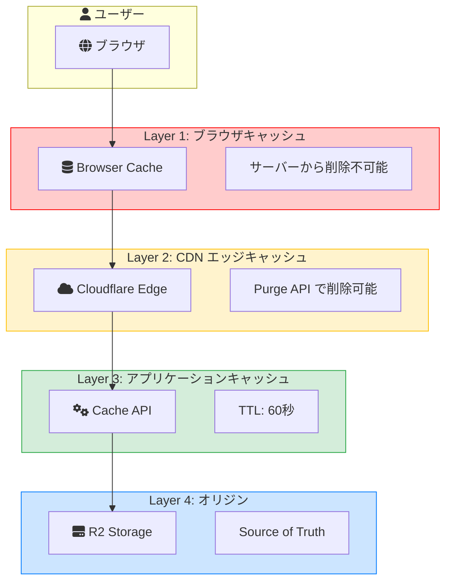
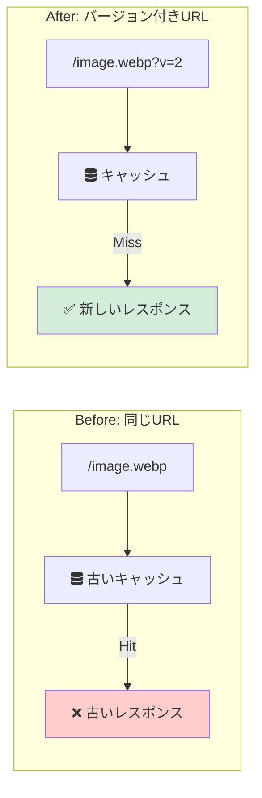
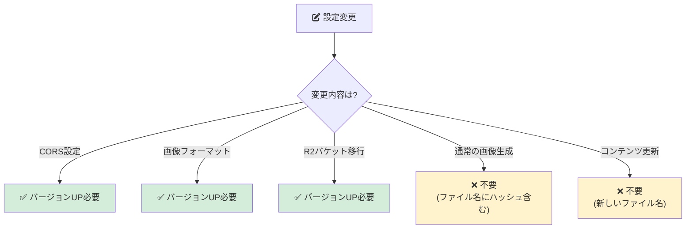
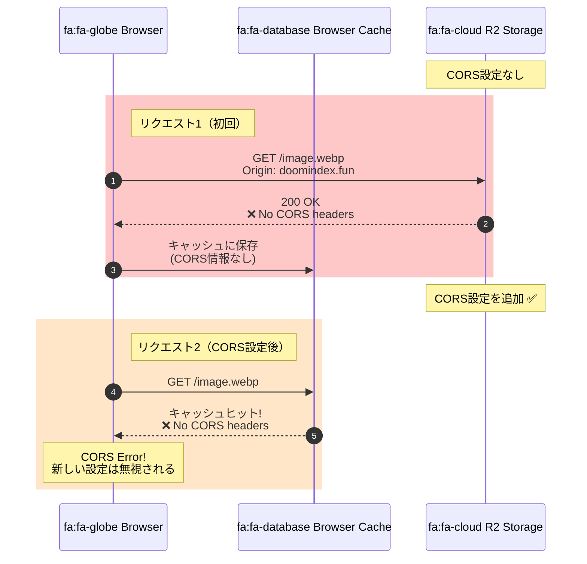
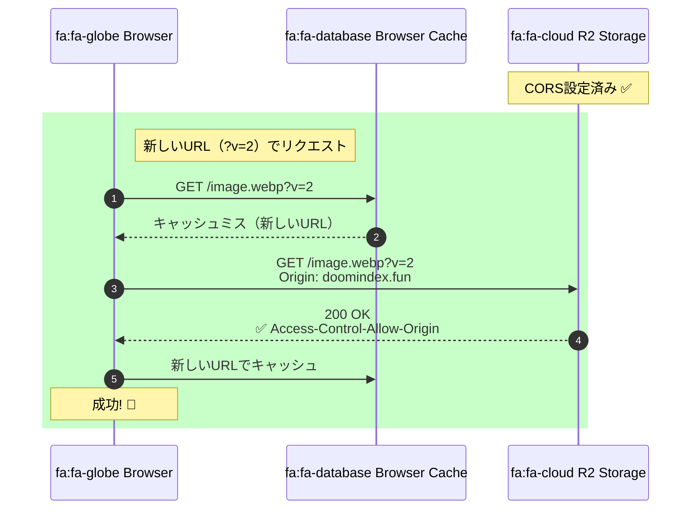
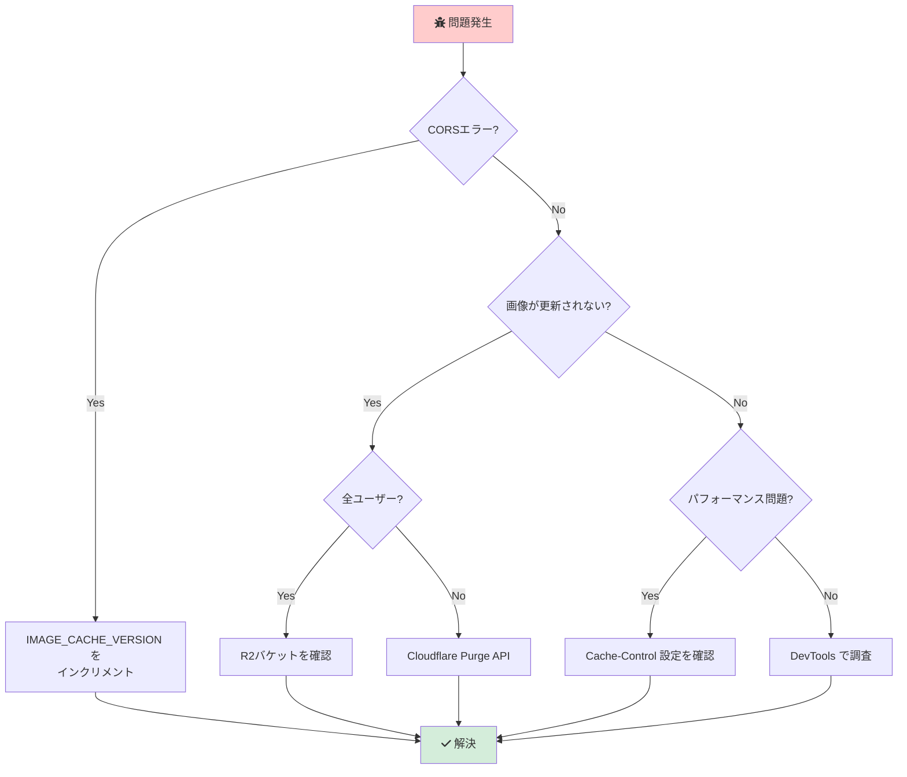

# キャッシュアーキテクチャ

## 概要

本プロジェクトでは複数のキャッシュレイヤーが存在し、それぞれが異なる役割を持っています。
このドキュメントでは各レイヤーの特性、制御方法、およびトラブルシューティングについて説明します。

---

## キャッシュレイヤー全体像



### レイヤー詳細表

| Layer | 名称                       | 場所               | 制御方法              | TTL               | 削除可否 |
| ----- | -------------------------- | ------------------ | --------------------- | ----------------- | -------- |
| 1     | ブラウザキャッシュ         | ユーザーのブラウザ | Cache-Control, ETag   | 1年（immutable）  | ❌ 不可  |
| 2     | CDNエッジキャッシュ        | Cloudflare PoP     | Page Rules, Purge API | Cache-Control依存 | ✅ 可能  |
| 3     | アプリケーションキャッシュ | Workers Runtime    | src/lib/cache.ts      | 60秒              | ✅ 可能  |
| 4     | オリジンストレージ         | R2 Bucket          | 直接アクセス          | -                 | -        |

---

## 各レイヤーの詳細

### Layer 1: ブラウザキャッシュ

#### 概要

ユーザーのブラウザ内に保存されるキャッシュ。**サーバー側から直接削除することは不可能**。

#### 制御ヘッダー

| ヘッダー        | 説明                                     | 例                                    |
| --------------- | ---------------------------------------- | ------------------------------------- |
| `Cache-Control` | キャッシュの動作を指定                   | `public, max-age=31536000, immutable` |
| `ETag`          | コンテンツのハッシュ                     | `"abc123"`                            |
| `Last-Modified` | 最終更新日時                             | `Thu, 27 Nov 2025 00:00:00 GMT`       |
| `Vary`          | キャッシュキーに含めるリクエストヘッダー | `Accept-Encoding`                     |

#### 本プロジェクトでの設定

**画像ファイル（R2経由）:**

```typescript
// src/app/api/r2/[...key]/route.ts
headers.set("Cache-Control", "public, max-age=31536000, immutable");
```

- `public`: 共有キャッシュに保存可能
- `max-age=31536000`: 1年間有効
- `immutable`: 変更されないことを明示（再検証リクエストを抑制）

**静的アセット（Next.js）:**

```
# public/_headers
/_next/static/*
  Cache-Control: public, max-age=31536000, immutable
```

#### 重要な特性

1. **サーバーから削除不可能**: `Cache-Control` や Cloudflare Purge はブラウザキャッシュに影響しない
2. **CORS情報もキャッシュされる**: CORSヘッダーの有無がキャッシュに含まれる（後述）
3. **ユーザーの手動クリア**: ユーザーがキャッシュをクリアするか、TTL切れを待つしかない

---

### Layer 2: CDNエッジキャッシュ

#### 概要

Cloudflareの世界各地のエッジサーバー（PoP: Point of Presence）に保存されるキャッシュ。

#### キャッシュ対象

| パス                           | キャッシュ | 設定                               |
| ------------------------------ | ---------- | ---------------------------------- |
| `storage.doomindex.fun/*`      | ✅         | R2 Public Bucket（自動キャッシュ） |
| `doomindex.fun/_next/static/*` | ✅         | immutable静的アセット              |
| `doomindex.fun/api/*`          | ❌         | APIレスポンスはキャッシュしない    |

#### Purge（キャッシュ削除）

```bash
# Cloudflare API経由でPurge
curl -X POST "https://api.cloudflare.com/client/v4/zones/{zone_id}/purge_cache" \
  -H "Authorization: Bearer {api_token}" \
  -H "Content-Type: application/json" \
  --data '{"files":["https://storage.doomindex.fun/images/..."]}'
```

**注意**: Purgeはエッジキャッシュのみ削除。ブラウザキャッシュは削除されない。

---

### Layer 3: アプリケーションキャッシュ

#### 概要

`src/lib/cache.ts` で実装されているCloudflare Cache API。

#### 実装

```typescript
// src/lib/cache.ts
export async function get<T>(key: string): Promise<T | null>;
export async function set<T>(key: string, value: T, options?: { ttlSeconds?: number }): Promise<void>;
export async function getOrSet<T>(key: string, fn: () => Promise<T>, options?: { ttlSeconds?: number }): Promise<T>;
```

#### キャッシュされるデータ

| データ       | キーパターン            | TTL  |
| ------------ | ----------------------- | ---- |
| トークン状態 | `token:state:{tokenId}` | 60秒 |
| R2 JSON      | `r2:json:{key}`         | 60秒 |
| R2バイナリ   | `r2:route:{key}`        | 1年  |

#### 特徴

- **in-flight deduplication**: 同じキーへの同時リクエストは1回の計算で処理
- **プログラマティック制御**: コードから完全に制御可能
- **無料**: Cloudflare Workers無料枠に含まれる

---

### Layer 4: オリジンストレージ（R2）

#### 概要

Cloudflare R2はキャッシュではなく、データの**ソースオブトゥルース**（正式なデータソース）。

#### アクセス方法

1. **直接アクセス（本番）**: `https://storage.doomindex.fun/{key}`
2. **API経由（ローカル開発）**: `/api/r2/{key}`

#### 画像URL構造

```
https://storage.doomindex.fun/images/2025/11/27/DOOM_202511270430_3a0d86db_14871ff15e69.webp?v=2
                                  ^^^^                    ^^^^^^^^^^^^                      ^^^^
                                  日付prefix              ファイル名（immutable）           キャッシュバージョン
```

---

## キャッシュバスティング（Cache Busting）

### なぜ必要か

ブラウザキャッシュはサーバーから直接削除できないため、**URLを変更**することで「新しいリソース」として認識させる。



### 本プロジェクトでの実装

```typescript
// src/constants/index.ts
export const IMAGE_CACHE_VERSION = "2";

// src/utils/paintings.ts
export function buildPublicR2Path(key: string, version: string = IMAGE_CACHE_VERSION): string {
  // ...
  return version ? `${url}?v=${version}` : url;
}
```

### いつバージョンを上げるか



| シナリオ               | バージョン更新                      |
| ---------------------- | ----------------------------------- |
| CORS設定の変更         | ✅ 必要                             |
| 画像フォーマットの変更 | ✅ 必要                             |
| 通常の画像生成         | ❌ 不要（ファイル名にハッシュ含む） |
| R2バケット移行         | ✅ 必要                             |

---

## CORS とキャッシュの関係

### 問題の背景

WebGL / Three.js で画像をテクスチャとして使用する場合、**crossOrigin 属性**が必要。

```typescript
// @react-three/drei の useTexture 内部
const texture = useLoader(TextureLoader, url, loader => {
  loader.crossOrigin = "anonymous";
});
```

### "Tainted" キャッシュ問題

1. **初期状態**: R2バケットにCORS設定なし
2. **リクエスト1**: ブラウザが `https://storage.doomindex.fun/image.webp` を取得
3. **レスポンス**: CORSヘッダーなし → ブラウザは「CORS未対応」としてキャッシュ
4. **CORS設定追加**: R2バケットにCORS設定を追加
5. **リクエスト2**: 同じURLにアクセス → **キャッシュヒット**（新しいCORS設定は無視）
6. **結果**: CORSエラーが継続



### 解決策：URLバージョニング



---

## リクエストフロー全体図

```mermaid
flowchart LR
    subgraph Client["fa:fa-user クライアント"]
        Browser["fa:fa-globe ブラウザ"]
        ThreeJS["fa:fa-cube Three.js"]
    end

    subgraph BrowserLayer["Layer 1"]
        BCache["fa:fa-database Browser Cache"]
    end

    subgraph CDNLayer["Layer 2"]
        CF["fa:fa-cloud Cloudflare Edge"]
    end

    subgraph AppLayer["Layer 3"]
        Workers["fa:fa-cogs Workers"]
        CacheAPI["Cache API"]
    end

    subgraph Origin["Layer 4"]
        R2["fa:fa-hdd R2"]
    end

    ThreeJS -->|"useTexture()"| Browser
    Browser -->|"1. Check"| BCache
    BCache -->|"Miss"| CF
    CF -->|"Miss"| Workers
    Workers -->|"Check"| CacheAPI
    CacheAPI -->|"Miss"| R2

    R2 -->|"Response + CORS"| CacheAPI
    CacheAPI -->|"Cache & Return"| Workers
    Workers -->|"Response"| CF
    CF -->|"Edge Cache"| BCache
    BCache -->|"Store"| Browser

    style BCache fill:#ffcccc,stroke:#ff0000
    style CF fill:#fff3cd,stroke:#ffc107
    style CacheAPI fill:#d4edda,stroke:#28a745
    style R2 fill:#cce5ff,stroke:#007bff
```



---

## トラブルシューティング

### 症状別対処法



| 症状                     | 原因                               | 対処法                                      |
| ------------------------ | ---------------------------------- | ------------------------------------------- |
| CORSエラー（新規設定後） | ブラウザキャッシュに古いレスポンス | `IMAGE_CACHE_VERSION` をインクリメント      |
| 画像が更新されない       | CDNキャッシュ                      | Cloudflare Purge API                        |
| 全ユーザーで画像が古い   | R2へのアップロード失敗             | R2バケットを確認                            |
| 一部ユーザーで画像が古い | ブラウザキャッシュ                 | ユーザーに強制リロード（Cmd+Shift+R）を案内 |

### デバッグ手順

1. **ブラウザDevTools → Network タブ**
   - `Disable cache` をチェック
   - リクエストを確認
   - レスポンスヘッダー（`Cache-Control`, `Access-Control-Allow-Origin`）を確認

2. **curl で直接確認**

   ```bash
   curl -I "https://storage.doomindex.fun/images/.../image.webp" \
     -H "Origin: https://doomindex.fun"
   ```

3. **Cloudflare Dashboard**
   - Caching → Configuration でキャッシュ設定を確認
   - Analytics → Cache でヒット率を確認

---

## ベストプラクティス

### 1. immutable なリソースにはハッシュ/タイムスタンプを含める

```
❌ /images/banner.png
✅ /images/banner.4f8a2c1b.png
✅ /images/DOOM_202511270430_3a0d86db_14871ff15e69.webp
```

### 2. 設定変更時はバージョンを上げる

```typescript
// src/constants/index.ts
export const IMAGE_CACHE_VERSION = "3"; // CORS設定変更時にインクリメント
```

### 3. 適切なCache-Controlを設定する

| リソースタイプ        | Cache-Control                         |
| --------------------- | ------------------------------------- |
| immutable静的アセット | `public, max-age=31536000, immutable` |
| API レスポンス        | `no-cache, no-store, must-revalidate` |
| 動的コンテンツ        | `public, max-age=60`                  |

### 4. CORS設定は最初から適切に

後からCORS設定を変更すると、ブラウザキャッシュの問題が発生する。
初期設定で必要なオリジンを含めておく。

---

## 関連ドキュメント

- [cache-impact-analysis.md](./cache-impact-analysis.md) - キャッシュのコスト・UX影響分析
- [r2-storage-structure.md](./r2-storage-structure.md) - R2ストレージの構造
- [data-flow.md](./data-flow.md) - データフロー全体像

---

## 参考リンク

- [MDN: HTTP caching](https://developer.mozilla.org/en-US/docs/Web/HTTP/Caching)
- [Cloudflare: How caching works](https://developers.cloudflare.com/cache/concepts/default-cache-behavior/)
- [Cloudflare R2: CORS](https://developers.cloudflare.com/r2/buckets/cors/)
- [web.dev: Love your cache](https://web.dev/articles/love-your-cache)
