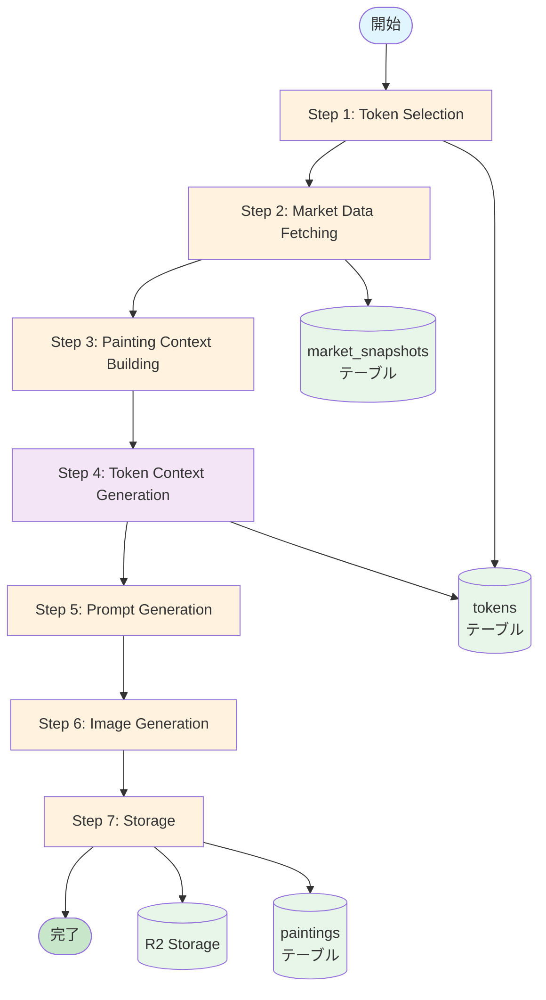
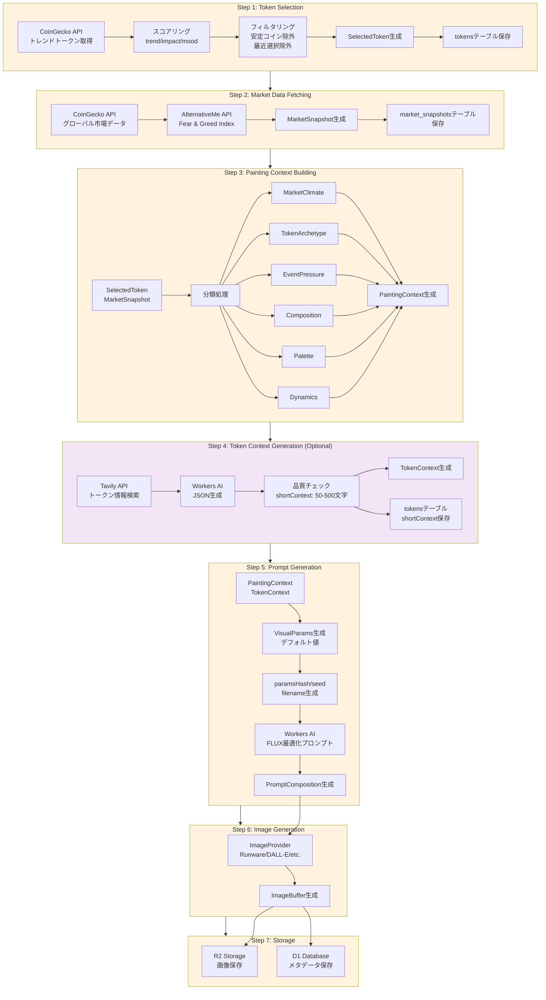
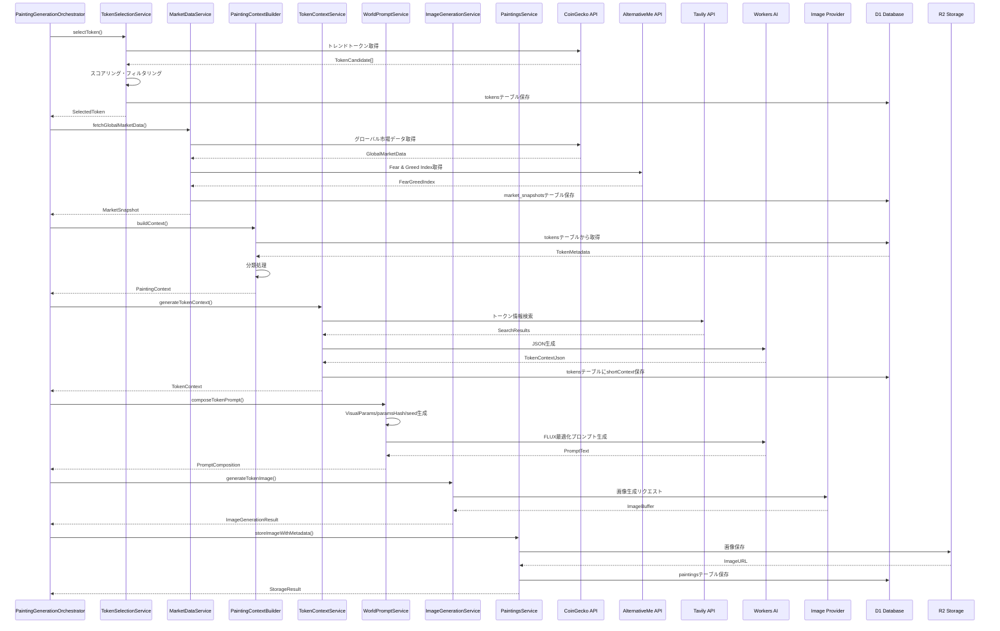
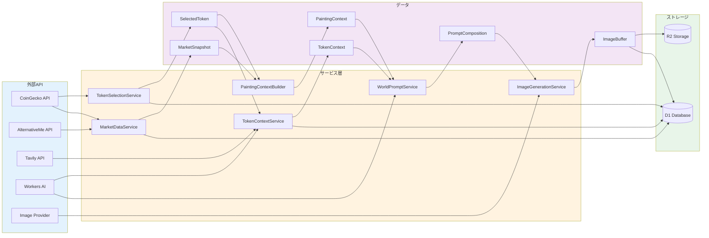
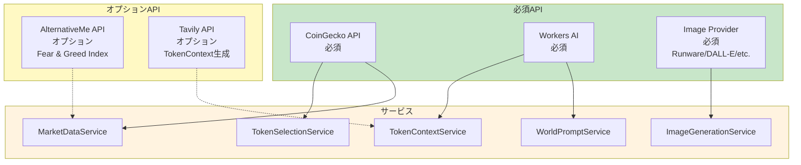
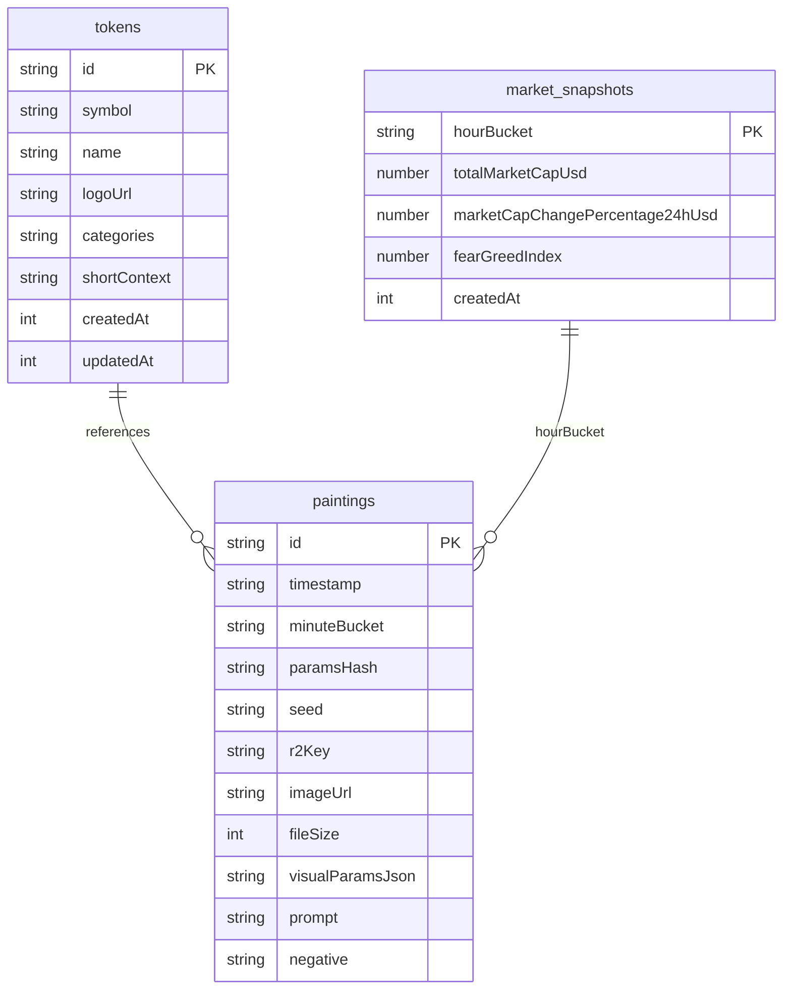
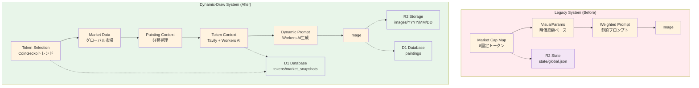

# データ取得から画像生成までの流れ

このドキュメントでは、DOOM INDEX プロジェクトにおけるデータ取得から画像生成までの全体的なフローを整理します。

## 概要

現在のシステムは **dynamic-draw** アーキテクチャに基づいており、以下の特徴があります：

- **動的トークン選択**: CoinGeckoからトレンドトークンを取得し、スコアリングして選択
- **動的プロンプト生成**: Workers AIを使用してトークンコンテキストに基づいたプロンプトを生成
- **市場データベース化**: 市場データとトークンメタデータをD1データベースに保存

## データフロー図

### 全体フロー



### 詳細フロー



### サービス間の相互作用



### データフロー



## 各ステップの詳細

### Step 1: Token Selection

**サービス**: `TokenSelectionService`

**データ取得**:
- CoinGecko API: トレンドトークンリスト取得
- 市場データ: スコアリング用の市場気候分類

**処理**:
1. CoinGeckoからトレンドトークンを取得
2. スコアリングエンジンで評価:
   - `trendScore`: 価格変動トレンド
   - `impactScore`: 市場インパクト
   - `moodScore`: 市場気候との適合度
3. フィルタリング:
   - 安定コイン除外
   - 最近選択されたトークン除外（24時間以内）
4. 最高スコアのトークンを選択

**出力**: `SelectedToken`
```typescript
{
  id: string;              // CoinGecko ID
  symbol: string;
  name: string;
  logoUrl: string;
  priceUsd: number;
  priceChange24h: number;
  priceChange7d: number;
  volume24hUsd: number;
  marketCapUsd: number;
  categories: string[];
  source: string;
  scores: { trend, impact, mood, final };
}
```

**データベース保存**: `tokens`テーブルにメタデータ保存

---

### Step 2: Market Data Fetching

**サービス**: `MarketDataService`

**データ取得**:
- CoinGecko API: グローバル市場データ
- AlternativeMe API: Fear & Greed Index

**処理**:
1. CoinGeckoからグローバル市場データ取得
2. AlternativeMeからFear & Greed Index取得（オプション）
3. MarketSnapshot生成

**出力**: `MarketSnapshot`
```typescript
{
  totalMarketCapUsd: number;
  totalVolumeUsd: number;
  marketCapChangePercentage24hUsd: number;
  btcDominance: number;
  ethDominance: number;
  activeCryptocurrencies: number;
  markets: number;
  fearGreedIndex: number | null;
  updatedAt: number;
}
```

**データベース保存**: `market_snapshots`テーブルに保存（hourBucket単位）

---

### Step 3: Painting Context Building

**サービス**: `PaintingContextBuilder`

**入力**:
- `SelectedToken`
- `MarketSnapshot`

**処理**:
1. トークンメタデータ取得（`tokens`テーブルから）
2. ボラティリティスコア計算
3. 分類処理:
   - **MarketClimate**: 市場気候分類（euphoria/cooling/despair/panic/transition）
   - **TokenArchetype**: トークンアーキタイプ分類（perp-liquidity/meme-ascendant/l1-sovereign/etc.）
   - **EventPressure**: イベント圧力分類（rally/collapse/ritual + intensity）
   - **Composition**: 構図選択（citadel-panorama/procession/central-altar/etc.）
   - **Palette**: パレット選択（solar-gold/ashen-blue/infernal-red/ivory-marble）
   - **Dynamics**: トレンド方向とボラティリティレベル
   - **Motifs**: モチーフタグ（pump-fun/official-meme/no-vc/etc.）
   - **NarrativeHints**: ナラティブヒント

**出力**: `PaintingContext`
```typescript
{
  t: { n: string; c: string };                    // token name, chain
  m: { mc: number; bd: number; fg: number | null }; // market snapshot
  s: { p: number; p7: number; v: number; mc: number; vol: number }; // token snapshot
  c: MarketClimate;
  a: TokenArchetype;
  e: { k: EventKind; i: EventIntensity };
  o: Composition;
  p: Palette;
  d: { dir: TrendDirection; vol: VolatilityLevel };
  f: MotifTag[];
  h: string[]; // narrative hints
}
```

---

### Step 4: Token Context Generation (Optional)

**サービス**: `TokenContextService`

**データ取得**:
- Tavily API: トークン情報検索
- Workers AI: JSON生成

**処理**:
1. Tavilyでトークン情報を検索
2. Workers AIでJSON生成:
   - `shortContext`: 2-4文の英語説明（50-500文字）
   - `category`: カテゴリ（meme/defi/nft/etc.）
   - `tags`: タグ配列（2-5個）
3. 品質チェック（shortContextの長さ）
4. `tokens`テーブルに`shortContext`保存

**出力**: `TokenContext`
```typescript
{
  category: string;
  tags: string[];
}
```

**注意**: `shortContext`は`tokens`テーブルに保存されるが、`TokenContext`型には含まれない

**フォールバック**: 生成失敗時は`FALLBACK_TOKEN_CONTEXT`を使用

---

### Step 5: Prompt Generation

**サービス**: `WorldPromptService`

**入力**:
- `PaintingContext`
- `TokenContext` (オプション)
- `TokenMetaInput` (TokenContext未提供時)

**処理**:
1. VisualParams生成（現在はデフォルト値）
2. paramsHash, seed, filename生成
3. Workers AIでFLUX最適化プロンプト生成:
   - System Prompt: FLUX最適化のガイドライン
   - User Prompt: PaintingContext + TokenContext + VisualParams
4. プロンプトテキストにparamsHashとseedを追加

**出力**: `PromptComposition`
```typescript
{
  seed: string;
  minuteBucket: string;
  vp: VisualParams;
  prompt: {
    text: string;
    negative: string;
    size: { w: number; h: number };
    format: "webp";
    seed: string;
    filename: string;
  };
  paramsHash: string;
}
```

---

### Step 6: Image Generation

**サービス**: `ImageGenerationService`

**入力**:
- `PromptComposition`
- `referenceImageUrl` (トークンロゴURL、オプション)

**処理**:
1. プロンプト詳細ログ出力
2. ImageProviderにリクエスト:
   - prompt: 生成されたプロンプトテキスト
   - negative: ネガティブプロンプト
   - width, height: 画像サイズ（デフォルト: 1024x1024）
   - format: webp
   - seed: シード値
   - referenceImageUrl: トークンロゴURL（オプション）

**出力**: `ImageGenerationResult`
```typescript
{
  composition: PromptComposition;
  imageBuffer: ArrayBuffer;
  providerMeta: Record<string, unknown>;
}
```

---

### Step 7: Storage

**サービス**: `PaintingsService`

**処理**:
1. R2に画像保存: `images/YYYY/MM/DD/DOOM_{timestamp}_{paramsHash}_{seed}.webp`
2. D1にメタデータ保存: `paintings`テーブル
   - id, timestamp, minuteBucket
   - paramsHash, seed
   - r2Key, imageUrl, fileSize
   - visualParamsJson
   - prompt, negative

**完了**: 画像生成パイプライン完了

---

## 必要なデータ

### 外部API依存関係



### 外部APIから取得するデータ

1. **CoinGecko API** (必須)
   - トレンドトークンリスト
   - トークン詳細（価格、ボリューム、時価総額など）
   - グローバル市場データ

2. **AlternativeMe API** (オプション)
   - Fear & Greed Index

3. **Tavily API** (オプション)
   - トークン情報検索結果

4. **Workers AI** (必須)
   - トークンコンテキスト生成（JSON）
   - プロンプト生成（テキスト）

5. **Image Provider** (必須)
   - Runware/DALL-E/etc.
   - 画像生成

### データベース保存構造



### データベースに保存するデータ

1. **tokensテーブル**
   - トークンメタデータ（id, symbol, name, logoUrl, categories）
   - `shortContext`（TokenContextServiceで生成）

2. **market_snapshotsテーブル**
   - 市場スナップショット（hourBucket単位）

3. **paintingsテーブル**
   - 生成された画像のメタデータ
   - プロンプト、パラメータ、R2キーなど

---

## 不要になったデータ

### Legacy 8-Token System

以下のデータは削除されました：

1. **McMap (Market Cap Map)**
   - 8つの固定トークン（CO2, ICE, FEAR, HOPE, FOREST, MACHINE, NUKE, PANDEMIC）の時価総額マップ
   - `normalizeMcMap()`は空のオブジェクトを返す（後方互換性のため）

2. **mcRounded**
   - 時価総額を4桁に丸めた値
   - `paintings`テーブルには`mcRoundedJson`カラムが残っているが、使用されていない

3. **VisualParams from Market Cap**
   - 時価総額マップから生成されるVisualParams
   - 現在はデフォルト値（すべて0）が使用される

4. **Weighted Prompt System**
   - `buildSDXLPrompt()`は非推奨
   - 代わりに`WorldPromptService.composeTokenPrompt()`を使用

### 削除されたファイル

- `src/constants/prompts/doom-painting.ts` - Legacy プロンプト定義
- `src/repositories/token-context-repository.ts` - TokenContextは直接`tokens`テーブルに保存

### 削除されたコンポーネント

- `src/components/archive/archive-camera-rig.tsx`
- `src/components/archive/archive-painting-skeleton.tsx`
- `src/components/archive/archive-paintings-grid.tsx`
- `src/components/archive/archive-scene.tsx`
- `src/components/archive/archive-zoom-view.tsx`

---

## データフローの変更点

### Before vs After 比較



### 主な変更点

1. **固定トークン → 動的トークン選択**
   - 8つの固定トークンから、CoinGeckoのトレンドトークンに変更

2. **時価総額ベースのVisualParams → デフォルト値**
   - 時価総額マップから生成されるVisualParamsは使用されず、デフォルト値（すべて0）が使用される

3. **静的プロンプト → 動的プロンプト生成**
   - Workers AIを使用してトークンコンテキストに基づいたプロンプトを動的に生成

4. **R2 State → D1 Database**
   - アプリケーション状態はR2の`state/`フォルダからD1データベースに移行

---

## 環境変数

### 必須

- `COINGECKO_API_KEY`: CoinGecko APIキー
- `AI`: Cloudflare Workers AIバインディング（本番環境）

### オプション

- `TAVILY_API_KEY`: Tavily APIキー（TokenContext生成用）
- `FORCE_TOKEN_LIST`: 強制トークンリスト（テスト用）
- `IMAGE_MODEL`: 画像生成モデル名

---

## 関連ファイル

### サービス

- `src/services/paintings/token-selection.ts` - トークン選択
- `src/services/paintings/market-data.ts` - 市場データ取得
- `src/services/paintings/painting-context-builder.ts` - コンテキスト構築
- `src/services/token-context-service.ts` - トークンコンテキスト生成
- `src/services/world-prompt-service.ts` - プロンプト生成
- `src/services/image-generation.ts` - 画像生成
- `src/services/paintings/painting-generation-orchestrator.ts` - オーケストレーション

### リポジトリ

- `src/repositories/tokens-repository.ts` - トークンメタデータ
- `src/repositories/market-snapshots-repository.ts` - 市場スナップショット
- `src/repositories/paintings-repository.ts` - 画像メタデータ

### 型定義

- `src/types/paintings.ts` - SelectedToken, MarketSnapshot, etc.
- `src/types/painting-context.ts` - PaintingContext
- `src/services/token-context-service.ts` - TokenContext

### データベーススキーマ

- `src/db/schema/tokens.ts` - tokensテーブル
- `src/db/schema/market-snapshots.ts` - market_snapshotsテーブル
- `src/db/schema/paintings.ts` - paintingsテーブル
